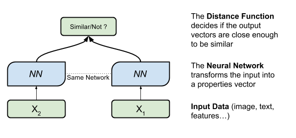
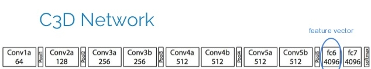
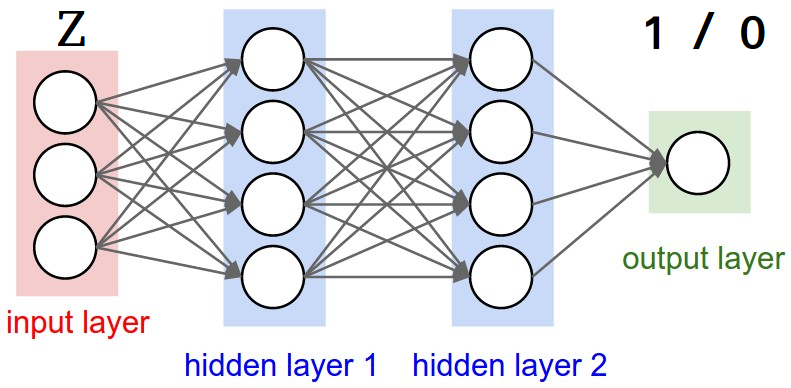
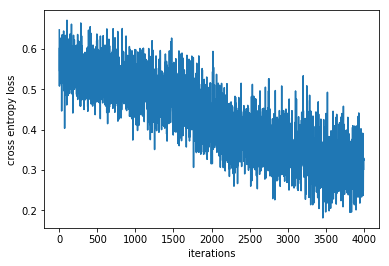
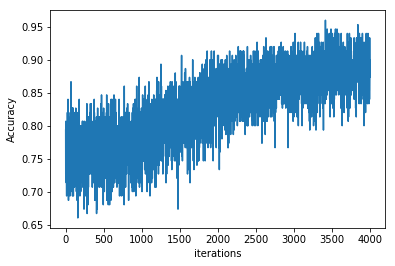

# C3D-Siamese Network


```python
"""
Created on Mon Jan 22 16:20:03 2018

@author: Wail
"""

from __future__ import absolute_import
from __future__ import division
from __future__ import print_function
import matplotlib.pyplot as plt 
from random import randint
import pickle
import os.path
import time
from six.moves import xrange  # pylint: disable=redefined-builtin
import tensorflow as tf
#import input_data
#import c3d_model
import numpy as np
from IPython.display import Image
pickle_path_kth="data/kth_data.p"
pickle_path_Weizmann="data/Weizmann_test.p"
```

## Presenting C3D-siamese model

First, a siamese network is defined as follow:


```python
Image(filename='../img/siamese.png') 
```





C3D model is defined as follow:


```python
Image(filename='../img/c3d.jpg') 
```





## Purpose 

The purpose of the C3D-siamese model is to detect similarity between actions (specificaly imitation). In other words given these 4 videos:

 - swim_person1.avi and swim_person2.avi
 - boxing_person3.avi and boxing_person4.avi
 
We want our model to give us the following results:
 - C3D-siamese(swim_person1.avi,swim_person2.avi)=1 ---> similar
 - C3D-siamese(swim_person1.avi,boxing_person4.avi)=0  ----> not similar


## Model Architecture 

the C3D-siamese architecture is derived from the siamese one where:
- The inputs are videos decomposed into a series of frames (X1: video1, X2: video2)
- The Neural Network is a 3-Dimensional Convolutional Networks pre-trained on **sports1m** dataset and used for feature extraction. 
*for further details visit this link (http://vlg.cs.dartmouth.edu/c3d/)*
- For the distance function we took a different path. Knowing that NN(X1)==Y1 and NN(X2)==Y2 we defined our distance function (or vector difference) as Z=abs(Y1-Y2) where Z is still a vector whereas in the classical siamese architecture is z equal to (1 :similar or 0 :not-similar)
- Now we use Z as an input to another Neural network for binary classification similar/not-similar

### We train only this Network:


```python
Image(filename='../img/nn.png') 
```





#  KTH and WEIZMANN Datasets

- **KTH is for training**
- **WEIZMANN is for testing**

### KTH description

1. Classes
 - Number of action classes = 6.
 - Classes/verbs: walking, jogging, running, boxing, hand waving, and hand clapping.
2. Videos
    - 600 videos.
    - Resolution = 160x120.
    - Black and white videos.
    - Static camera.
3. Properties
    - Homogeneous indoor/outdoor backgrounds.
    - Performed by 25 persons, 4 scenes, and 6 classes/verbs. 
4. Website for more infos (http://www.nada.kth.se/cvap/actions/)

### WEIZMANN description

1. Classes
    - Number of action classes = 10.
    - Verbs: walk, run, jump, gallop sideways, bend, one-hand wave, two-hands wave, jump in place, jumping jack, skip.
2. Videos
    - 90 videos.
    - Resolution = 180x144.
    - Static camera.
3. Properties
    - Homogeneous outdoor backgrounds.
    
    
    
    

## C3D features extraction

 **The features extraction procedure is overwhelming therefore it will be described in another notebook**
                        - Videos -----> fc6 features (4069 dimension vector)

### KTH features


```python
### features are pickled for efficiency
kth_data = pickle.load( open( pickle_path_kth, "rb" ) )
print("Classes = ",kth_data['classes'])
print("KTH train data shape: ", kth_data['train_data'].shape)
print("KTH test data shape: ", kth_data['test_data'].shape)
print("KTH train labels between 0-6 : ", kth_data['train_labels'][:20])
print("KTH test labels between 0-6 : ", kth_data['test_labels'][:20])
```

    Classes =  ['walking', 'jogging', 'running', 'boxing', 'handwaving', 'handclapping']
    KTH train data shape:  (499, 4096)
    KTH test data shape:  (101, 4096)
    KTH train labels between 0-6 :  [1 0 1 1 0 5 2 0 0 0 0 1 3 3 0 3 1 3 5 4]
    KTH test labels between 0-6 :  [2 4 2 0 3 1 1 1 1 0 3 4 0 3 3 3 4 0 2 3]


### WEIZMANN features


```python
### features are pickled for efficiency, same as before except weizmann dataset is used for testing
Weizmann_test_data=pickle.load( open(pickle_path_Weizmann, "rb" ) )
print(Weizmann_test_data)
```

    {'classes': ['run', 'walk', 'skip', 'jack', 'bend', 'wave', 'jump', 'side', 'pj'], 'test_labels': array([7, 4, 1, 7, 3, 7, 6, 3, 5, 8, 4, 0, 4, 2, 8, 7, 1, 4, 8, 2, 1, 5,
           1, 5, 5, 4, 5, 4, 5, 8, 8, 4, 3, 5, 5, 1, 6, 3, 6, 8, 8, 3, 7, 5,
           5, 7, 5, 3, 6, 2, 0, 0, 1, 5, 2, 2, 5, 1, 5, 2, 5, 5, 3, 4, 1, 3,
           1, 5, 6, 4, 0, 3, 8, 0, 0, 2, 2, 2, 2, 2, 2, 2, 2, 2, 2, 2, 2, 2,
           2, 2, 2, 2, 2]), 'test_data': array([[0.        , 0.        , 0.        , ..., 0.        , 0.6928104 ,
            0.        ],
           [0.        , 0.        , 0.17376561, ..., 0.        , 0.        ,
            0.        ],
           [0.        , 0.75278556, 0.        , ..., 1.09073   , 0.        ,
            0.        ],
           ...,
           [0.        , 0.        , 0.        , ..., 1.1108038 , 0.        ,
            0.        ],
           [0.        , 0.9212859 , 0.        , ..., 0.        , 0.        ,
            0.        ],
           [0.1273484 , 0.        , 0.        , ..., 0.        , 0.        ,
            0.        ]], dtype=float32)}


# Implementation with Tensorflow


```python
#### trainable variables
def _variable_on_cpu(name, shape, initializer,trainable):
  #with tf.device('/cpu:%d' % cpu_id):
  with tf.device('/gpu:0'):
    var = tf.get_variable(name, shape, initializer=initializer,trainable=trainable)
  return var

def _variable_with_weight_decay(name, shape, stddev, wd,trainable=False):
  var = _variable_on_cpu(name, shape, tf.truncated_normal_initializer(stddev=stddev),trainable=trainable)
  if wd is not None:
    weight_decay = tf.nn.l2_loss(var) * wd
    tf.add_to_collection('losses', weight_decay)
  return var
```


```python
########## getting  KTH training  batchs ################################
def get_batch_train(batch_size,kth_data):
    train=kth_data["train_data"]
    train_label=kth_data["train_labels"]
    rand_indexes=[randint(0, train.shape[0]-1) for i in range(batch_size)]
    return train[rand_indexes],train_label[rand_indexes] 
########## getting WEIZMANN test data  #################
def get_all_test(kth_data):
    test=kth_data["test_data"]
    test_label=kth_data["test_labels"]
    rand_indexes=[randint(0, test.shape[0]-1) for i in range(test.shape[0])]
    return test[rand_indexes],test_label[rand_indexes]
    
```

### Training/Testing the Network 


```python
def Siamese():
  _dropout=0.8  
  tf.reset_default_graph()
  kth_data = pickle.load( open( pickle_path_kth, "rb" ) )
  Weizmann_test_data=pickle.load( open(pickle_path_Weizmann, "rb" ) )

  X_input = tf.placeholder(tf.float32, [None, 4096])
  Z_input = tf.placeholder(tf.float32, [None, 4096])
  Y = tf.placeholder(tf.float32, [None, 2])

  sess = tf.Session(config=tf.ConfigProto(allow_soft_placement=True))
 
#  ANN trial

  W_1=_variable_with_weight_decay('W_1', [4096, 2000], 0.04, 0.005,trainable=True)
  b_1=_variable_with_weight_decay('b_1', [2000], 0.04, 0.0,trainable=True)
  
  W_2=_variable_with_weight_decay('W_2', [2000, 1000], 0.04, 0.005,trainable=True)
  b_2=_variable_with_weight_decay('b_2', [1000], 0.04, 0.0,trainable=True)
  
  W_3=_variable_with_weight_decay('W_3', [1000, 200], 0.04, 0.005,trainable=True)
  b_3=_variable_with_weight_decay('b_3', [200], 0.04, 0.0,trainable=True)
  
  
  W_4=_variable_with_weight_decay('W_4', [200, 2], 0.04, 0.005,trainable=True)
  b_4=_variable_with_weight_decay('b_4', [2], 0.04, 0.0,trainable=True)
 
  ###ops ANN ###
  
  l1=tf.add(tf.matmul(tf.abs(X_input-Z_input),W_1), b_1)   
  l1=tf.nn.relu(l1, 'relu11')
  l1=tf.nn.dropout(l1, _dropout)
  
  l2=tf.add(tf.matmul(l1,W_2), b_2)
  l2=tf.nn.relu(l2, 'relu22')
  l2=tf.nn.dropout(l2, _dropout)
  
  l3=tf.add(tf.matmul(l2,W_3), b_3)
  l3=tf.nn.relu(l3, 'relu33')
  l3=tf.nn.dropout(l3, _dropout)
  
  Siamese_output=tf.add(tf.matmul(l3,W_4), b_4)
  Siamese_output=tf.nn.relu(Siamese_output, 'relu44')

  loss_opp = tf.reduce_mean(tf.nn.softmax_cross_entropy_with_logits(
             logits=Siamese_output, labels=Y))
  prediction = tf.nn.softmax(Siamese_output)
  
  # Evaluate model
  correct_pred = tf.equal(tf.argmax(prediction, 1), tf.argmax(Y, 1))
  accuracy = tf.reduce_mean(tf.cast(correct_pred, tf.float32))

  optimizer = tf.train.AdamOptimizer(learning_rate=0.0001)
  train_op = optimizer.minimize(loss_opp)
  init = tf.global_variables_initializer()
  
  sess.run(init)

  loss_list=[]
  acc_list=[]
  acc_test_list=[]
  acc_test_list_weizmann=[]
  
  for step in xrange(4000):
    # generate random batches for training  
    X,X_label=get_batch_train(kth_data=kth_data,batch_size=150)
    Z,Z_label=get_batch_train(kth_data=kth_data,batch_size=150)
    
    A=Z_label==X_label
    y=[[1,0] if a else [0,1] for a in A ] 
    
    ######## calculate batch loss #######################
    loss=sess.run([loss_opp,train_op],  feed_dict={X_input: X, Z_input: Z, Y:y})
    ####### calculate batch accuracy #####################
    acc=sess.run([accuracy],  feed_dict={X_input: X, Z_input: Z, Y:y})
    
    loss_list.append(loss[0]) 
    acc_list.append(acc[0])
    
    print("loss  "+str(loss[0])+"  accuracy "+ str(acc[0]))
 
    
  X,X_label=get_all_test(kth_data=kth_data)
  Z,Z_label=get_all_test(kth_data=kth_data)
  A=Z_label==X_label
  y=[[1,0] if a else [0,1] for a in A ] 
  print("####### accuracy score on Kth loading########### ")          
  for i in range(20):
      acc_test=sess.run([accuracy],   feed_dict={X_input: X, Z_input: Z, Y:y})
      acc_test_list.append(acc_test[0])
      
  X,X_label=get_all_test(kth_data=Weizmann_test_data)
  Z,Z_label=get_all_test(kth_data=Weizmann_test_data)
  A=Z_label==X_label
  y=[[1,0] if a else [0,1] for a in A ] 
  print("####### accuracy score on Weizmann loading########### ")          
  for i in range(20):
      acc_test=sess.run([accuracy],   feed_dict={X_input: X, Z_input: Z, Y:y})
      acc_test_list_weizmann.append(acc_test[0])   
      
      
  ##### save the model #######    
    #  saver = tf.train.Saver() 
    #  saver.save(sess, '/home/jan/Desktop/Tensorflow/kth_model/C3D')  
  print("done with Accuracy on Kth test data "+ str(np.mean(acc_test_list)))
  print("done with Accuracy on Weizmann data "+ str(np.mean(acc_test_list_weizmann)))
  
  
  return loss_list,acc_list,acc_test_list,acc_test_list_weizmann
```


```python
################# Results #######################################
loss_list,acc_list,acc_test_list,acc_test_list_weizmann=Siamese()

```

    WARNING:tensorflow:From <ipython-input-7-0cd2b5bbcc22>:46: softmax_cross_entropy_with_logits (from tensorflow.python.ops.nn_ops) is deprecated and will be removed in a future version.
    Instructions for updating:
    
    Future major versions of TensorFlow will allow gradients to flow
    into the labels input on backprop by default.
    
    See tf.nn.softmax_cross_entropy_with_logits_v2.
    
    loss  0.64776886  accuracy 0.79333335
    loss  0.5894172  accuracy 0.7266667
    loss  0.5082188  accuracy 0.8066667
    loss  0.5663003  accuracy 0.76
    loss  0.60314614  accuracy 0.76666665
    loss  0.5451954  accuracy 0.78
    loss  0.6262056  accuracy 0.75333333
    loss  0.56454784  accuracy 0.7266667
    loss  0.5889228  accuracy 0.73333335
    loss  0.6063364  accuracy 0.7133333
    loss  0.594445  accuracy 0.72
    loss  0.6053417  accuracy 0.7266667
    loss  0.60582393  accuracy 0.7133333
    loss  0.60562986  accuracy 0.6933333
    loss  0.58090943  accuracy 0.74
    loss  0.51562023  accuracy 0.8
    loss  0.6127381  accuracy 0.7266667
    loss  0.5346875  accuracy 0.78
    loss  0.6036238  accuracy 0.75333333
    loss  0.5444365  accuracy 0.7733333
    loss  0.5913814  accuracy 0.74
    loss  0.6264137  accuracy 0.72
    loss  0.5701354  accuracy 0.76666665
    loss  0.5186128  accuracy 0.82
    loss  0.6274469  accuracy 0.7133333
    loss  0.5136624  accuracy 0.8
    loss  0.5368044  accuracy 0.7733333
    loss  0.5675516  accuracy 0.75333333
    loss  0.6073171  accuracy 0.7133333
    loss  0.58614737  accuracy 0.73333335
    loss  0.59365135  accuracy 0.7133333
    loss  0.4464151  accuracy 0.84
    loss  0.54826427  accuracy 0.76666665
    loss  0.5742592  accuracy 0.73333335
    loss  0.5353926  accuracy 0.7733333
    loss  0.55017394  accuracy 0.74
    loss  0.5443069  accuracy 0.7866667
    loss  0.63542587  accuracy 0.68666667
    loss  0.6115978  accuracy 0.73333335
    loss  0.5440744  accuracy 0.74666667
    loss  0.55999464  accuracy 0.75333333
    loss  0.5399182  accuracy 0.78
    loss  0.54983866  accuracy 0.76
    loss  0.55916137  accuracy 0.76
    loss  0.5298234  accuracy 0.7866667
    loss  0.5363411  accuracy 0.78
    loss  0.5899578  accuracy 0.73333335
    loss  0.5356142  accuracy 0.76
    loss  0.5152089  accuracy 0.79333335
    loss  0.55681235  accuracy 0.76
    loss  0.59019536  accuracy 0.74
    loss  0.5184862  accuracy 0.8
    loss  0.5595194  accuracy 0.76666665
    loss  0.58968425  accuracy 0.7266667
    loss  0.55691296  accuracy 0.76
    loss  0.5778453  accuracy 0.7266667
    loss  0.55433756  accuracy 0.76
    loss  0.6448975  accuracy 0.6933333
    loss  0.5581563  accuracy 0.74
    loss  0.5999244  accuracy 0.70666665
    loss  0.5675055  accuracy 0.76
    loss  0.5240059  accuracy 0.82
    loss  0.54465556  accuracy 0.76666665
    loss  0.5947851  accuracy 0.73333335
    loss  0.5038908  accuracy 0.81333333
    loss  0.49596068  accuracy 0.8
    loss  0.5680748  accuracy 0.75333333
    loss  0.54275846  accuracy 0.7733333
    loss  0.63175327  accuracy 0.7266667
    loss  0.61883014  accuracy 0.73333335
    loss  0.4034448  accuracy 0.8666667
    loss  0.59524864  accuracy 0.73333335
    loss  0.5209553  accuracy 0.79333335
    loss  0.581464  accuracy 0.74
    loss  0.5290257  accuracy 0.7866667
    loss  0.5409104  accuracy 0.76
    loss  0.527198  accuracy 0.7866667
    loss  0.549231  accuracy 0.76666665
    loss  0.5527346  accuracy 0.75333333
    loss  0.54980725  accuracy 0.78
    loss  0.56665987  accuracy 0.74
    loss  0.54899114  accuracy 0.75333333
    loss  0.53980607  accuracy 0.78
    loss  0.60779226  accuracy 0.70666665
    loss  0.63404936  accuracy 0.7
    loss  0.613743  accuracy 0.72
    loss  0.59142715  accuracy 0.72
    loss  0.52213925  accuracy 0.7866667
    loss  0.52889454  accuracy 0.79333335
    loss  0.49206015  accuracy 0.82666665
    loss  0.6252998  accuracy 0.6933333
    loss  0.60322344  accuracy 0.7133333
    loss  0.48585826  accuracy 0.82666665
    loss  0.51639324  accuracy 0.7866667
    loss  0.48428985  accuracy 0.8066667
    loss  0.52943027  accuracy 0.78
    loss  0.58533466  accuracy 0.74
    loss  0.6047622  accuracy 0.7266667
    loss  0.4613084  accuracy 0.82666665
    loss  0.5266237  accuracy 0.78
    loss  0.49966294  accuracy 0.8
    loss  0.67160106  accuracy 0.6933333
    loss  0.5006158  accuracy 0.78
    loss  0.53092927  accuracy 0.7866667
    loss  0.543372  accuracy 0.78
    loss  0.6106014  accuracy 0.70666665
    loss  0.5093889  accuracy 0.79333335
    loss  0.5028164  accuracy 0.8066667
    loss  0.5256502  accuracy 0.78
    loss  0.5291451  accuracy 0.7866667
    loss  0.485849  accuracy 0.82
    loss  0.54410493  accuracy 0.76
    loss  0.49021053  accuracy 0.8066667
    loss  0.6156847  accuracy 0.73333335
    loss  0.5479334  accuracy 0.78
    loss  0.6252667  accuracy 0.70666665
    loss  0.5716812  accuracy 0.75333333
    loss  0.48496002  accuracy 0.8
    loss  0.5330272  accuracy 0.78
    loss  0.5519567  accuracy 0.76
    loss  0.58273447  accuracy 0.73333335
    loss  0.5629269  accuracy 0.75333333
    loss  0.58524907  accuracy 0.72
    loss  0.5472815  accuracy 0.7733333
    loss  0.5508486  accuracy 0.7733333
    loss  0.57805115  accuracy 0.74
    loss  0.54411715  accuracy 0.78
    loss  0.5621115  accuracy 0.73333335
    loss  0.5706629  accuracy 0.74666667
    loss  0.572336  accuracy 0.74
    loss  0.5791205  accuracy 0.74
    loss  0.5625238  accuracy 0.74
    loss  0.5915994  accuracy 0.7133333
    loss  0.48998183  accuracy 0.82666665
    loss  0.5771252  accuracy 0.73333335
    loss  0.5254603  accuracy 0.7866667
    loss  0.55977756  accuracy 0.75333333
    loss  0.5675287  accuracy 0.74666667
    loss  0.59905195  accuracy 0.7266667
    loss  0.53418916  accuracy 0.76666665
    loss  0.5076335  accuracy 0.7866667
    loss  0.6373816  accuracy 0.7
    loss  0.5854258  accuracy 0.73333335
    loss  0.5430826  accuracy 0.75333333
    loss  0.52202207  accuracy 0.7733333
    loss  0.51844734  accuracy 0.8
    loss  0.54096013  accuracy 0.76666665
    loss  0.5637865  accuracy 0.76666665
    loss  0.5687707  accuracy 0.75333333
    loss  0.592596  accuracy 0.72
    loss  0.6311865  accuracy 0.68666667
    loss  0.5702014  accuracy 0.75333333
    loss  0.5006252  accuracy 0.8066667
    loss  0.58018494  accuracy 0.73333335
    loss  0.58611196  accuracy 0.7266667
    loss  0.53252965  accuracy 0.7733333
    loss  0.591603  accuracy 0.7133333
    loss  0.5175061  accuracy 0.78
    loss  0.57050794  accuracy 0.73333335
    loss  0.6117004  accuracy 0.6933333
    loss  0.66181976  accuracy 0.66
    loss  0.48987743  accuracy 0.81333333
    loss  0.5044266  accuracy 0.82
    loss  0.56603444  accuracy 0.75333333
    loss  0.54650104  accuracy 0.75333333
    loss  0.51267755  accuracy 0.79333335
    loss  0.5591408  accuracy 0.74666667
    loss  0.49135497  accuracy 0.8066667
    loss  0.6071217  accuracy 0.72
    loss  0.5676046  accuracy 0.74666667
    loss  0.5171864  accuracy 0.7733333
    loss  0.5684315  accuracy 0.75333333
    loss  0.49073994  accuracy 0.79333335
    loss  0.54641914  accuracy 0.75333333
    loss  0.48720023  accuracy 0.8
    loss  0.5035182  accuracy 0.8066667
    loss  0.54821795  accuracy 0.75333333
    loss  0.5910322  accuracy 0.7266667
    loss  0.4413311  accuracy 0.84
    loss  0.51151013  accuracy 0.78
    loss  0.58802533  accuracy 0.74
    loss  0.5170547  accuracy 0.7866667
    loss  0.53377306  accuracy 0.76666665
    loss  0.56116056  accuracy 0.75333333
    loss  0.51150584  accuracy 0.7866667
    loss  0.53384155  accuracy 0.75333333
    loss  0.58700764  accuracy 0.7266667
    loss  0.6342906  accuracy 0.6933333
    loss  0.5584583  accuracy 0.75333333
    loss  0.51462954  accuracy 0.8
    loss  0.5565803  accuracy 0.76
    loss  0.53515136  accuracy 0.7733333
    loss  0.5782598  accuracy 0.73333335
    loss  0.5377417  accuracy 0.76666665
    loss  0.52372557  accuracy 0.76666665
    loss  0.57798684  accuracy 0.74666667
    loss  0.54275584  accuracy 0.76
    loss  0.5726389  accuracy 0.74
    loss  0.623028  accuracy 0.7
    loss  0.50021553  accuracy 0.8
    loss  0.5842177  accuracy 0.73333335
    loss  0.52152616  accuracy 0.7866667
    loss  0.5788436  accuracy 0.7266667
    loss  0.57997614  accuracy 0.74666667
    loss  0.5463726  accuracy 0.76666665
    loss  0.55704445  accuracy 0.76
    loss  0.5582321  accuracy 0.74666667
    loss  0.50706047  accuracy 0.7733333
    loss  0.5296707  accuracy 0.7866667
    loss  0.5335902  accuracy 0.76
    loss  0.5108301  accuracy 0.76666665
    loss  0.608086  accuracy 0.72
    loss  0.5550748  accuracy 0.76
    loss  0.53352046  accuracy 0.78
    loss  0.57419  accuracy 0.74666667
    loss  0.60137856  accuracy 0.7266667
    loss  0.59444946  accuracy 0.7266667
    loss  0.50870675  accuracy 0.8
    loss  0.55156016  accuracy 0.76666665
    loss  0.5465691  accuracy 0.76
    loss  0.5049836  accuracy 0.8066667
    loss  0.60882264  accuracy 0.7133333
    loss  0.59740055  accuracy 0.72
    loss  0.54146457  accuracy 0.7733333
    loss  0.54533494  accuracy 0.76
    loss  0.51864487  accuracy 0.79333335
    loss  0.6094715  accuracy 0.70666665
    loss  0.48774812  accuracy 0.8066667
    loss  0.5844348  accuracy 0.74
    loss  0.48331186  accuracy 0.8
    loss  0.57347137  accuracy 0.73333335
    loss  0.5723036  accuracy 0.73333335
    loss  0.5870101  accuracy 0.75333333
    loss  0.5711382  accuracy 0.7266667
    loss  0.5480946  accuracy 0.74666667
    loss  0.54575384  accuracy 0.76
    loss  0.51242775  accuracy 0.8
    loss  0.6067869  accuracy 0.7133333
    loss  0.48881602  accuracy 0.8
    loss  0.4988435  accuracy 0.8
    loss  0.63510114  accuracy 0.6933333
    loss  0.636259  accuracy 0.67333335
    loss  0.47499058  accuracy 0.8
    loss  0.4990543  accuracy 0.8
    loss  0.5524064  accuracy 0.76666665
    loss  0.5706056  accuracy 0.74
    loss  0.5563078  accuracy 0.76
    loss  0.5736758  accuracy 0.74666667
    loss  0.49952188  accuracy 0.8066667
    loss  0.6122047  accuracy 0.7
    loss  0.5840873  accuracy 0.73333335
    loss  0.5352014  accuracy 0.76
    loss  0.5396168  accuracy 0.75333333
    loss  0.5134609  accuracy 0.8
    loss  0.50839317  accuracy 0.79333335
    loss  0.5333328  accuracy 0.76666665
    loss  0.5195382  accuracy 0.78
    loss  0.61935097  accuracy 0.6933333
    loss  0.541075  accuracy 0.76666665
    loss  0.5765218  accuracy 0.74666667
    loss  0.5738634  accuracy 0.74666667
    loss  0.59781796  accuracy 0.7266667
    loss  0.5696443  accuracy 0.75333333
    loss  0.5540684  accuracy 0.74666667
    loss  0.53896624  accuracy 0.7733333
    loss  0.55242443  accuracy 0.74
    loss  0.5700734  accuracy 0.7266667
    loss  0.57529247  accuracy 0.74
    loss  0.54346514  accuracy 0.76
    loss  0.5126073  accuracy 0.8
    loss  0.5843735  accuracy 0.7266667
    loss  0.52585155  accuracy 0.76666665
    loss  0.58817995  accuracy 0.73333335
    loss  0.54754937  accuracy 0.76666665
    loss  0.4805657  accuracy 0.8066667
    loss  0.5228746  accuracy 0.7866667
    loss  0.6042645  accuracy 0.7133333
    loss  0.45874903  accuracy 0.82666665
    loss  0.6061757  accuracy 0.6933333
    loss  0.45797774  accuracy 0.8333333
    loss  0.51829565  accuracy 0.78
    loss  0.51113963  accuracy 0.78
    loss  0.66483694  accuracy 0.6666667
    loss  0.47414082  accuracy 0.81333333
    loss  0.5619727  accuracy 0.75333333
    loss  0.54527766  accuracy 0.74666667
    loss  0.5212067  accuracy 0.7866667
    loss  0.56456536  accuracy 0.74
    loss  0.5776619  accuracy 0.74
    loss  0.5792228  accuracy 0.73333335
    loss  0.60223264  accuracy 0.70666665
    loss  0.5944559  accuracy 0.72
    loss  0.54288846  accuracy 0.76
    loss  0.6326639  accuracy 0.68
    loss  0.5975496  accuracy 0.72
    loss  0.5364769  accuracy 0.8066667
    loss  0.5371543  accuracy 0.7866667
    loss  0.49056005  accuracy 0.81333333
    loss  0.59619516  accuracy 0.7133333
    loss  0.6081437  accuracy 0.70666665
    loss  0.52963847  accuracy 0.7733333
    loss  0.5523614  accuracy 0.75333333
    loss  0.5163588  accuracy 0.7866667
    loss  0.5654027  accuracy 0.73333335
    loss  0.5345584  accuracy 0.76
    loss  0.5540617  accuracy 0.75333333
    loss  0.47473395  accuracy 0.81333333
    loss  0.5290463  accuracy 0.7733333
    loss  0.5549695  accuracy 0.76
    loss  0.54890805  accuracy 0.74666667
    loss  0.51155835  accuracy 0.78
    loss  0.58843076  accuracy 0.7266667
    loss  0.5713125  accuracy 0.7266667
    loss  0.5533303  accuracy 0.76
    loss  0.51569897  accuracy 0.7866667
    loss  0.5673511  accuracy 0.75333333
    loss  0.53450674  accuracy 0.76666665
    loss  0.5597823  accuracy 0.75333333
    loss  0.5574878  accuracy 0.73333335
    loss  0.5845785  accuracy 0.7266667
    loss  0.5480575  accuracy 0.76
    loss  0.53844917  accuracy 0.76
    loss  0.47550696  accuracy 0.82
    loss  0.5206876  accuracy 0.7866667
    loss  0.53484905  accuracy 0.76666665
    loss  0.4500934  accuracy 0.8333333
    loss  0.5301558  accuracy 0.76
    loss  0.50263065  accuracy 0.7866667
    loss  0.4713094  accuracy 0.81333333
    loss  0.5327833  accuracy 0.7866667
    loss  0.47267583  accuracy 0.8333333
    loss  0.5727637  accuracy 0.74
    loss  0.5639042  accuracy 0.75333333
    loss  0.5114874  accuracy 0.78
    loss  0.5243579  accuracy 0.78
    loss  0.4897083  accuracy 0.8
    loss  0.47414196  accuracy 0.8333333
    loss  0.57747537  accuracy 0.7266667
    loss  0.5920131  accuracy 0.74
    loss  0.50869626  accuracy 0.78
    loss  0.49610686  accuracy 0.8066667
    loss  0.5422139  accuracy 0.76
    loss  0.5877033  accuracy 0.7266667
    loss  0.55751336  accuracy 0.76666665
    loss  0.5668151  accuracy 0.74
    loss  0.5355577  accuracy 0.76
    loss  0.52223814  accuracy 0.78
    loss  0.5726632  accuracy 0.7266667
    loss  0.56178075  accuracy 0.74666667
    loss  0.49288142  accuracy 0.7866667
    loss  0.58486015  accuracy 0.70666665
    loss  0.5391127  accuracy 0.74
    loss  0.5471224  accuracy 0.76666665
    loss  0.54111826  accuracy 0.76
    loss  0.5448802  accuracy 0.76
    loss  0.5886614  accuracy 0.73333335
    loss  0.5210947  accuracy 0.78
    loss  0.5645457  accuracy 0.74666667
    loss  0.5331039  accuracy 0.76666665
    loss  0.5692393  accuracy 0.74
    loss  0.50139433  accuracy 0.8
    loss  0.4769645  accuracy 0.8066667
    loss  0.6017447  accuracy 0.7133333
    loss  0.52882713  accuracy 0.74666667
    loss  0.6025386  accuracy 0.72
    loss  0.5806608  accuracy 0.72
    loss  0.57804537  accuracy 0.73333335
    loss  0.5651736  accuracy 0.74666667
    loss  0.5062927  accuracy 0.8066667
    loss  0.49674433  accuracy 0.82666665
    loss  0.5513956  accuracy 0.76
    loss  0.5264959  accuracy 0.75333333
    loss  0.5410108  accuracy 0.75333333
    loss  0.45733362  accuracy 0.82666665
    loss  0.5937313  accuracy 0.72
    loss  0.44566807  accuracy 0.84
    loss  0.6048451  accuracy 0.72
    loss  0.4790512  accuracy 0.82
    loss  0.4818373  accuracy 0.8066667
    loss  0.49310344  accuracy 0.8
    loss  0.50933695  accuracy 0.7866667
    loss  0.5393245  accuracy 0.76
    loss  0.49574876  accuracy 0.8066667
    loss  0.5134568  accuracy 0.78
    loss  0.6469618  accuracy 0.68666667
    loss  0.5439584  accuracy 0.74666667
    loss  0.57134  accuracy 0.7133333
    loss  0.5403395  accuracy 0.76666665
    loss  0.5329609  accuracy 0.76666665
    loss  0.5072939  accuracy 0.8
    loss  0.53806174  accuracy 0.76666665
    loss  0.5021442  accuracy 0.7866667
    loss  0.5099047  accuracy 0.7733333
    loss  0.60140765  accuracy 0.72
    loss  0.5748678  accuracy 0.74666667
    loss  0.5420323  accuracy 0.76666665
    loss  0.56071186  accuracy 0.73333335
    loss  0.5267116  accuracy 0.74666667
    loss  0.5028087  accuracy 0.8066667
    loss  0.56331235  accuracy 0.74
    loss  0.5327387  accuracy 0.76
    loss  0.48685363  accuracy 0.8
    loss  0.5344329  accuracy 0.75333333
    loss  0.57084256  accuracy 0.74666667
    loss  0.5741341  accuracy 0.7266667
    loss  0.47512552  accuracy 0.81333333
    loss  0.6555871  accuracy 0.6666667
    loss  0.517086  accuracy 0.7866667
    loss  0.5642693  accuracy 0.74
    loss  0.5102361  accuracy 0.8066667
    loss  0.5680163  accuracy 0.74
    loss  0.5183576  accuracy 0.7866667
    loss  0.56794304  accuracy 0.7266667
    loss  0.59793776  accuracy 0.7266667
    loss  0.63947725  accuracy 0.67333335
    loss  0.5474836  accuracy 0.75333333
    loss  0.4987421  accuracy 0.8
    loss  0.51823175  accuracy 0.79333335
    loss  0.5959987  accuracy 0.72
    loss  0.58376974  accuracy 0.7266667
    loss  0.46363997  accuracy 0.82666665
    loss  0.5086186  accuracy 0.76666665
    loss  0.59953725  accuracy 0.70666665
    loss  0.5748244  accuracy 0.74
    loss  0.5624426  accuracy 0.75333333
    loss  0.5402245  accuracy 0.76666665
    loss  0.5223653  accuracy 0.76
    loss  0.5890932  accuracy 0.73333335
    loss  0.5549932  accuracy 0.74666667
    loss  0.5229614  accuracy 0.76666665
    loss  0.5731212  accuracy 0.74
    loss  0.52806437  accuracy 0.76
    loss  0.47884673  accuracy 0.81333333
    loss  0.5744165  accuracy 0.7266667
    loss  0.5073417  accuracy 0.79333335
    loss  0.59507316  accuracy 0.73333335
    loss  0.49904057  accuracy 0.8
    loss  0.55765104  accuracy 0.76
    loss  0.4585539  accuracy 0.8066667
    loss  0.4651269  accuracy 0.8
    loss  0.5247245  accuracy 0.7733333
    loss  0.56823874  accuracy 0.74666667
    loss  0.47051528  accuracy 0.81333333
    loss  0.60993314  accuracy 0.7133333
    loss  0.55665606  accuracy 0.76
    loss  0.60121447  accuracy 0.70666665
    loss  0.48458523  accuracy 0.79333335
    loss  0.57586145  accuracy 0.72
    loss  0.5386698  accuracy 0.7866667
    loss  0.5414242  accuracy 0.74
    loss  0.5541815  accuracy 0.76
    loss  0.5234142  accuracy 0.76666665
    loss  0.48555923  accuracy 0.8
    loss  0.56276304  accuracy 0.76
    loss  0.5231811  accuracy 0.75333333
    loss  0.5697799  accuracy 0.7266667
    loss  0.4968246  accuracy 0.8
    loss  0.5588658  accuracy 0.75333333
    loss  0.6003763  accuracy 0.7266667
    loss  0.48723888  accuracy 0.81333333
    loss  0.5837283  accuracy 0.7266667
    loss  0.52092934  accuracy 0.75333333
    loss  0.57326233  accuracy 0.74666667
    loss  0.54414815  accuracy 0.76
    loss  0.46358535  accuracy 0.8333333
    loss  0.5027434  accuracy 0.7866667
    loss  0.5369049  accuracy 0.7733333
    loss  0.5571492  accuracy 0.74666667
    loss  0.5807604  accuracy 0.74666667
    loss  0.594453  accuracy 0.7133333
    loss  0.58957964  accuracy 0.70666665
    loss  0.4373148  accuracy 0.8466667
    loss  0.48095122  accuracy 0.82
    loss  0.51267344  accuracy 0.7866667
    loss  0.50667036  accuracy 0.7866667
    loss  0.50469273  accuracy 0.7733333
    loss  0.4668679  accuracy 0.82
    loss  0.5549259  accuracy 0.76
    loss  0.5163162  accuracy 0.7733333
    loss  0.4942447  accuracy 0.7866667
    loss  0.60551345  accuracy 0.73333335
    loss  0.5635865  accuracy 0.75333333
    loss  0.55486524  accuracy 0.73333335
    loss  0.54588574  accuracy 0.74666667
    loss  0.54173803  accuracy 0.7733333
    loss  0.56661826  accuracy 0.74666667
    loss  0.51748127  accuracy 0.76666665
    loss  0.5562928  accuracy 0.76666665
    loss  0.49778962  accuracy 0.7866667
    loss  0.5869456  accuracy 0.73333335
    loss  0.5255897  accuracy 0.74666667
    loss  0.62093914  accuracy 0.72
    loss  0.6079871  accuracy 0.7266667
    loss  0.5697391  accuracy 0.7266667
    loss  0.6374496  accuracy 0.68
    loss  0.5253404  accuracy 0.7733333
    loss  0.5286466  accuracy 0.78
    loss  0.51988685  accuracy 0.79333335
    loss  0.54135054  accuracy 0.75333333
    loss  0.46970794  accuracy 0.82666665
    loss  0.5089406  accuracy 0.7733333
    loss  0.6232258  accuracy 0.70666665
    loss  0.4980756  accuracy 0.7866667
    loss  0.5890559  accuracy 0.7266667
    loss  0.51713157  accuracy 0.76666665
    loss  0.5227472  accuracy 0.79333335
    loss  0.56951404  accuracy 0.74666667
    loss  0.59934926  accuracy 0.70666665
    loss  0.58715385  accuracy 0.7
    loss  0.59263706  accuracy 0.72
    loss  0.5092433  accuracy 0.81333333
    loss  0.5657704  accuracy 0.76
    loss  0.55879265  accuracy 0.74
    loss  0.5434524  accuracy 0.78
    loss  0.5050459  accuracy 0.7733333
    loss  0.48664856  accuracy 0.8066667
    loss  0.59741366  accuracy 0.72
    loss  0.5328991  accuracy 0.74666667
    loss  0.5675058  accuracy 0.74666667
    loss  0.54006124  accuracy 0.7866667
    loss  0.5607271  accuracy 0.75333333
    loss  0.46763006  accuracy 0.8066667
    loss  0.52937204  accuracy 0.76
    loss  0.5363147  accuracy 0.75333333
    loss  0.5143772  accuracy 0.79333335
    loss  0.5658672  accuracy 0.73333335
    loss  0.48993602  accuracy 0.81333333
    loss  0.51889235  accuracy 0.76
    loss  0.54601574  accuracy 0.75333333
    loss  0.5222345  accuracy 0.76666665
    loss  0.54916227  accuracy 0.75333333
    loss  0.5347286  accuracy 0.74666667
    loss  0.5118413  accuracy 0.7866667
    loss  0.5317759  accuracy 0.7733333
    loss  0.511349  accuracy 0.7866667
    loss  0.46715984  accuracy 0.81333333
    loss  0.5248106  accuracy 0.7733333
    loss  0.46535796  accuracy 0.82
    loss  0.515605  accuracy 0.76
    loss  0.42740437  accuracy 0.8466667
    loss  0.63234437  accuracy 0.68666667
    loss  0.5896421  accuracy 0.73333335
    loss  0.5912352  accuracy 0.74
    loss  0.54911304  accuracy 0.76666665
    loss  0.54053086  accuracy 0.76
    loss  0.5189141  accuracy 0.7866667
    loss  0.52290696  accuracy 0.76
    loss  0.53466904  accuracy 0.76666665
    loss  0.5071601  accuracy 0.79333335
    loss  0.4934929  accuracy 0.8
    loss  0.5042828  accuracy 0.78
    loss  0.49583003  accuracy 0.79333335
    loss  0.5552946  accuracy 0.76666665
    loss  0.56309646  accuracy 0.7733333
    loss  0.51632714  accuracy 0.76666665
    loss  0.52748084  accuracy 0.7733333
    loss  0.60332644  accuracy 0.72
    loss  0.5511198  accuracy 0.7266667
    loss  0.5722662  accuracy 0.7266667
    loss  0.57529676  accuracy 0.76
    loss  0.59175295  accuracy 0.68
    loss  0.58830595  accuracy 0.72
    loss  0.50753224  accuracy 0.81333333
    loss  0.47423863  accuracy 0.8333333
    loss  0.5530214  accuracy 0.74
    loss  0.47810492  accuracy 0.8066667
    loss  0.5790202  accuracy 0.75333333
    loss  0.48865795  accuracy 0.79333335
    loss  0.5502482  accuracy 0.75333333
    loss  0.6038  accuracy 0.7266667
    loss  0.46645224  accuracy 0.7866667
    loss  0.54826355  accuracy 0.75333333
    loss  0.5741745  accuracy 0.7266667
    loss  0.5469759  accuracy 0.75333333
    loss  0.5265305  accuracy 0.79333335
    loss  0.49962762  accuracy 0.81333333
    loss  0.55117005  accuracy 0.74
    loss  0.6334521  accuracy 0.68
    loss  0.5605171  accuracy 0.74
    loss  0.5079046  accuracy 0.7866667
    loss  0.5347382  accuracy 0.75333333
    loss  0.4998166  accuracy 0.79333335
    loss  0.5244496  accuracy 0.76666665
    loss  0.5856935  accuracy 0.7133333
    loss  0.5567066  accuracy 0.74
    loss  0.5342852  accuracy 0.74
    loss  0.52154565  accuracy 0.74
    loss  0.5819684  accuracy 0.73333335
    loss  0.51277244  accuracy 0.76666665
    loss  0.5212315  accuracy 0.76666665
    loss  0.59418195  accuracy 0.7133333
    loss  0.5222679  accuracy 0.75333333
    loss  0.54729056  accuracy 0.74
    loss  0.6058327  accuracy 0.68666667
    loss  0.5634884  accuracy 0.74
    loss  0.5386458  accuracy 0.76666665
    loss  0.46694133  accuracy 0.82
    loss  0.46256363  accuracy 0.84
    loss  0.5380869  accuracy 0.73333335
    loss  0.47326928  accuracy 0.79333335
    loss  0.47350356  accuracy 0.81333333
    loss  0.610032  accuracy 0.7266667
    loss  0.48202214  accuracy 0.8
    loss  0.5321033  accuracy 0.76
    loss  0.5034927  accuracy 0.78
    loss  0.5015831  accuracy 0.78
    loss  0.51588196  accuracy 0.7866667
    loss  0.53936595  accuracy 0.74
    loss  0.46358195  accuracy 0.82666665
    loss  0.4586941  accuracy 0.84
    loss  0.5635064  accuracy 0.74
    loss  0.6048838  accuracy 0.70666665
    loss  0.5759114  accuracy 0.7
    loss  0.5661496  accuracy 0.7266667
    loss  0.5172209  accuracy 0.78
    loss  0.48303783  accuracy 0.8066667
    loss  0.5528589  accuracy 0.74666667
    loss  0.5523084  accuracy 0.7133333
    loss  0.5273853  accuracy 0.75333333
    loss  0.49268174  accuracy 0.76666665
    loss  0.5276001  accuracy 0.75333333
    loss  0.5461476  accuracy 0.74666667
    loss  0.48960662  accuracy 0.8066667
    loss  0.44251624  accuracy 0.8333333
    loss  0.50294054  accuracy 0.7733333
    loss  0.6501212  accuracy 0.70666665
    loss  0.5208239  accuracy 0.76666665
    loss  0.6041973  accuracy 0.70666665
    loss  0.4739564  accuracy 0.82666665
    loss  0.56279624  accuracy 0.7733333
    loss  0.5404019  accuracy 0.75333333
    loss  0.500814  accuracy 0.8066667
    loss  0.53448534  accuracy 0.74
    loss  0.52883697  accuracy 0.73333335
    loss  0.553567  accuracy 0.73333335
    loss  0.4148449  accuracy 0.8466667
    loss  0.5266712  accuracy 0.76666665
    loss  0.5111835  accuracy 0.79333335
    loss  0.5105215  accuracy 0.78
    loss  0.47809637  accuracy 0.7866667
    loss  0.5044534  accuracy 0.79333335
    loss  0.50270367  accuracy 0.78
    loss  0.61490804  accuracy 0.7133333
    loss  0.5048506  accuracy 0.76666665
    loss  0.5970548  accuracy 0.7266667
    loss  0.48692748  accuracy 0.81333333
    loss  0.5866036  accuracy 0.76
    loss  0.52022946  accuracy 0.75333333
    loss  0.4695484  accuracy 0.82666665
    loss  0.50806916  accuracy 0.7866667
    loss  0.56357217  accuracy 0.75333333
    loss  0.49374154  accuracy 0.7733333
    loss  0.62457395  accuracy 0.7266667
    loss  0.50193363  accuracy 0.7733333
    loss  0.44345012  accuracy 0.84
    loss  0.5276953  accuracy 0.7733333
    loss  0.49742544  accuracy 0.7866667
    loss  0.5407444  accuracy 0.75333333
    loss  0.47158754  accuracy 0.79333335
    loss  0.45961294  accuracy 0.82
    loss  0.45635977  accuracy 0.81333333
    loss  0.6079206  accuracy 0.72
    loss  0.46328604  accuracy 0.81333333
    loss  0.5557605  accuracy 0.76
    loss  0.5419172  accuracy 0.78
    loss  0.5576144  accuracy 0.74
    loss  0.5877374  accuracy 0.72
    loss  0.48710328  accuracy 0.8
    loss  0.52155024  accuracy 0.76666665
    loss  0.5117026  accuracy 0.78
    loss  0.5654958  accuracy 0.7133333
    loss  0.52898604  accuracy 0.75333333
    loss  0.5843634  accuracy 0.72
    loss  0.48856068  accuracy 0.8
    loss  0.5663031  accuracy 0.70666665
    loss  0.51924  accuracy 0.78
    loss  0.4871613  accuracy 0.8
    loss  0.50434804  accuracy 0.7866667
    loss  0.53373045  accuracy 0.75333333
    loss  0.5514804  accuracy 0.76
    loss  0.552001  accuracy 0.74
    loss  0.49507114  accuracy 0.78
    loss  0.51054746  accuracy 0.7733333
    loss  0.5146253  accuracy 0.78
    loss  0.51066643  accuracy 0.7866667
    loss  0.5123286  accuracy 0.75333333
    loss  0.56959057  accuracy 0.75333333
    loss  0.5630071  accuracy 0.74
    loss  0.53752327  accuracy 0.76
    loss  0.5347005  accuracy 0.76666665
    loss  0.5024155  accuracy 0.76666665
    loss  0.46495187  accuracy 0.8
    loss  0.48505947  accuracy 0.78
    loss  0.51131773  accuracy 0.7866667
    loss  0.59274  accuracy 0.7133333
    loss  0.51616716  accuracy 0.78
    loss  0.5051833  accuracy 0.8
    loss  0.5132722  accuracy 0.7866667
    loss  0.5172032  accuracy 0.74666667
    loss  0.53723925  accuracy 0.76666665
    loss  0.56328857  accuracy 0.74
    loss  0.59910566  accuracy 0.7133333
    loss  0.4779422  accuracy 0.84
    loss  0.49842498  accuracy 0.79333335
    loss  0.4529388  accuracy 0.8
    loss  0.50971204  accuracy 0.7866667
    loss  0.5260402  accuracy 0.8
    loss  0.65063274  accuracy 0.7133333
    loss  0.61403364  accuracy 0.6933333
    loss  0.536129  accuracy 0.76
    loss  0.5053235  accuracy 0.8066667
    loss  0.56253225  accuracy 0.75333333
    loss  0.57895124  accuracy 0.75333333
    loss  0.6055275  accuracy 0.7
    loss  0.54504865  accuracy 0.74
    loss  0.5855604  accuracy 0.72
    loss  0.55264777  accuracy 0.72
    loss  0.51285076  accuracy 0.76666665
    loss  0.4802599  accuracy 0.79333335
    loss  0.5909178  accuracy 0.7
    loss  0.52134097  accuracy 0.74
    loss  0.52180535  accuracy 0.75333333
    loss  0.55213535  accuracy 0.7266667
    loss  0.51571196  accuracy 0.74
    loss  0.5103806  accuracy 0.7733333
    loss  0.50763273  accuracy 0.8
    loss  0.5382664  accuracy 0.73333335
    loss  0.45411402  accuracy 0.8066667
    loss  0.46127585  accuracy 0.7866667
    loss  0.47243103  accuracy 0.81333333
    loss  0.44319388  accuracy 0.8066667
    loss  0.605403  accuracy 0.74
    loss  0.62821394  accuracy 0.6933333
    loss  0.5862814  accuracy 0.72
    loss  0.51108295  accuracy 0.7866667
    loss  0.5019539  accuracy 0.8
    loss  0.522833  accuracy 0.76666665
    loss  0.51709414  accuracy 0.8066667
    loss  0.5556793  accuracy 0.73333335
    loss  0.5473298  accuracy 0.74
    loss  0.59299135  accuracy 0.72
    loss  0.5299185  accuracy 0.7733333
    loss  0.517923  accuracy 0.76
    loss  0.49531877  accuracy 0.7866667
    loss  0.46644738  accuracy 0.81333333
    loss  0.55407345  accuracy 0.75333333
    loss  0.5290203  accuracy 0.76666665
    loss  0.48922047  accuracy 0.79333335
    loss  0.5640149  accuracy 0.7133333
    loss  0.5187294  accuracy 0.7733333
    loss  0.49119264  accuracy 0.8
    loss  0.5183825  accuracy 0.76666665
    loss  0.4663689  accuracy 0.8066667
    loss  0.5153126  accuracy 0.7733333
    loss  0.48780498  accuracy 0.8
    loss  0.59972185  accuracy 0.72
    loss  0.583244  accuracy 0.73333335
    loss  0.49461517  accuracy 0.76666665
    loss  0.57049763  accuracy 0.6933333
    loss  0.51652324  accuracy 0.78
    loss  0.53376883  accuracy 0.78
    loss  0.51722056  accuracy 0.81333333
    loss  0.52489513  accuracy 0.75333333
    loss  0.53697485  accuracy 0.75333333
    loss  0.47743404  accuracy 0.79333335
    loss  0.45878112  accuracy 0.8
    loss  0.5059452  accuracy 0.76666665
    loss  0.60176754  accuracy 0.73333335
    loss  0.6437205  accuracy 0.68
    loss  0.5916336  accuracy 0.72
    loss  0.42118287  accuracy 0.86
    loss  0.4789972  accuracy 0.82666665
    loss  0.52800417  accuracy 0.79333335
    loss  0.57411987  accuracy 0.74
    loss  0.49246785  accuracy 0.78
    loss  0.50365365  accuracy 0.75333333
    loss  0.5581586  accuracy 0.74666667
    loss  0.48145223  accuracy 0.79333335
    loss  0.5619209  accuracy 0.73333335
    loss  0.5385709  accuracy 0.74666667
    loss  0.5251516  accuracy 0.79333335
    loss  0.48892722  accuracy 0.81333333
    loss  0.52073026  accuracy 0.82
    loss  0.555315  accuracy 0.7266667
    loss  0.4828651  accuracy 0.79333335
    loss  0.486171  accuracy 0.79333335
    loss  0.5205184  accuracy 0.79333335
    loss  0.5798784  accuracy 0.70666665
    loss  0.49709707  accuracy 0.78
    loss  0.42676306  accuracy 0.82
    loss  0.4518111  accuracy 0.81333333
    loss  0.49581233  accuracy 0.79333335
    loss  0.549413  accuracy 0.7266667
    loss  0.48530725  accuracy 0.79333335
    loss  0.5579367  accuracy 0.76
    loss  0.50318533  accuracy 0.7866667
    loss  0.4952697  accuracy 0.78
    loss  0.51917917  accuracy 0.78
    loss  0.4671461  accuracy 0.8066667
    loss  0.55902356  accuracy 0.74
    loss  0.5577051  accuracy 0.7266667
    loss  0.51943654  accuracy 0.76666665
    loss  0.51321334  accuracy 0.7733333
    loss  0.45353517  accuracy 0.82666665
    loss  0.48686522  accuracy 0.7733333
    loss  0.51846766  accuracy 0.76666665
    loss  0.5516611  accuracy 0.74
    loss  0.48165426  accuracy 0.78
    loss  0.46209162  accuracy 0.8
    loss  0.49644724  accuracy 0.7733333
    loss  0.50314623  accuracy 0.79333335
    loss  0.4914293  accuracy 0.7733333
    loss  0.51404375  accuracy 0.76666665
    loss  0.50041455  accuracy 0.7733333
    loss  0.42927185  accuracy 0.8333333
    loss  0.48472565  accuracy 0.76666665
    loss  0.5055631  accuracy 0.75333333
    loss  0.53306216  accuracy 0.7733333
    loss  0.46219712  accuracy 0.81333333
    loss  0.44921443  accuracy 0.79333335
    loss  0.46097493  accuracy 0.7866667
    loss  0.50519556  accuracy 0.7733333
    loss  0.5281672  accuracy 0.74666667
    loss  0.50974566  accuracy 0.7733333
    loss  0.49698934  accuracy 0.79333335
    loss  0.5724947  accuracy 0.74
    loss  0.4699892  accuracy 0.79333335
    loss  0.65101814  accuracy 0.68666667
    loss  0.4704505  accuracy 0.7733333
    loss  0.511494  accuracy 0.78
    loss  0.53903633  accuracy 0.75333333
    loss  0.48664927  accuracy 0.76
    loss  0.5074107  accuracy 0.76
    loss  0.5059921  accuracy 0.78
    loss  0.5502047  accuracy 0.7266667
    loss  0.5949437  accuracy 0.7266667
    loss  0.49457103  accuracy 0.82
    loss  0.51836956  accuracy 0.79333335
    loss  0.4959709  accuracy 0.76666665
    loss  0.49875405  accuracy 0.7866667
    loss  0.54348373  accuracy 0.74
    loss  0.4804005  accuracy 0.8066667
    loss  0.50588995  accuracy 0.76
    loss  0.59369063  accuracy 0.73333335
    loss  0.557323  accuracy 0.7266667
    loss  0.534375  accuracy 0.74
    loss  0.51155347  accuracy 0.8
    loss  0.5511625  accuracy 0.75333333
    loss  0.52362424  accuracy 0.8
    loss  0.55241024  accuracy 0.74
    loss  0.4643783  accuracy 0.7866667
    loss  0.5329974  accuracy 0.76
    loss  0.54221433  accuracy 0.75333333
    loss  0.54776394  accuracy 0.76
    loss  0.50022596  accuracy 0.76666665
    loss  0.5651281  accuracy 0.7133333
    loss  0.5589624  accuracy 0.75333333
    loss  0.5204387  accuracy 0.8
    loss  0.5339437  accuracy 0.75333333
    loss  0.5244151  accuracy 0.7733333
    loss  0.55894524  accuracy 0.73333335
    loss  0.55249774  accuracy 0.75333333
    loss  0.54034853  accuracy 0.76
    loss  0.48261973  accuracy 0.8066667
    loss  0.5690892  accuracy 0.72
    loss  0.48127532  accuracy 0.7733333
    loss  0.4732257  accuracy 0.78
    loss  0.51388574  accuracy 0.78
    loss  0.51757926  accuracy 0.78
    loss  0.46561405  accuracy 0.8066667
    loss  0.5149746  accuracy 0.78
    loss  0.5500399  accuracy 0.75333333
    loss  0.5928189  accuracy 0.70666665
    loss  0.48058823  accuracy 0.78
    loss  0.5773224  accuracy 0.7266667
    loss  0.48676056  accuracy 0.78
    loss  0.4511978  accuracy 0.82
    loss  0.63249624  accuracy 0.7
    loss  0.56036407  accuracy 0.73333335
    loss  0.5400766  accuracy 0.74
    loss  0.4908984  accuracy 0.8066667
    loss  0.5709029  accuracy 0.74
    loss  0.5102915  accuracy 0.8
    loss  0.5187156  accuracy 0.74666667
    loss  0.51834327  accuracy 0.75333333
    loss  0.4474232  accuracy 0.82666665
    loss  0.50863886  accuracy 0.75333333
    loss  0.54883534  accuracy 0.74666667
    loss  0.5386683  accuracy 0.78
    loss  0.54556775  accuracy 0.8
    loss  0.5151164  accuracy 0.7733333
    loss  0.466428  accuracy 0.8333333
    loss  0.50932956  accuracy 0.76
    loss  0.497347  accuracy 0.7866667
    loss  0.5057884  accuracy 0.79333335
    loss  0.53855336  accuracy 0.76
    loss  0.58428496  accuracy 0.7
    loss  0.50223637  accuracy 0.74666667
    loss  0.47993648  accuracy 0.8066667
    loss  0.4959463  accuracy 0.79333335
    loss  0.5188184  accuracy 0.76666665
    loss  0.5127683  accuracy 0.7866667
    loss  0.5660194  accuracy 0.74666667
    loss  0.52038753  accuracy 0.7733333
    loss  0.532001  accuracy 0.78
    loss  0.45577127  accuracy 0.8066667
    loss  0.48898265  accuracy 0.7866667
    loss  0.5727802  accuracy 0.72
    loss  0.5182337  accuracy 0.75333333
    loss  0.54355574  accuracy 0.7866667
    loss  0.48816395  accuracy 0.7866667
    loss  0.5099919  accuracy 0.7733333
    loss  0.4522765  accuracy 0.84
    loss  0.4575687  accuracy 0.79333335
    loss  0.47869506  accuracy 0.79333335
    loss  0.5517492  accuracy 0.73333335
    loss  0.5221683  accuracy 0.78
    loss  0.55531  accuracy 0.7733333
    loss  0.48808837  accuracy 0.7866667
    loss  0.45051733  accuracy 0.8333333
    loss  0.4952391  accuracy 0.76666665
    loss  0.606255  accuracy 0.74
    loss  0.54581696  accuracy 0.6933333
    loss  0.4332389  accuracy 0.84
    loss  0.50425243  accuracy 0.75333333
    loss  0.4495491  accuracy 0.81333333
    loss  0.51157707  accuracy 0.76666665
    loss  0.5084915  accuracy 0.78
    loss  0.49141133  accuracy 0.8
    loss  0.5036979  accuracy 0.7733333
    loss  0.439925  accuracy 0.81333333
    loss  0.59918696  accuracy 0.72
    loss  0.5324467  accuracy 0.75333333
    loss  0.4343219  accuracy 0.86
    loss  0.4754275  accuracy 0.82
    loss  0.479973  accuracy 0.7733333
    loss  0.53841686  accuracy 0.7266667
    loss  0.51344943  accuracy 0.8066667
    loss  0.5224423  accuracy 0.75333333
    loss  0.43250504  accuracy 0.8066667
    loss  0.50804406  accuracy 0.76
    loss  0.5294062  accuracy 0.7866667
    loss  0.5004609  accuracy 0.78
    loss  0.49852076  accuracy 0.8066667
    loss  0.4670182  accuracy 0.78
    loss  0.4767639  accuracy 0.7733333
    loss  0.5499124  accuracy 0.79333335
    loss  0.5639731  accuracy 0.72
    loss  0.48755467  accuracy 0.8
    loss  0.48465633  accuracy 0.78
    loss  0.50806546  accuracy 0.76
    loss  0.49691218  accuracy 0.7866667
    loss  0.45312104  accuracy 0.79333335
    loss  0.4881917  accuracy 0.78
    loss  0.5209117  accuracy 0.7866667
    loss  0.5959024  accuracy 0.7133333
    loss  0.42679855  accuracy 0.82666665
    loss  0.47318232  accuracy 0.8
    loss  0.46598613  accuracy 0.7733333
    loss  0.4983542  accuracy 0.8066667
    loss  0.5346512  accuracy 0.76
    loss  0.42860925  accuracy 0.82666665
    loss  0.55677843  accuracy 0.76666665
    loss  0.5348381  accuracy 0.7866667
    loss  0.5248097  accuracy 0.7733333
    loss  0.5171515  accuracy 0.7866667
    loss  0.374259  accuracy 0.87333333
    loss  0.48506713  accuracy 0.7866667
    loss  0.4945508  accuracy 0.7866667
    loss  0.46288186  accuracy 0.7733333
    loss  0.52373475  accuracy 0.70666665
    loss  0.58449495  accuracy 0.7133333
    loss  0.5509589  accuracy 0.8
    loss  0.50068575  accuracy 0.81333333
    loss  0.54921883  accuracy 0.74666667
    loss  0.5093753  accuracy 0.78
    loss  0.56352496  accuracy 0.7133333
    loss  0.50306636  accuracy 0.76
    loss  0.5152356  accuracy 0.75333333
    loss  0.4432438  accuracy 0.8066667
    loss  0.4345534  accuracy 0.81333333
    loss  0.4508739  accuracy 0.82
    loss  0.4556547  accuracy 0.7733333
    loss  0.48194894  accuracy 0.82
    loss  0.54505545  accuracy 0.75333333
    loss  0.497573  accuracy 0.7866667
    loss  0.49472663  accuracy 0.82
    loss  0.53581923  accuracy 0.79333335
    loss  0.5098722  accuracy 0.7866667
    loss  0.46815592  accuracy 0.82
    loss  0.49556452  accuracy 0.7733333
    loss  0.4994748  accuracy 0.76666665
    loss  0.52010626  accuracy 0.74666667
    loss  0.5730853  accuracy 0.74
    loss  0.5988449  accuracy 0.72
    loss  0.46050996  accuracy 0.8066667
    loss  0.43052542  accuracy 0.82666665
    loss  0.58490217  accuracy 0.72
    loss  0.48631135  accuracy 0.8
    loss  0.518178  accuracy 0.76666665
    loss  0.5648766  accuracy 0.74666667
    loss  0.46465617  accuracy 0.8
    loss  0.47925663  accuracy 0.78
    loss  0.5985354  accuracy 0.7
    loss  0.4842774  accuracy 0.8
    loss  0.44207844  accuracy 0.82
    loss  0.47371334  accuracy 0.8
    loss  0.5456288  accuracy 0.76
    loss  0.4801843  accuracy 0.79333335
    loss  0.54772687  accuracy 0.76666665
    loss  0.56365705  accuracy 0.74666667
    loss  0.411692  accuracy 0.8466667
    loss  0.5218392  accuracy 0.8
    loss  0.42242813  accuracy 0.82
    loss  0.44022685  accuracy 0.8333333
    loss  0.47684708  accuracy 0.7866667
    loss  0.5032604  accuracy 0.76666665
    loss  0.5555863  accuracy 0.74666667
    loss  0.49634597  accuracy 0.76666665
    loss  0.48183155  accuracy 0.7733333
    loss  0.46939078  accuracy 0.84
    loss  0.5330606  accuracy 0.8
    loss  0.5108715  accuracy 0.7733333
    loss  0.55693513  accuracy 0.76
    loss  0.50502723  accuracy 0.81333333
    loss  0.51638967  accuracy 0.74666667
    loss  0.4494277  accuracy 0.8066667
    loss  0.5202514  accuracy 0.74666667
    loss  0.3979605  accuracy 0.82666665
    loss  0.4451479  accuracy 0.8333333
    loss  0.42569646  accuracy 0.8066667
    loss  0.5929765  accuracy 0.74666667
    loss  0.55999637  accuracy 0.78
    loss  0.50458187  accuracy 0.74666667
    loss  0.48398215  accuracy 0.82
    loss  0.47905722  accuracy 0.8066667
    loss  0.49751893  accuracy 0.79333335
    loss  0.4637862  accuracy 0.81333333
    loss  0.5523746  accuracy 0.73333335
    loss  0.47334412  accuracy 0.84
    loss  0.47187763  accuracy 0.79333335
    loss  0.54286766  accuracy 0.78
    loss  0.5176775  accuracy 0.78
    loss  0.55491036  accuracy 0.7733333
    loss  0.4105386  accuracy 0.82666665
    loss  0.48105195  accuracy 0.79333335
    loss  0.4485313  accuracy 0.86
    loss  0.509074  accuracy 0.75333333
    loss  0.49634457  accuracy 0.75333333
    loss  0.5689709  accuracy 0.7266667
    loss  0.46800923  accuracy 0.8
    loss  0.49060568  accuracy 0.84
    loss  0.4583901  accuracy 0.84
    loss  0.46639833  accuracy 0.82666665
    loss  0.49759904  accuracy 0.7733333
    loss  0.52293164  accuracy 0.76666665
    loss  0.47980794  accuracy 0.8066667
    loss  0.56595355  accuracy 0.73333335
    loss  0.49996474  accuracy 0.76666665
    loss  0.60157126  accuracy 0.73333335
    loss  0.46828887  accuracy 0.82
    loss  0.52873373  accuracy 0.73333335
    loss  0.53353935  accuracy 0.8
    loss  0.4946699  accuracy 0.76666665
    loss  0.44919088  accuracy 0.79333335
    loss  0.5285921  accuracy 0.75333333
    loss  0.49199727  accuracy 0.78
    loss  0.4605305  accuracy 0.8
    loss  0.4596  accuracy 0.79333335
    loss  0.43756866  accuracy 0.82666665
    loss  0.5986059  accuracy 0.7
    loss  0.48080993  accuracy 0.78
    loss  0.4745364  accuracy 0.8
    loss  0.5183901  accuracy 0.79333335
    loss  0.48863694  accuracy 0.7866667
    loss  0.53944945  accuracy 0.76
    loss  0.48572338  accuracy 0.76666665
    loss  0.506075  accuracy 0.76
    loss  0.56043434  accuracy 0.73333335
    loss  0.5897537  accuracy 0.7133333
    loss  0.50835  accuracy 0.7733333
    loss  0.49409217  accuracy 0.74666667
    loss  0.5122275  accuracy 0.7866667
    loss  0.45554617  accuracy 0.8466667
    loss  0.4774003  accuracy 0.81333333
    loss  0.45780247  accuracy 0.79333335
    loss  0.4911967  accuracy 0.7733333
    loss  0.5322259  accuracy 0.76
    loss  0.521582  accuracy 0.76666665
    loss  0.5209455  accuracy 0.7733333
    loss  0.55517256  accuracy 0.75333333
    loss  0.445773  accuracy 0.84
    loss  0.48293954  accuracy 0.81333333
    loss  0.5261944  accuracy 0.78
    loss  0.43386286  accuracy 0.8666667
    loss  0.561107  accuracy 0.74
    loss  0.55899763  accuracy 0.76666665
    loss  0.49151978  accuracy 0.76666665
    loss  0.5488848  accuracy 0.76
    loss  0.4570634  accuracy 0.8066667
    loss  0.51217544  accuracy 0.7866667
    loss  0.6010338  accuracy 0.7266667
    loss  0.45882598  accuracy 0.82666665
    loss  0.54425627  accuracy 0.76
    loss  0.48532113  accuracy 0.8
    loss  0.60239667  accuracy 0.73333335
    loss  0.45800725  accuracy 0.8066667
    loss  0.47454804  accuracy 0.8066667
    loss  0.58876884  accuracy 0.6933333
    loss  0.49276987  accuracy 0.76666665
    loss  0.51146054  accuracy 0.78
    loss  0.4703369  accuracy 0.8066667
    loss  0.5036623  accuracy 0.79333335
    loss  0.43185416  accuracy 0.82666665
    loss  0.48033774  accuracy 0.8066667
    loss  0.46928528  accuracy 0.8
    loss  0.41999492  accuracy 0.8333333
    loss  0.44261068  accuracy 0.8066667
    loss  0.50635237  accuracy 0.78
    loss  0.55640674  accuracy 0.73333335
    loss  0.5093252  accuracy 0.76666665
    loss  0.54020524  accuracy 0.7866667
    loss  0.5700646  accuracy 0.76666665
    loss  0.50655514  accuracy 0.81333333
    loss  0.5083851  accuracy 0.81333333
    loss  0.52873117  accuracy 0.76
    loss  0.5147941  accuracy 0.75333333
    loss  0.46879008  accuracy 0.79333335
    loss  0.48860657  accuracy 0.7733333
    loss  0.58749723  accuracy 0.7133333
    loss  0.547473  accuracy 0.74666667
    loss  0.57193714  accuracy 0.76
    loss  0.47837463  accuracy 0.84
    loss  0.5124215  accuracy 0.78
    loss  0.5203041  accuracy 0.7733333
    loss  0.54105794  accuracy 0.78
    loss  0.5160197  accuracy 0.74666667
    loss  0.50686526  accuracy 0.8066667
    loss  0.5050691  accuracy 0.76
    loss  0.5741852  accuracy 0.72
    loss  0.5117437  accuracy 0.74666667
    loss  0.52887744  accuracy 0.7733333
    loss  0.48039368  accuracy 0.8066667
    loss  0.5120656  accuracy 0.75333333
    loss  0.50990105  accuracy 0.79333335
    loss  0.5706661  accuracy 0.7733333
    loss  0.48243007  accuracy 0.81333333
    loss  0.49347118  accuracy 0.79333335
    loss  0.47060576  accuracy 0.8
    loss  0.49549824  accuracy 0.76
    loss  0.5217188  accuracy 0.74
    loss  0.49473011  accuracy 0.7866667
    loss  0.49285543  accuracy 0.79333335
    loss  0.46016425  accuracy 0.79333335
    loss  0.5707128  accuracy 0.73333335
    loss  0.5199815  accuracy 0.74666667
    loss  0.48515975  accuracy 0.8466667
    loss  0.4517974  accuracy 0.8466667
    loss  0.52230954  accuracy 0.79333335
    loss  0.44950658  accuracy 0.8066667
    loss  0.51603615  accuracy 0.76666665
    loss  0.3993179  accuracy 0.82
    loss  0.53877  accuracy 0.74666667
    loss  0.48604318  accuracy 0.7733333
    loss  0.52348095  accuracy 0.73333335
    loss  0.5370086  accuracy 0.79333335
    loss  0.4606062  accuracy 0.82666665
    loss  0.5021443  accuracy 0.8
    loss  0.5212182  accuracy 0.79333335
    loss  0.46952993  accuracy 0.81333333
    loss  0.44385716  accuracy 0.8066667
    loss  0.49010792  accuracy 0.7866667
    loss  0.5690135  accuracy 0.70666665
    loss  0.5063008  accuracy 0.76666665
    loss  0.50400543  accuracy 0.82
    loss  0.60140514  accuracy 0.7266667
    loss  0.5568456  accuracy 0.81333333
    loss  0.5167121  accuracy 0.7733333
    loss  0.51286054  accuracy 0.74666667
    loss  0.554913  accuracy 0.75333333
    loss  0.46190795  accuracy 0.81333333
    loss  0.44682354  accuracy 0.84
    loss  0.54405737  accuracy 0.7133333
    loss  0.52422124  accuracy 0.74666667
    loss  0.5557519  accuracy 0.7733333
    loss  0.41720563  accuracy 0.84
    loss  0.46646613  accuracy 0.8333333
    loss  0.4840614  accuracy 0.79333335
    loss  0.5712705  accuracy 0.70666665
    loss  0.45993745  accuracy 0.8066667
    loss  0.47951788  accuracy 0.78
    loss  0.45447475  accuracy 0.82
    loss  0.48824337  accuracy 0.7733333
    loss  0.42762187  accuracy 0.82666665
    loss  0.581591  accuracy 0.75333333
    loss  0.43793824  accuracy 0.76666665
    loss  0.37528777  accuracy 0.85333335
    loss  0.45259362  accuracy 0.7866667
    loss  0.49529552  accuracy 0.7866667
    loss  0.5205227  accuracy 0.76
    loss  0.41082132  accuracy 0.87333333
    loss  0.5463755  accuracy 0.8
    loss  0.47270778  accuracy 0.8
    loss  0.5461662  accuracy 0.74666667
    loss  0.49605042  accuracy 0.79333335
    loss  0.5048483  accuracy 0.76
    loss  0.4361235  accuracy 0.82666665
    loss  0.5062597  accuracy 0.76666665
    loss  0.55062985  accuracy 0.74
    loss  0.51241785  accuracy 0.76
    loss  0.50572896  accuracy 0.79333335
    loss  0.5255144  accuracy 0.79333335
    loss  0.45680842  accuracy 0.82
    loss  0.4813925  accuracy 0.7866667
    loss  0.4745134  accuracy 0.82
    loss  0.50743467  accuracy 0.78
    loss  0.44285467  accuracy 0.82
    loss  0.46779555  accuracy 0.79333335
    loss  0.39326528  accuracy 0.8466667
    loss  0.6209408  accuracy 0.7266667
    loss  0.5116156  accuracy 0.76666665
    loss  0.4222898  accuracy 0.8666667
    loss  0.5158629  accuracy 0.76666665
    loss  0.44881043  accuracy 0.81333333
    loss  0.49079767  accuracy 0.78
    loss  0.47243983  accuracy 0.76666665
    loss  0.5112497  accuracy 0.76666665
    loss  0.4839338  accuracy 0.78
    loss  0.5461989  accuracy 0.7733333
    loss  0.59745526  accuracy 0.74
    loss  0.4900769  accuracy 0.79333335
    loss  0.54689604  accuracy 0.7733333
    loss  0.5083495  accuracy 0.8
    loss  0.41875786  accuracy 0.8466667
    loss  0.4933699  accuracy 0.76
    loss  0.52364606  accuracy 0.74666667
    loss  0.47449026  accuracy 0.82
    loss  0.5044469  accuracy 0.7733333
    loss  0.41950497  accuracy 0.84
    loss  0.4842993  accuracy 0.8
    loss  0.48104233  accuracy 0.76666665
    loss  0.47892472  accuracy 0.75333333
    loss  0.54762125  accuracy 0.79333335
    loss  0.4799468  accuracy 0.8
    loss  0.46393117  accuracy 0.82666665
    loss  0.44324952  accuracy 0.82666665
    loss  0.5456401  accuracy 0.7733333
    loss  0.48154917  accuracy 0.7866667
    loss  0.47272873  accuracy 0.7866667
    loss  0.47477356  accuracy 0.8
    loss  0.49270952  accuracy 0.79333335
    loss  0.47702047  accuracy 0.82666665
    loss  0.3506907  accuracy 0.8933333
    loss  0.5411378  accuracy 0.76
    loss  0.4970047  accuracy 0.7733333
    loss  0.44705835  accuracy 0.82
    loss  0.47009858  accuracy 0.8066667
    loss  0.49268758  accuracy 0.8066667
    loss  0.41712025  accuracy 0.86
    loss  0.5508722  accuracy 0.74666667
    loss  0.47505894  accuracy 0.8
    loss  0.49959177  accuracy 0.78
    loss  0.5349467  accuracy 0.75333333
    loss  0.43358654  accuracy 0.8066667
    loss  0.43968466  accuracy 0.82666665
    loss  0.4391704  accuracy 0.82666665
    loss  0.4630073  accuracy 0.81333333
    loss  0.51457715  accuracy 0.74666667
    loss  0.54177946  accuracy 0.76666665
    loss  0.5237716  accuracy 0.76666665
    loss  0.48671696  accuracy 0.8
    loss  0.58306974  accuracy 0.76666665
    loss  0.40448117  accuracy 0.8333333
    loss  0.5203037  accuracy 0.76666665
    loss  0.46616027  accuracy 0.78
    loss  0.4453829  accuracy 0.84
    loss  0.48209503  accuracy 0.7866667
    loss  0.55254173  accuracy 0.7266667
    loss  0.4206611  accuracy 0.82666665
    loss  0.397573  accuracy 0.84
    loss  0.5035121  accuracy 0.7866667
    loss  0.43111724  accuracy 0.8333333
    loss  0.47325408  accuracy 0.7866667
    loss  0.45489207  accuracy 0.84
    loss  0.41664994  accuracy 0.8333333
    loss  0.45056427  accuracy 0.79333335
    loss  0.46853012  accuracy 0.79333335
    loss  0.42992324  accuracy 0.82
    loss  0.5124704  accuracy 0.7733333
    loss  0.47495225  accuracy 0.84
    loss  0.4763306  accuracy 0.79333335
    loss  0.4904649  accuracy 0.79333335
    loss  0.4837373  accuracy 0.82666665
    loss  0.50520563  accuracy 0.8066667
    loss  0.5349756  accuracy 0.7733333
    loss  0.45217332  accuracy 0.7866667
    loss  0.47256324  accuracy 0.8
    loss  0.47769418  accuracy 0.7866667
    loss  0.4979477  accuracy 0.78
    loss  0.4514731  accuracy 0.82
    loss  0.52878606  accuracy 0.79333335
    loss  0.5000242  accuracy 0.7733333
    loss  0.49165213  accuracy 0.7866667
    loss  0.46676096  accuracy 0.8466667
    loss  0.489132  accuracy 0.82
    loss  0.52527964  accuracy 0.78
    loss  0.51211184  accuracy 0.7733333
    loss  0.41927344  accuracy 0.8066667
    loss  0.40937945  accuracy 0.8466667
    loss  0.39354056  accuracy 0.82666665
    loss  0.51804954  accuracy 0.7733333
    loss  0.5050157  accuracy 0.8
    loss  0.5750074  accuracy 0.75333333
    loss  0.49237975  accuracy 0.82666665
    loss  0.54963773  accuracy 0.79333335
    loss  0.5006306  accuracy 0.8
    loss  0.4571262  accuracy 0.85333335
    loss  0.4910078  accuracy 0.7733333
    loss  0.55266005  accuracy 0.7733333
    loss  0.57097316  accuracy 0.7133333
    loss  0.5415295  accuracy 0.78
    loss  0.5286225  accuracy 0.78
    loss  0.55612123  accuracy 0.76666665
    loss  0.48990953  accuracy 0.8066667
    loss  0.45371836  accuracy 0.79333335
    loss  0.5450799  accuracy 0.76
    loss  0.45131373  accuracy 0.8066667
    loss  0.5964699  accuracy 0.7266667
    loss  0.59050584  accuracy 0.74
    loss  0.44998544  accuracy 0.82666665
    loss  0.5050698  accuracy 0.75333333
    loss  0.43123028  accuracy 0.81333333
    loss  0.4960016  accuracy 0.7866667
    loss  0.45731708  accuracy 0.78
    loss  0.51032966  accuracy 0.84
    loss  0.46871266  accuracy 0.78
    loss  0.50711  accuracy 0.76666665
    loss  0.44236556  accuracy 0.8
    loss  0.47099757  accuracy 0.85333335
    loss  0.48931015  accuracy 0.7866667
    loss  0.48836365  accuracy 0.78
    loss  0.50330466  accuracy 0.76666665
    loss  0.43247682  accuracy 0.8333333
    loss  0.4055664  accuracy 0.86
    loss  0.40013063  accuracy 0.85333335
    loss  0.46996725  accuracy 0.81333333
    loss  0.5456322  accuracy 0.74
    loss  0.4952419  accuracy 0.8066667
    loss  0.43744823  accuracy 0.85333335
    loss  0.53386015  accuracy 0.79333335
    loss  0.46562704  accuracy 0.8
    loss  0.4920784  accuracy 0.8
    loss  0.53663754  accuracy 0.75333333
    loss  0.49403402  accuracy 0.82666665
    loss  0.4251348  accuracy 0.82
    loss  0.53579193  accuracy 0.75333333
    loss  0.4108161  accuracy 0.8466667
    loss  0.46114925  accuracy 0.7866667
    loss  0.5416158  accuracy 0.76
    loss  0.53027457  accuracy 0.7866667
    loss  0.5128127  accuracy 0.7866667
    loss  0.45063046  accuracy 0.8066667
    loss  0.4392128  accuracy 0.82666665
    loss  0.47757384  accuracy 0.8066667
    loss  0.43414956  accuracy 0.82666665
    loss  0.50695735  accuracy 0.8066667
    loss  0.49677938  accuracy 0.7866667
    loss  0.42602426  accuracy 0.86
    loss  0.4865036  accuracy 0.7733333
    loss  0.5294789  accuracy 0.78
    loss  0.4477771  accuracy 0.8333333
    loss  0.5244339  accuracy 0.7866667
    loss  0.43714306  accuracy 0.85333335
    loss  0.44917938  accuracy 0.82
    loss  0.5274587  accuracy 0.7866667
    loss  0.49213308  accuracy 0.79333335
    loss  0.4086261  accuracy 0.8666667
    loss  0.4876827  accuracy 0.76666665
    loss  0.4115769  accuracy 0.8466667
    loss  0.4762352  accuracy 0.79333335
    loss  0.47642878  accuracy 0.79333335
    loss  0.40676194  accuracy 0.84
    loss  0.50394714  accuracy 0.8066667
    loss  0.5230651  accuracy 0.78
    loss  0.464775  accuracy 0.82666665
    loss  0.41591117  accuracy 0.82666665
    loss  0.40375522  accuracy 0.84
    loss  0.49786225  accuracy 0.8066667
    loss  0.44999716  accuracy 0.8333333
    loss  0.48757604  accuracy 0.79333335
    loss  0.5672847  accuracy 0.74666667
    loss  0.4783432  accuracy 0.79333335
    loss  0.45451382  accuracy 0.81333333
    loss  0.4157031  accuracy 0.8466667
    loss  0.5878278  accuracy 0.74666667
    loss  0.5374446  accuracy 0.73333335
    loss  0.47061113  accuracy 0.81333333
    loss  0.50000215  accuracy 0.8
    loss  0.4122423  accuracy 0.8666667
    loss  0.49309704  accuracy 0.82666665
    loss  0.4518513  accuracy 0.81333333
    loss  0.50700384  accuracy 0.76666665
    loss  0.46600142  accuracy 0.82
    loss  0.44886565  accuracy 0.82666665
    loss  0.47093734  accuracy 0.8066667
    loss  0.46737176  accuracy 0.81333333
    loss  0.49327922  accuracy 0.79333335
    loss  0.44175822  accuracy 0.82
    loss  0.4874533  accuracy 0.82666665
    loss  0.5694206  accuracy 0.75333333
    loss  0.38927492  accuracy 0.86
    loss  0.49813625  accuracy 0.79333335
    loss  0.5604454  accuracy 0.76666665
    loss  0.5260509  accuracy 0.78
    loss  0.47646913  accuracy 0.8
    loss  0.45996058  accuracy 0.82666665
    loss  0.3716779  accuracy 0.8466667
    loss  0.5585287  accuracy 0.76
    loss  0.45423466  accuracy 0.82666665
    loss  0.43875957  accuracy 0.82666665
    loss  0.47606385  accuracy 0.79333335
    loss  0.49392745  accuracy 0.82
    loss  0.4462443  accuracy 0.8466667
    loss  0.529426  accuracy 0.7733333
    loss  0.45398518  accuracy 0.81333333
    loss  0.49714184  accuracy 0.8066667
    loss  0.53574806  accuracy 0.8
    loss  0.4921176  accuracy 0.79333335
    loss  0.44330952  accuracy 0.86
    loss  0.48723194  accuracy 0.8
    loss  0.5339624  accuracy 0.74666667
    loss  0.5072175  accuracy 0.78
    loss  0.4550591  accuracy 0.81333333
    loss  0.54818434  accuracy 0.79333335
    loss  0.4295197  accuracy 0.84
    loss  0.41832206  accuracy 0.81333333
    loss  0.4319631  accuracy 0.8466667
    loss  0.5139623  accuracy 0.81333333
    loss  0.5296962  accuracy 0.7733333
    loss  0.4150627  accuracy 0.81333333
    loss  0.425478  accuracy 0.88
    loss  0.43823752  accuracy 0.8066667
    loss  0.42617407  accuracy 0.81333333
    loss  0.55366254  accuracy 0.74666667
    loss  0.43878824  accuracy 0.81333333
    loss  0.47480574  accuracy 0.7866667
    loss  0.59557396  accuracy 0.7733333
    loss  0.47608832  accuracy 0.82666665
    loss  0.5324048  accuracy 0.7866667
    loss  0.43967566  accuracy 0.8666667
    loss  0.50656414  accuracy 0.79333335
    loss  0.5154918  accuracy 0.78
    loss  0.5102041  accuracy 0.79333335
    loss  0.56989133  accuracy 0.76666665
    loss  0.4331968  accuracy 0.8
    loss  0.48114598  accuracy 0.7733333
    loss  0.5593281  accuracy 0.76666665
    loss  0.4884745  accuracy 0.82
    loss  0.44520837  accuracy 0.84
    loss  0.508969  accuracy 0.76666665
    loss  0.5111319  accuracy 0.76
    loss  0.54528314  accuracy 0.75333333
    loss  0.4178384  accuracy 0.84
    loss  0.443537  accuracy 0.82
    loss  0.44981313  accuracy 0.82
    loss  0.6183267  accuracy 0.72
    loss  0.5814971  accuracy 0.75333333
    loss  0.45699927  accuracy 0.79333335
    loss  0.49604487  accuracy 0.8066667
    loss  0.45853186  accuracy 0.8333333
    loss  0.4675776  accuracy 0.84
    loss  0.5240537  accuracy 0.7866667
    loss  0.47151452  accuracy 0.76666665
    loss  0.53189844  accuracy 0.76666665
    loss  0.47560236  accuracy 0.78
    loss  0.5101848  accuracy 0.78
    loss  0.6273245  accuracy 0.67333335
    loss  0.5835005  accuracy 0.74666667
    loss  0.5118266  accuracy 0.7866667
    loss  0.47239238  accuracy 0.7733333
    loss  0.49126565  accuracy 0.7866667
    loss  0.4974063  accuracy 0.76666665
    loss  0.50676066  accuracy 0.82666665
    loss  0.47605112  accuracy 0.79333335
    loss  0.51169014  accuracy 0.78
    loss  0.5021766  accuracy 0.7733333
    loss  0.56232935  accuracy 0.74
    loss  0.46069738  accuracy 0.81333333
    loss  0.5170948  accuracy 0.79333335
    loss  0.48529175  accuracy 0.7866667
    loss  0.43541875  accuracy 0.8333333
    loss  0.43271002  accuracy 0.86
    loss  0.49973255  accuracy 0.81333333
    loss  0.43166518  accuracy 0.86
    loss  0.5001039  accuracy 0.8
    loss  0.47780293  accuracy 0.8
    loss  0.47781804  accuracy 0.82
    loss  0.38678595  accuracy 0.85333335
    loss  0.44708726  accuracy 0.82
    loss  0.53269255  accuracy 0.76
    loss  0.47701463  accuracy 0.7866667
    loss  0.43348008  accuracy 0.8
    loss  0.5000148  accuracy 0.7733333
    loss  0.5422153  accuracy 0.78
    loss  0.50953746  accuracy 0.7733333
    loss  0.56705004  accuracy 0.79333335
    loss  0.39741692  accuracy 0.8466667
    loss  0.44533303  accuracy 0.8066667
    loss  0.4654424  accuracy 0.81333333
    loss  0.48967153  accuracy 0.79333335
    loss  0.5453652  accuracy 0.78
    loss  0.46730733  accuracy 0.82
    loss  0.4540144  accuracy 0.8333333
    loss  0.5126181  accuracy 0.7866667
    loss  0.55383223  accuracy 0.76
    loss  0.4818046  accuracy 0.82
    loss  0.5010825  accuracy 0.81333333
    loss  0.48954904  accuracy 0.79333335
    loss  0.39517775  accuracy 0.86
    loss  0.50743914  accuracy 0.78
    loss  0.45269877  accuracy 0.82
    loss  0.5413983  accuracy 0.8066667
    loss  0.43367967  accuracy 0.8466667
    loss  0.40189525  accuracy 0.9066667
    loss  0.51067024  accuracy 0.7733333
    loss  0.41695338  accuracy 0.8666667
    loss  0.46669704  accuracy 0.7866667
    loss  0.4666808  accuracy 0.79333335
    loss  0.5141062  accuracy 0.8066667
    loss  0.4587146  accuracy 0.8066667
    loss  0.5204362  accuracy 0.75333333
    loss  0.5761812  accuracy 0.76
    loss  0.51283497  accuracy 0.8
    loss  0.39395264  accuracy 0.82666665
    loss  0.554438  accuracy 0.74666667
    loss  0.42470312  accuracy 0.81333333
    loss  0.5039553  accuracy 0.7866667
    loss  0.47561753  accuracy 0.8466667
    loss  0.41685832  accuracy 0.82666665
    loss  0.48027948  accuracy 0.7866667
    loss  0.4881155  accuracy 0.8
    loss  0.52124584  accuracy 0.79333335
    loss  0.4623526  accuracy 0.82666665
    loss  0.4873938  accuracy 0.81333333
    loss  0.41373825  accuracy 0.85333335
    loss  0.5168815  accuracy 0.8066667
    loss  0.47865275  accuracy 0.81333333
    loss  0.4525413  accuracy 0.8333333
    loss  0.518895  accuracy 0.82
    loss  0.5374226  accuracy 0.78
    loss  0.46556488  accuracy 0.8466667
    loss  0.42074287  accuracy 0.86
    loss  0.4828955  accuracy 0.8
    loss  0.44949722  accuracy 0.84
    loss  0.5049995  accuracy 0.7733333
    loss  0.4274618  accuracy 0.8666667
    loss  0.45887834  accuracy 0.8066667
    loss  0.3658277  accuracy 0.8466667
    loss  0.44666493  accuracy 0.81333333
    loss  0.4439477  accuracy 0.79333335
    loss  0.4315037  accuracy 0.84
    loss  0.4431896  accuracy 0.8066667
    loss  0.49203053  accuracy 0.8066667
    loss  0.44408482  accuracy 0.8333333
    loss  0.39639127  accuracy 0.88
    loss  0.43393046  accuracy 0.86
    loss  0.5408813  accuracy 0.7866667
    loss  0.49886522  accuracy 0.8
    loss  0.5161157  accuracy 0.8466667
    loss  0.4024626  accuracy 0.8333333
    loss  0.47788367  accuracy 0.8333333
    loss  0.44164786  accuracy 0.82666665
    loss  0.5955005  accuracy 0.76666665
    loss  0.48396617  accuracy 0.81333333
    loss  0.38130313  accuracy 0.88666666
    loss  0.3602456  accuracy 0.88
    loss  0.44198838  accuracy 0.8066667
    loss  0.47697803  accuracy 0.79333335
    loss  0.5099893  accuracy 0.8066667
    loss  0.43207937  accuracy 0.84
    loss  0.4439561  accuracy 0.8
    loss  0.41095468  accuracy 0.8333333
    loss  0.4561351  accuracy 0.82
    loss  0.41386572  accuracy 0.82
    loss  0.41505632  accuracy 0.8333333
    loss  0.44656953  accuracy 0.82
    loss  0.5165255  accuracy 0.8066667
    loss  0.37947378  accuracy 0.8666667
    loss  0.5094401  accuracy 0.76666665
    loss  0.54139984  accuracy 0.7866667
    loss  0.39212498  accuracy 0.82666665
    loss  0.49080724  accuracy 0.82666665
    loss  0.48285294  accuracy 0.8
    loss  0.48982483  accuracy 0.84
    loss  0.4951929  accuracy 0.8
    loss  0.4402976  accuracy 0.8333333
    loss  0.47045934  accuracy 0.78
    loss  0.45150492  accuracy 0.84
    loss  0.4098226  accuracy 0.82
    loss  0.47445923  accuracy 0.82666665
    loss  0.550494  accuracy 0.8
    loss  0.58835804  accuracy 0.7266667
    loss  0.53546727  accuracy 0.7733333
    loss  0.4249972  accuracy 0.84
    loss  0.4982488  accuracy 0.79333335
    loss  0.44718724  accuracy 0.84
    loss  0.37268403  accuracy 0.8666667
    loss  0.5047032  accuracy 0.7733333
    loss  0.5064916  accuracy 0.8
    loss  0.39362755  accuracy 0.86
    loss  0.41941896  accuracy 0.82
    loss  0.41391948  accuracy 0.86
    loss  0.5902382  accuracy 0.73333335
    loss  0.49194962  accuracy 0.7866667
    loss  0.5418067  accuracy 0.8
    loss  0.41230106  accuracy 0.86
    loss  0.42455006  accuracy 0.81333333
    loss  0.5359712  accuracy 0.78
    loss  0.48336476  accuracy 0.82666665
    loss  0.53185254  accuracy 0.79333335
    loss  0.5007991  accuracy 0.79333335
    loss  0.42029163  accuracy 0.81333333
    loss  0.5377005  accuracy 0.74666667
    loss  0.49192667  accuracy 0.8466667
    loss  0.3852342  accuracy 0.85333335
    loss  0.43886906  accuracy 0.81333333
    loss  0.4310166  accuracy 0.82666665
    loss  0.39725068  accuracy 0.87333333
    loss  0.5772871  accuracy 0.76666665
    loss  0.5125362  accuracy 0.78
    loss  0.4757778  accuracy 0.8
    loss  0.48499498  accuracy 0.7866667
    loss  0.53457636  accuracy 0.8333333
    loss  0.48662245  accuracy 0.8666667
    loss  0.5487801  accuracy 0.7133333
    loss  0.5149291  accuracy 0.76
    loss  0.42269188  accuracy 0.8333333
    loss  0.4180478  accuracy 0.8466667
    loss  0.5352938  accuracy 0.76666665
    loss  0.5133482  accuracy 0.8
    loss  0.45500487  accuracy 0.8066667
    loss  0.42674333  accuracy 0.82666665
    loss  0.46349013  accuracy 0.84
    loss  0.54767156  accuracy 0.76666665
    loss  0.46619004  accuracy 0.82
    loss  0.4895293  accuracy 0.78
    loss  0.4780098  accuracy 0.78
    loss  0.46593934  accuracy 0.8
    loss  0.43782693  accuracy 0.82666665
    loss  0.48921052  accuracy 0.82666665
    loss  0.47202048  accuracy 0.84
    loss  0.5165493  accuracy 0.8
    loss  0.4081182  accuracy 0.8466667
    loss  0.53612804  accuracy 0.76666665
    loss  0.48877588  accuracy 0.8
    loss  0.52335167  accuracy 0.81333333
    loss  0.44195792  accuracy 0.8333333
    loss  0.42403743  accuracy 0.82
    loss  0.5009153  accuracy 0.8
    loss  0.49853516  accuracy 0.81333333
    loss  0.47195593  accuracy 0.8
    loss  0.4377711  accuracy 0.84
    loss  0.41738135  accuracy 0.7866667
    loss  0.40532368  accuracy 0.86
    loss  0.4466948  accuracy 0.84
    loss  0.42664114  accuracy 0.84
    loss  0.4143928  accuracy 0.8333333
    loss  0.45602396  accuracy 0.8066667
    loss  0.39844665  accuracy 0.86
    loss  0.3570012  accuracy 0.9
    loss  0.44264156  accuracy 0.82
    loss  0.51168114  accuracy 0.82666665
    loss  0.4505513  accuracy 0.78
    loss  0.48884055  accuracy 0.82666665
    loss  0.52504224  accuracy 0.81333333
    loss  0.42175883  accuracy 0.86
    loss  0.4165874  accuracy 0.8333333
    loss  0.58468527  accuracy 0.74666667
    loss  0.4255936  accuracy 0.82666665
    loss  0.52825373  accuracy 0.8066667
    loss  0.48913366  accuracy 0.82
    loss  0.44691142  accuracy 0.84
    loss  0.4648228  accuracy 0.82666665
    loss  0.41765153  accuracy 0.8333333
    loss  0.5389263  accuracy 0.76666665
    loss  0.5389084  accuracy 0.73333335
    loss  0.5126109  accuracy 0.7866667
    loss  0.49558163  accuracy 0.82
    loss  0.47886667  accuracy 0.82
    loss  0.4877877  accuracy 0.79333335
    loss  0.45361608  accuracy 0.8466667
    loss  0.40330446  accuracy 0.8666667
    loss  0.4507612  accuracy 0.85333335
    loss  0.42756364  accuracy 0.82666665
    loss  0.43795064  accuracy 0.8066667
    loss  0.4740487  accuracy 0.81333333
    loss  0.42474863  accuracy 0.82666665
    loss  0.40345538  accuracy 0.87333333
    loss  0.4639624  accuracy 0.82666665
    loss  0.4518891  accuracy 0.81333333
    loss  0.5091093  accuracy 0.78
    loss  0.48024535  accuracy 0.84
    loss  0.5272651  accuracy 0.79333335
    loss  0.43494198  accuracy 0.82
    loss  0.574767  accuracy 0.79333335
    loss  0.5014723  accuracy 0.78
    loss  0.44329223  accuracy 0.84
    loss  0.47993916  accuracy 0.86
    loss  0.38135105  accuracy 0.8666667
    loss  0.42864582  accuracy 0.8466667
    loss  0.43124416  accuracy 0.85333335
    loss  0.37190032  accuracy 0.86
    loss  0.46532634  accuracy 0.81333333
    loss  0.46084306  accuracy 0.8
    loss  0.3817551  accuracy 0.8666667
    loss  0.42327037  accuracy 0.84
    loss  0.45150116  accuracy 0.85333335
    loss  0.43893662  accuracy 0.82666665
    loss  0.55131245  accuracy 0.78
    loss  0.45213237  accuracy 0.8466667
    loss  0.503949  accuracy 0.79333335
    loss  0.50943357  accuracy 0.78
    loss  0.4723428  accuracy 0.82
    loss  0.46421772  accuracy 0.84
    loss  0.43143794  accuracy 0.81333333
    loss  0.5705976  accuracy 0.74
    loss  0.47054097  accuracy 0.78
    loss  0.4875446  accuracy 0.81333333
    loss  0.49082917  accuracy 0.7866667
    loss  0.48614216  accuracy 0.7866667
    loss  0.4777  accuracy 0.78
    loss  0.5018513  accuracy 0.81333333
    loss  0.41485062  accuracy 0.8666667
    loss  0.49099776  accuracy 0.81333333
    loss  0.43619126  accuracy 0.8466667
    loss  0.40009576  accuracy 0.8466667
    loss  0.49053982  accuracy 0.8
    loss  0.45505288  accuracy 0.82666665
    loss  0.51711226  accuracy 0.7866667
    loss  0.55630964  accuracy 0.7866667
    loss  0.49546447  accuracy 0.76666665
    loss  0.5826514  accuracy 0.75333333
    loss  0.47774586  accuracy 0.87333333
    loss  0.4864574  accuracy 0.81333333
    loss  0.52724355  accuracy 0.74666667
    loss  0.46651453  accuracy 0.8
    loss  0.49681488  accuracy 0.7733333
    loss  0.5361597  accuracy 0.74666667
    loss  0.43771967  accuracy 0.85333335
    loss  0.45198175  accuracy 0.82
    loss  0.4474495  accuracy 0.82
    loss  0.46308076  accuracy 0.8333333
    loss  0.54028183  accuracy 0.82
    loss  0.4361866  accuracy 0.8666667
    loss  0.486312  accuracy 0.7866667
    loss  0.46350414  accuracy 0.8066667
    loss  0.4001447  accuracy 0.8466667
    loss  0.51479644  accuracy 0.76666665
    loss  0.48291147  accuracy 0.79333335
    loss  0.43403265  accuracy 0.82
    loss  0.515825  accuracy 0.78
    loss  0.5789883  accuracy 0.7733333
    loss  0.40724486  accuracy 0.88
    loss  0.4566005  accuracy 0.8066667
    loss  0.30634785  accuracy 0.88
    loss  0.4758066  accuracy 0.8066667
    loss  0.4566926  accuracy 0.81333333
    loss  0.44797322  accuracy 0.8466667
    loss  0.50396574  accuracy 0.79333335
    loss  0.4518999  accuracy 0.82
    loss  0.42240077  accuracy 0.8466667
    loss  0.4383989  accuracy 0.81333333
    loss  0.5278488  accuracy 0.78
    loss  0.4473939  accuracy 0.8066667
    loss  0.37212372  accuracy 0.85333335
    loss  0.43288234  accuracy 0.8333333
    loss  0.4493  accuracy 0.82666665
    loss  0.44600424  accuracy 0.86
    loss  0.47657216  accuracy 0.82
    loss  0.41391033  accuracy 0.84
    loss  0.4305463  accuracy 0.82666665
    loss  0.40290788  accuracy 0.8333333
    loss  0.39143568  accuracy 0.86
    loss  0.40068877  accuracy 0.84
    loss  0.49524546  accuracy 0.7866667
    loss  0.3821455  accuracy 0.87333333
    loss  0.4631293  accuracy 0.8466667
    loss  0.49905166  accuracy 0.82
    loss  0.4009925  accuracy 0.82
    loss  0.5054108  accuracy 0.7866667
    loss  0.4068902  accuracy 0.88
    loss  0.46198365  accuracy 0.82666665
    loss  0.4465874  accuracy 0.82666665
    loss  0.41283372  accuracy 0.86
    loss  0.5185209  accuracy 0.82666665
    loss  0.3471701  accuracy 0.8933333
    loss  0.5397878  accuracy 0.7733333
    loss  0.4596758  accuracy 0.82666665
    loss  0.38651422  accuracy 0.85333335
    loss  0.38645914  accuracy 0.85333335
    loss  0.45402792  accuracy 0.82
    loss  0.34310073  accuracy 0.88
    loss  0.45564133  accuracy 0.81333333
    loss  0.37900457  accuracy 0.87333333
    loss  0.47783372  accuracy 0.8
    loss  0.51193976  accuracy 0.82
    loss  0.5649436  accuracy 0.7866667
    loss  0.41352758  accuracy 0.87333333
    loss  0.44976088  accuracy 0.82
    loss  0.41021886  accuracy 0.84
    loss  0.5371144  accuracy 0.74666667
    loss  0.4160912  accuracy 0.85333335
    loss  0.45608333  accuracy 0.82666665
    loss  0.43815944  accuracy 0.8466667
    loss  0.34701946  accuracy 0.87333333
    loss  0.4123131  accuracy 0.8666667
    loss  0.4647093  accuracy 0.8333333
    loss  0.4312171  accuracy 0.8333333
    loss  0.43249553  accuracy 0.8666667
    loss  0.406948  accuracy 0.8333333
    loss  0.38072965  accuracy 0.88
    loss  0.3779315  accuracy 0.88666666
    loss  0.39578536  accuracy 0.8466667
    loss  0.41621584  accuracy 0.84
    loss  0.37739176  accuracy 0.86
    loss  0.5260384  accuracy 0.78
    loss  0.4352596  accuracy 0.82666665
    loss  0.48770568  accuracy 0.82666665
    loss  0.535296  accuracy 0.76
    loss  0.47819042  accuracy 0.85333335
    loss  0.41721854  accuracy 0.8333333
    loss  0.3437832  accuracy 0.8933333
    loss  0.4291152  accuracy 0.8333333
    loss  0.5831064  accuracy 0.74666667
    loss  0.42126092  accuracy 0.85333335
    loss  0.39598805  accuracy 0.8666667
    loss  0.42998403  accuracy 0.8466667
    loss  0.4435195  accuracy 0.78
    loss  0.39899287  accuracy 0.8466667
    loss  0.5203536  accuracy 0.79333335
    loss  0.45860973  accuracy 0.8466667
    loss  0.3980874  accuracy 0.84
    loss  0.51296526  accuracy 0.78
    loss  0.3453469  accuracy 0.9
    loss  0.42725775  accuracy 0.85333335
    loss  0.485746  accuracy 0.81333333
    loss  0.4680568  accuracy 0.81333333
    loss  0.4440217  accuracy 0.79333335
    loss  0.4503309  accuracy 0.8333333
    loss  0.39041603  accuracy 0.8666667
    loss  0.47479707  accuracy 0.79333335
    loss  0.37546396  accuracy 0.8466667
    loss  0.3953792  accuracy 0.85333335
    loss  0.38838604  accuracy 0.8666667
    loss  0.48867366  accuracy 0.82
    loss  0.370552  accuracy 0.85333335
    loss  0.45035473  accuracy 0.8333333
    loss  0.3815631  accuracy 0.8666667
    loss  0.49991933  accuracy 0.7733333
    loss  0.339182  accuracy 0.91333336
    loss  0.39877784  accuracy 0.86
    loss  0.45891622  accuracy 0.82
    loss  0.39688966  accuracy 0.86
    loss  0.47646877  accuracy 0.82666665
    loss  0.4983296  accuracy 0.7866667
    loss  0.4496776  accuracy 0.8066667
    loss  0.49142465  accuracy 0.7866667
    loss  0.4389213  accuracy 0.8
    loss  0.47013617  accuracy 0.79333335
    loss  0.49132615  accuracy 0.81333333
    loss  0.47524393  accuracy 0.76666665
    loss  0.48255122  accuracy 0.8333333
    loss  0.487742  accuracy 0.8066667
    loss  0.4032871  accuracy 0.84
    loss  0.43747228  accuracy 0.8
    loss  0.39764252  accuracy 0.8333333
    loss  0.44713405  accuracy 0.8333333
    loss  0.5517094  accuracy 0.7866667
    loss  0.40913787  accuracy 0.8066667
    loss  0.42396292  accuracy 0.8466667
    loss  0.54778016  accuracy 0.7733333
    loss  0.42751774  accuracy 0.84
    loss  0.46496186  accuracy 0.82666665
    loss  0.40315688  accuracy 0.87333333
    loss  0.36426654  accuracy 0.8666667
    loss  0.46708047  accuracy 0.8333333
    loss  0.40351823  accuracy 0.87333333
    loss  0.415067  accuracy 0.84
    loss  0.4343734  accuracy 0.82
    loss  0.48315573  accuracy 0.8066667
    loss  0.40188885  accuracy 0.82
    loss  0.41241828  accuracy 0.85333335
    loss  0.40201417  accuracy 0.8333333
    loss  0.37100348  accuracy 0.8666667
    loss  0.413017  accuracy 0.8466667
    loss  0.3445191  accuracy 0.9
    loss  0.45736638  accuracy 0.84
    loss  0.33868092  accuracy 0.88
    loss  0.42929265  accuracy 0.85333335
    loss  0.4182369  accuracy 0.8
    loss  0.3566271  accuracy 0.85333335
    loss  0.42417198  accuracy 0.8333333
    loss  0.44512445  accuracy 0.82
    loss  0.5046413  accuracy 0.7733333
    loss  0.5248594  accuracy 0.8
    loss  0.51928264  accuracy 0.76666665
    loss  0.34302357  accuracy 0.85333335
    loss  0.44796517  accuracy 0.8
    loss  0.47302547  accuracy 0.79333335
    loss  0.4310746  accuracy 0.82666665
    loss  0.3615383  accuracy 0.8933333
    loss  0.37656388  accuracy 0.8466667
    loss  0.3980949  accuracy 0.84
    loss  0.42768717  accuracy 0.82666665
    loss  0.49596485  accuracy 0.8066667
    loss  0.39134473  accuracy 0.91333336
    loss  0.40409485  accuracy 0.84
    loss  0.49935886  accuracy 0.79333335
    loss  0.4520728  accuracy 0.85333335
    loss  0.43194208  accuracy 0.87333333
    loss  0.4400817  accuracy 0.81333333
    loss  0.40208063  accuracy 0.86
    loss  0.44191426  accuracy 0.86
    loss  0.3672935  accuracy 0.85333335
    loss  0.41481796  accuracy 0.82
    loss  0.5120215  accuracy 0.79333335
    loss  0.3932815  accuracy 0.85333335
    loss  0.50888944  accuracy 0.78
    loss  0.50769967  accuracy 0.79333335
    loss  0.49190685  accuracy 0.84
    loss  0.34620154  accuracy 0.88666666
    loss  0.3951976  accuracy 0.81333333
    loss  0.42683542  accuracy 0.81333333
    loss  0.49993652  accuracy 0.82
    loss  0.42730463  accuracy 0.86
    loss  0.33830172  accuracy 0.9
    loss  0.37728974  accuracy 0.87333333
    loss  0.5307151  accuracy 0.74666667
    loss  0.42940205  accuracy 0.8466667
    loss  0.4347516  accuracy 0.82
    loss  0.36695892  accuracy 0.88666666
    loss  0.4203866  accuracy 0.82
    loss  0.32634884  accuracy 0.88666666
    loss  0.4213929  accuracy 0.8466667
    loss  0.39917508  accuracy 0.82
    loss  0.3602105  accuracy 0.87333333
    loss  0.42934316  accuracy 0.8666667
    loss  0.43585765  accuracy 0.82666665
    loss  0.35914645  accuracy 0.85333335
    loss  0.5015773  accuracy 0.82666665
    loss  0.42034587  accuracy 0.8466667
    loss  0.3451036  accuracy 0.91333336
    loss  0.48006618  accuracy 0.8066667
    loss  0.36915675  accuracy 0.86
    loss  0.438704  accuracy 0.86
    loss  0.41615212  accuracy 0.8466667
    loss  0.50466686  accuracy 0.8
    loss  0.388846  accuracy 0.86
    loss  0.3650642  accuracy 0.88
    loss  0.39544308  accuracy 0.8466667
    loss  0.44994953  accuracy 0.8
    loss  0.45868358  accuracy 0.8
    loss  0.37629426  accuracy 0.8466667
    loss  0.365835  accuracy 0.8666667
    loss  0.47579446  accuracy 0.8333333
    loss  0.35673532  accuracy 0.87333333
    loss  0.43387976  accuracy 0.82666665
    loss  0.41131935  accuracy 0.85333335
    loss  0.4676539  accuracy 0.8066667
    loss  0.3935996  accuracy 0.85333335
    loss  0.37044102  accuracy 0.8666667
    loss  0.4344142  accuracy 0.8333333
    loss  0.41193143  accuracy 0.86
    loss  0.4749003  accuracy 0.82666665
    loss  0.41457462  accuracy 0.84
    loss  0.41520965  accuracy 0.8466667
    loss  0.41299376  accuracy 0.82
    loss  0.39943045  accuracy 0.88666666
    loss  0.51570636  accuracy 0.76666665
    loss  0.42197108  accuracy 0.84
    loss  0.45112905  accuracy 0.82666665
    loss  0.47481075  accuracy 0.8466667
    loss  0.4490964  accuracy 0.8333333
    loss  0.40544674  accuracy 0.88
    loss  0.37013355  accuracy 0.8466667
    loss  0.46712285  accuracy 0.82
    loss  0.4269251  accuracy 0.84
    loss  0.51592207  accuracy 0.82666665
    loss  0.42582333  accuracy 0.82666665
    loss  0.41074502  accuracy 0.85333335
    loss  0.37759864  accuracy 0.88666666
    loss  0.39910546  accuracy 0.82666665
    loss  0.44258296  accuracy 0.8333333
    loss  0.42926502  accuracy 0.84
    loss  0.41097927  accuracy 0.82
    loss  0.39307493  accuracy 0.86
    loss  0.40231755  accuracy 0.84
    loss  0.31521612  accuracy 0.9066667
    loss  0.35743332  accuracy 0.88
    loss  0.38555253  accuracy 0.85333335
    loss  0.42185983  accuracy 0.84
    loss  0.4426236  accuracy 0.81333333
    loss  0.40162414  accuracy 0.88666666
    loss  0.3336803  accuracy 0.88
    loss  0.45710608  accuracy 0.84
    loss  0.33664075  accuracy 0.8933333
    loss  0.35037574  accuracy 0.9066667
    loss  0.40030596  accuracy 0.8333333
    loss  0.41657928  accuracy 0.8333333
    loss  0.34231707  accuracy 0.8933333
    loss  0.34416792  accuracy 0.85333335
    loss  0.3157718  accuracy 0.8933333
    loss  0.39243883  accuracy 0.87333333
    loss  0.34991187  accuracy 0.8933333
    loss  0.54392946  accuracy 0.76666665
    loss  0.3982519  accuracy 0.8666667
    loss  0.37577724  accuracy 0.8933333
    loss  0.3799933  accuracy 0.84
    loss  0.44327962  accuracy 0.82
    loss  0.5943227  accuracy 0.73333335
    loss  0.40685698  accuracy 0.82
    loss  0.35130882  accuracy 0.82666665
    loss  0.47489873  accuracy 0.8
    loss  0.46113926  accuracy 0.84
    loss  0.4745982  accuracy 0.84
    loss  0.4591171  accuracy 0.81333333
    loss  0.52231044  accuracy 0.7733333
    loss  0.55453885  accuracy 0.76
    loss  0.47904658  accuracy 0.8066667
    loss  0.4807633  accuracy 0.85333335
    loss  0.46700108  accuracy 0.79333335
    loss  0.41984832  accuracy 0.86
    loss  0.36652955  accuracy 0.8666667
    loss  0.4111194  accuracy 0.87333333
    loss  0.44494095  accuracy 0.8466667
    loss  0.42226353  accuracy 0.81333333
    loss  0.47708985  accuracy 0.8066667
    loss  0.41266504  accuracy 0.8333333
    loss  0.41265184  accuracy 0.82
    loss  0.511239  accuracy 0.81333333
    loss  0.43076438  accuracy 0.82666665
    loss  0.35573816  accuracy 0.86
    loss  0.38762808  accuracy 0.9
    loss  0.4057478  accuracy 0.84
    loss  0.4072693  accuracy 0.8466667
    loss  0.40889904  accuracy 0.87333333
    loss  0.41346037  accuracy 0.88
    loss  0.44475952  accuracy 0.85333335
    loss  0.4195992  accuracy 0.8466667
    loss  0.43315974  accuracy 0.82666665
    loss  0.4354906  accuracy 0.8066667
    loss  0.3965167  accuracy 0.84
    loss  0.37674698  accuracy 0.8466667
    loss  0.40485808  accuracy 0.84
    loss  0.4755835  accuracy 0.78
    loss  0.4451512  accuracy 0.84
    loss  0.4205775  accuracy 0.8466667
    loss  0.4263061  accuracy 0.8333333
    loss  0.3628335  accuracy 0.9
    loss  0.39869422  accuracy 0.8666667
    loss  0.3909965  accuracy 0.86
    loss  0.37370217  accuracy 0.84
    loss  0.4312975  accuracy 0.82666665
    loss  0.3746345  accuracy 0.88
    loss  0.4657808  accuracy 0.84
    loss  0.4447253  accuracy 0.84
    loss  0.5373986  accuracy 0.81333333
    loss  0.46602732  accuracy 0.8333333
    loss  0.45575225  accuracy 0.82666665
    loss  0.44393647  accuracy 0.82
    loss  0.38013235  accuracy 0.8466667
    loss  0.34390712  accuracy 0.86
    loss  0.37137422  accuracy 0.8666667
    loss  0.45854682  accuracy 0.8466667
    loss  0.50010073  accuracy 0.87333333
    loss  0.3911972  accuracy 0.82666665
    loss  0.447674  accuracy 0.8333333
    loss  0.38756955  accuracy 0.8666667
    loss  0.45709768  accuracy 0.84
    loss  0.40984985  accuracy 0.8466667
    loss  0.38721597  accuracy 0.8933333
    loss  0.47039938  accuracy 0.82
    loss  0.37999713  accuracy 0.8933333
    loss  0.42701405  accuracy 0.8
    loss  0.3741505  accuracy 0.85333335
    loss  0.46512905  accuracy 0.86
    loss  0.4936725  accuracy 0.81333333
    loss  0.4037879  accuracy 0.8666667
    loss  0.5153909  accuracy 0.8
    loss  0.45331883  accuracy 0.84
    loss  0.37075952  accuracy 0.8666667
    loss  0.3921875  accuracy 0.86
    loss  0.47770545  accuracy 0.79333335
    loss  0.41639838  accuracy 0.8333333
    loss  0.44990835  accuracy 0.82
    loss  0.45761138  accuracy 0.8466667
    loss  0.39252496  accuracy 0.86
    loss  0.45072368  accuracy 0.8333333
    loss  0.33501136  accuracy 0.9
    loss  0.4180077  accuracy 0.82
    loss  0.38897133  accuracy 0.88
    loss  0.4267833  accuracy 0.8466667
    loss  0.35343185  accuracy 0.85333335
    loss  0.3499665  accuracy 0.84
    loss  0.3481883  accuracy 0.8933333
    loss  0.3960924  accuracy 0.8466667
    loss  0.5102459  accuracy 0.7866667
    loss  0.35688278  accuracy 0.88666666
    loss  0.3607605  accuracy 0.85333335
    loss  0.4027684  accuracy 0.8466667
    loss  0.41143242  accuracy 0.81333333
    loss  0.4199133  accuracy 0.8333333
    loss  0.36200663  accuracy 0.8666667
    loss  0.42950866  accuracy 0.82666665
    loss  0.36817124  accuracy 0.88666666
    loss  0.4998056  accuracy 0.8066667
    loss  0.30669388  accuracy 0.9066667
    loss  0.42717195  accuracy 0.8333333
    loss  0.41823128  accuracy 0.82
    loss  0.4176244  accuracy 0.84
    loss  0.4195174  accuracy 0.86
    loss  0.38918447  accuracy 0.87333333
    loss  0.43505573  accuracy 0.8466667
    loss  0.43313  accuracy 0.84
    loss  0.36564964  accuracy 0.8666667
    loss  0.48313817  accuracy 0.8
    loss  0.41798756  accuracy 0.86
    loss  0.3724568  accuracy 0.88
    loss  0.3393188  accuracy 0.88666666
    loss  0.4592479  accuracy 0.8066667
    loss  0.42396212  accuracy 0.8466667
    loss  0.39317048  accuracy 0.85333335
    loss  0.51491153  accuracy 0.76666665
    loss  0.44447267  accuracy 0.81333333
    loss  0.4138599  accuracy 0.8466667
    loss  0.48193473  accuracy 0.76666665
    loss  0.40573952  accuracy 0.86
    loss  0.44398636  accuracy 0.8333333
    loss  0.39357167  accuracy 0.87333333
    loss  0.40399262  accuracy 0.85333335
    loss  0.34793922  accuracy 0.85333335
    loss  0.40790355  accuracy 0.88
    loss  0.49043697  accuracy 0.7733333
    loss  0.4482515  accuracy 0.8333333
    loss  0.48308986  accuracy 0.8
    loss  0.32353047  accuracy 0.87333333
    loss  0.39660904  accuracy 0.87333333
    loss  0.3841732  accuracy 0.88666666
    loss  0.45674083  accuracy 0.81333333
    loss  0.36847454  accuracy 0.85333335
    loss  0.38233593  accuracy 0.85333335
    loss  0.44970068  accuracy 0.84
    loss  0.40084782  accuracy 0.84
    loss  0.3772792  accuracy 0.85333335
    loss  0.3058687  accuracy 0.91333336
    loss  0.42602402  accuracy 0.88
    loss  0.42105198  accuracy 0.84
    loss  0.392249  accuracy 0.8466667
    loss  0.40982896  accuracy 0.8466667
    loss  0.41604015  accuracy 0.8666667
    loss  0.42160547  accuracy 0.8466667
    loss  0.38471264  accuracy 0.86
    loss  0.43262511  accuracy 0.8333333
    loss  0.404768  accuracy 0.8466667
    loss  0.43304783  accuracy 0.86
    loss  0.41738236  accuracy 0.85333335
    loss  0.41114485  accuracy 0.85333335
    loss  0.44525558  accuracy 0.8333333
    loss  0.50425875  accuracy 0.7866667
    loss  0.41922387  accuracy 0.87333333
    loss  0.4236115  accuracy 0.8333333
    loss  0.4134184  accuracy 0.82666665
    loss  0.42716196  accuracy 0.82
    loss  0.3681398  accuracy 0.8933333
    loss  0.40300396  accuracy 0.86
    loss  0.36346045  accuracy 0.8466667
    loss  0.39981505  accuracy 0.86
    loss  0.4457375  accuracy 0.84
    loss  0.38399547  accuracy 0.88
    loss  0.39787975  accuracy 0.8466667
    loss  0.29756734  accuracy 0.88
    loss  0.47438914  accuracy 0.8066667
    loss  0.44876862  accuracy 0.84
    loss  0.40820816  accuracy 0.84
    loss  0.3598887  accuracy 0.8933333
    loss  0.48592174  accuracy 0.81333333
    loss  0.37459543  accuracy 0.8466667
    loss  0.4320015  accuracy 0.82
    loss  0.40731665  accuracy 0.8466667
    loss  0.3734614  accuracy 0.8666667
    loss  0.32396647  accuracy 0.9066667
    loss  0.39797378  accuracy 0.82
    loss  0.45902282  accuracy 0.8333333
    loss  0.40693897  accuracy 0.85333335
    loss  0.36585078  accuracy 0.8466667
    loss  0.40173867  accuracy 0.8466667
    loss  0.3635819  accuracy 0.8466667
    loss  0.39154288  accuracy 0.8666667
    loss  0.40880427  accuracy 0.85333335
    loss  0.4045423  accuracy 0.88666666
    loss  0.37450773  accuracy 0.87333333
    loss  0.36297822  accuracy 0.85333335
    loss  0.43047842  accuracy 0.8333333
    loss  0.5142604  accuracy 0.7866667
    loss  0.3823791  accuracy 0.88
    loss  0.4437862  accuracy 0.81333333
    loss  0.42682916  accuracy 0.85333335
    loss  0.40451774  accuracy 0.88
    loss  0.36613566  accuracy 0.8666667
    loss  0.40887097  accuracy 0.8466667
    loss  0.3189262  accuracy 0.8933333
    loss  0.451951  accuracy 0.79333335
    loss  0.3743482  accuracy 0.86
    loss  0.38692653  accuracy 0.88666666
    loss  0.37121972  accuracy 0.9
    loss  0.36768234  accuracy 0.86
    loss  0.3815122  accuracy 0.8666667
    loss  0.39585868  accuracy 0.85333335
    loss  0.4198464  accuracy 0.82666665
    loss  0.37566507  accuracy 0.86
    loss  0.34119302  accuracy 0.8666667
    loss  0.36304712  accuracy 0.8666667
    loss  0.4092916  accuracy 0.8066667
    loss  0.43060988  accuracy 0.85333335
    loss  0.46450984  accuracy 0.82
    loss  0.43230948  accuracy 0.8333333
    loss  0.35330078  accuracy 0.87333333
    loss  0.36566558  accuracy 0.86
    loss  0.40026292  accuracy 0.8666667
    loss  0.42497477  accuracy 0.84
    loss  0.39923048  accuracy 0.85333335
    loss  0.31922227  accuracy 0.8933333
    loss  0.40215796  accuracy 0.82666665
    loss  0.43827733  accuracy 0.82666665
    loss  0.35315585  accuracy 0.8466667
    loss  0.2839836  accuracy 0.9066667
    loss  0.37533787  accuracy 0.8466667
    loss  0.30164787  accuracy 0.9
    loss  0.36730435  accuracy 0.8933333
    loss  0.4347259  accuracy 0.88666666
    loss  0.38667798  accuracy 0.87333333
    loss  0.43709  accuracy 0.88
    loss  0.39053994  accuracy 0.8666667
    loss  0.40398008  accuracy 0.8666667
    loss  0.3658441  accuracy 0.8666667
    loss  0.46615723  accuracy 0.81333333
    loss  0.38599294  accuracy 0.87333333
    loss  0.41967854  accuracy 0.84
    loss  0.3439718  accuracy 0.87333333
    loss  0.3472352  accuracy 0.8666667
    loss  0.41265878  accuracy 0.8666667
    loss  0.40283486  accuracy 0.85333335
    loss  0.31505638  accuracy 0.8933333
    loss  0.42158115  accuracy 0.84
    loss  0.43307522  accuracy 0.82
    loss  0.44519383  accuracy 0.82
    loss  0.43091252  accuracy 0.8
    loss  0.46893498  accuracy 0.81333333
    loss  0.3902426  accuracy 0.84
    loss  0.3752463  accuracy 0.88
    loss  0.3579893  accuracy 0.8666667
    loss  0.3811663  accuracy 0.88666666
    loss  0.43409944  accuracy 0.84
    loss  0.38586485  accuracy 0.8466667
    loss  0.3551107  accuracy 0.8666667
    loss  0.4007315  accuracy 0.87333333
    loss  0.46064276  accuracy 0.82
    loss  0.3663623  accuracy 0.8466667
    loss  0.30463383  accuracy 0.92
    loss  0.36841905  accuracy 0.87333333
    loss  0.3867518  accuracy 0.8466667
    loss  0.3873007  accuracy 0.8466667
    loss  0.4063015  accuracy 0.85333335
    loss  0.38512224  accuracy 0.85333335
    loss  0.38162965  accuracy 0.88
    loss  0.34175393  accuracy 0.8666667
    loss  0.45718125  accuracy 0.82
    loss  0.43600565  accuracy 0.82666665
    loss  0.38650435  accuracy 0.86
    loss  0.37353685  accuracy 0.88
    loss  0.36587715  accuracy 0.85333335
    loss  0.43995103  accuracy 0.85333335
    loss  0.37161678  accuracy 0.86
    loss  0.43147126  accuracy 0.8333333
    loss  0.40757358  accuracy 0.82
    loss  0.29078636  accuracy 0.8933333
    loss  0.43262064  accuracy 0.8066667
    loss  0.3468902  accuracy 0.85333335
    loss  0.42116797  accuracy 0.84
    loss  0.426783  accuracy 0.85333335
    loss  0.35131997  accuracy 0.91333336
    loss  0.39952937  accuracy 0.8066667
    loss  0.34982845  accuracy 0.87333333
    loss  0.41308522  accuracy 0.8333333
    loss  0.3978676  accuracy 0.82666665
    loss  0.25973868  accuracy 0.91333336
    loss  0.35674006  accuracy 0.85333335
    loss  0.37031922  accuracy 0.88
    loss  0.44358423  accuracy 0.86
    loss  0.39650393  accuracy 0.8466667
    loss  0.39540818  accuracy 0.85333335
    loss  0.44234666  accuracy 0.84
    loss  0.3409941  accuracy 0.91333336
    loss  0.43464595  accuracy 0.86
    loss  0.3498123  accuracy 0.8933333
    loss  0.36486894  accuracy 0.86
    loss  0.30908883  accuracy 0.87333333
    loss  0.29217875  accuracy 0.8933333
    loss  0.37931335  accuracy 0.8466667
    loss  0.482839  accuracy 0.8466667
    loss  0.31764194  accuracy 0.88666666
    loss  0.38587686  accuracy 0.8333333
    loss  0.32784104  accuracy 0.88
    loss  0.4651313  accuracy 0.82666665
    loss  0.32604104  accuracy 0.85333335
    loss  0.39262778  accuracy 0.82666665
    loss  0.48066762  accuracy 0.86
    loss  0.44702896  accuracy 0.8333333
    loss  0.3361138  accuracy 0.9066667
    loss  0.46618718  accuracy 0.81333333
    loss  0.33552724  accuracy 0.8466667
    loss  0.35298797  accuracy 0.8933333
    loss  0.41428408  accuracy 0.8066667
    loss  0.3454771  accuracy 0.8933333
    loss  0.4320843  accuracy 0.84
    loss  0.42535403  accuracy 0.8066667
    loss  0.3790867  accuracy 0.85333335
    loss  0.40319678  accuracy 0.8333333
    loss  0.39926335  accuracy 0.85333335
    loss  0.45371065  accuracy 0.84
    loss  0.37910903  accuracy 0.8666667
    loss  0.31633282  accuracy 0.91333336
    loss  0.40881377  accuracy 0.81333333
    loss  0.42837322  accuracy 0.81333333
    loss  0.31615508  accuracy 0.88
    loss  0.44720525  accuracy 0.8066667
    loss  0.39108023  accuracy 0.8333333
    loss  0.40799892  accuracy 0.86
    loss  0.3883849  accuracy 0.85333335
    loss  0.30586362  accuracy 0.91333336
    loss  0.419103  accuracy 0.8666667
    loss  0.43444607  accuracy 0.8333333
    loss  0.26625764  accuracy 0.9066667
    loss  0.3808245  accuracy 0.8666667
    loss  0.39987555  accuracy 0.88
    loss  0.33462098  accuracy 0.88
    loss  0.3783137  accuracy 0.84
    loss  0.39694303  accuracy 0.84
    loss  0.41007975  accuracy 0.86
    loss  0.38845503  accuracy 0.87333333
    loss  0.3847624  accuracy 0.86
    loss  0.3111257  accuracy 0.88
    loss  0.41625988  accuracy 0.8333333
    loss  0.3461985  accuracy 0.87333333
    loss  0.38371196  accuracy 0.85333335
    loss  0.36920816  accuracy 0.8466667
    loss  0.4417333  accuracy 0.81333333
    loss  0.44675258  accuracy 0.82666665
    loss  0.47979888  accuracy 0.7866667
    loss  0.38429496  accuracy 0.8466667
    loss  0.46597198  accuracy 0.85333335
    loss  0.41197637  accuracy 0.81333333
    loss  0.39553705  accuracy 0.85333335
    loss  0.40479633  accuracy 0.85333335
    loss  0.3807597  accuracy 0.88
    loss  0.36081514  accuracy 0.88
    loss  0.40297896  accuracy 0.8066667
    loss  0.44311082  accuracy 0.85333335
    loss  0.3268794  accuracy 0.88
    loss  0.3449593  accuracy 0.8466667
    loss  0.42037985  accuracy 0.85333335
    loss  0.43551016  accuracy 0.85333335
    loss  0.44563007  accuracy 0.85333335
    loss  0.399116  accuracy 0.8466667
    loss  0.366735  accuracy 0.86
    loss  0.31987023  accuracy 0.88666666
    loss  0.3310594  accuracy 0.8666667
    loss  0.44284517  accuracy 0.84
    loss  0.37217617  accuracy 0.8466667
    loss  0.35212082  accuracy 0.88
    loss  0.3262764  accuracy 0.88666666
    loss  0.43028513  accuracy 0.84
    loss  0.37177113  accuracy 0.82
    loss  0.47683376  accuracy 0.8
    loss  0.34557995  accuracy 0.88666666
    loss  0.33237812  accuracy 0.88666666
    loss  0.4121459  accuracy 0.88
    loss  0.42005417  accuracy 0.8466667
    loss  0.33887345  accuracy 0.92
    loss  0.5152379  accuracy 0.8
    loss  0.4120414  accuracy 0.85333335
    loss  0.4390915  accuracy 0.8066667
    loss  0.37331107  accuracy 0.82666665
    loss  0.43832946  accuracy 0.82
    loss  0.44475302  accuracy 0.82
    loss  0.4395286  accuracy 0.87333333
    loss  0.30862057  accuracy 0.9
    loss  0.4205754  accuracy 0.8
    loss  0.40192527  accuracy 0.88666666
    loss  0.37970302  accuracy 0.87333333
    loss  0.34903482  accuracy 0.87333333
    loss  0.40063184  accuracy 0.84
    loss  0.36476213  accuracy 0.88666666
    loss  0.42608565  accuracy 0.86
    loss  0.38370943  accuracy 0.86
    loss  0.42744923  accuracy 0.8466667
    loss  0.38465887  accuracy 0.8666667
    loss  0.37888333  accuracy 0.8466667
    loss  0.43254665  accuracy 0.85333335
    loss  0.40270904  accuracy 0.8466667
    loss  0.38539988  accuracy 0.8466667
    loss  0.38590124  accuracy 0.87333333
    loss  0.35906357  accuracy 0.8466667
    loss  0.3903825  accuracy 0.8666667
    loss  0.4069559  accuracy 0.8466667
    loss  0.40148667  accuracy 0.81333333
    loss  0.3926067  accuracy 0.8666667
    loss  0.38651448  accuracy 0.85333335
    loss  0.38199973  accuracy 0.8933333
    loss  0.37220308  accuracy 0.8666667
    loss  0.3589428  accuracy 0.9
    loss  0.3878368  accuracy 0.84
    loss  0.43769628  accuracy 0.86
    loss  0.44945812  accuracy 0.84
    loss  0.32273865  accuracy 0.88666666
    loss  0.4596968  accuracy 0.82
    loss  0.43247008  accuracy 0.82666665
    loss  0.32179394  accuracy 0.9
    loss  0.36511466  accuracy 0.86
    loss  0.39169535  accuracy 0.84
    loss  0.34015942  accuracy 0.9066667
    loss  0.3634667  accuracy 0.88
    loss  0.4304968  accuracy 0.85333335
    loss  0.38594863  accuracy 0.87333333
    loss  0.44162863  accuracy 0.82
    loss  0.32353035  accuracy 0.87333333
    loss  0.29031417  accuracy 0.88
    loss  0.3839794  accuracy 0.85333335
    loss  0.40933922  accuracy 0.8466667
    loss  0.39561313  accuracy 0.82
    loss  0.37894386  accuracy 0.85333335
    loss  0.34383515  accuracy 0.88
    loss  0.4041808  accuracy 0.86
    loss  0.4184658  accuracy 0.85333335
    loss  0.33160722  accuracy 0.8933333
    loss  0.3582713  accuracy 0.87333333
    loss  0.3748593  accuracy 0.8666667
    loss  0.36708656  accuracy 0.87333333
    loss  0.3974604  accuracy 0.82666665
    loss  0.42229778  accuracy 0.8333333
    loss  0.41921127  accuracy 0.86
    loss  0.39158693  accuracy 0.88
    loss  0.42425677  accuracy 0.8
    loss  0.44456422  accuracy 0.81333333
    loss  0.3373863  accuracy 0.8933333
    loss  0.4116626  accuracy 0.87333333
    loss  0.4266372  accuracy 0.84
    loss  0.4518982  accuracy 0.8066667
    loss  0.4435368  accuracy 0.86
    loss  0.3945134  accuracy 0.86
    loss  0.42131692  accuracy 0.82
    loss  0.4094199  accuracy 0.85333335
    loss  0.42812562  accuracy 0.82666665
    loss  0.43166825  accuracy 0.86
    loss  0.37188876  accuracy 0.8666667
    loss  0.4161878  accuracy 0.82
    loss  0.37532932  accuracy 0.86
    loss  0.31367514  accuracy 0.91333336
    loss  0.38118598  accuracy 0.87333333
    loss  0.44258514  accuracy 0.82666665
    loss  0.40986228  accuracy 0.8333333
    loss  0.4326511  accuracy 0.8333333
    loss  0.3660793  accuracy 0.88666666
    loss  0.4014154  accuracy 0.8666667
    loss  0.39120492  accuracy 0.85333335
    loss  0.4370467  accuracy 0.84
    loss  0.460398  accuracy 0.8466667
    loss  0.33372933  accuracy 0.9
    loss  0.4285665  accuracy 0.8
    loss  0.38107046  accuracy 0.87333333
    loss  0.32703578  accuracy 0.88666666
    loss  0.44729096  accuracy 0.86
    loss  0.32220137  accuracy 0.86
    loss  0.38066575  accuracy 0.85333335
    loss  0.45359448  accuracy 0.8666667
    loss  0.35936007  accuracy 0.88666666
    loss  0.2993799  accuracy 0.91333336
    loss  0.360219  accuracy 0.88
    loss  0.35472947  accuracy 0.86
    loss  0.39280787  accuracy 0.8466667
    loss  0.44239867  accuracy 0.81333333
    loss  0.30764845  accuracy 0.9
    loss  0.4213915  accuracy 0.86
    loss  0.39904663  accuracy 0.86
    loss  0.39203385  accuracy 0.8466667
    loss  0.41617656  accuracy 0.84
    loss  0.4411139  accuracy 0.8
    loss  0.35860574  accuracy 0.87333333
    loss  0.35589412  accuracy 0.88
    loss  0.3619961  accuracy 0.88
    loss  0.32348466  accuracy 0.88
    loss  0.416745  accuracy 0.84
    loss  0.37601334  accuracy 0.8666667
    loss  0.36057568  accuracy 0.8466667
    loss  0.44030848  accuracy 0.82
    loss  0.35627398  accuracy 0.88
    loss  0.3894459  accuracy 0.86
    loss  0.34350836  accuracy 0.88
    loss  0.33258012  accuracy 0.8666667
    loss  0.3656089  accuracy 0.88666666
    loss  0.3052846  accuracy 0.88666666
    loss  0.3937745  accuracy 0.82666665
    loss  0.38272294  accuracy 0.84
    loss  0.39167064  accuracy 0.86
    loss  0.3800967  accuracy 0.87333333
    loss  0.25976393  accuracy 0.9266667
    loss  0.34218988  accuracy 0.87333333
    loss  0.34821802  accuracy 0.8666667
    loss  0.37426904  accuracy 0.88666666
    loss  0.3244041  accuracy 0.86
    loss  0.33087733  accuracy 0.88666666
    loss  0.30679998  accuracy 0.8933333
    loss  0.3927511  accuracy 0.8466667
    loss  0.3905323  accuracy 0.86
    loss  0.35663524  accuracy 0.88
    loss  0.482157  accuracy 0.8
    loss  0.3688451  accuracy 0.86
    loss  0.33188656  accuracy 0.8933333
    loss  0.31383687  accuracy 0.91333336
    loss  0.31915796  accuracy 0.91333336
    loss  0.3786693  accuracy 0.86
    loss  0.3263509  accuracy 0.88666666
    loss  0.3389129  accuracy 0.87333333
    loss  0.27376708  accuracy 0.9
    loss  0.31928712  accuracy 0.88
    loss  0.39114878  accuracy 0.84
    loss  0.39877155  accuracy 0.8333333
    loss  0.5124767  accuracy 0.8333333
    loss  0.44044027  accuracy 0.82666665
    loss  0.37385455  accuracy 0.84
    loss  0.34767163  accuracy 0.88
    loss  0.4418224  accuracy 0.82666665
    loss  0.39586234  accuracy 0.8466667
    loss  0.36667168  accuracy 0.8466667
    loss  0.40381652  accuracy 0.86
    loss  0.3241098  accuracy 0.88666666
    loss  0.47038695  accuracy 0.82666665
    loss  0.39414328  accuracy 0.82666665
    loss  0.31035173  accuracy 0.88666666
    loss  0.3438261  accuracy 0.8666667
    loss  0.32349595  accuracy 0.88
    loss  0.38422942  accuracy 0.85333335
    loss  0.30571634  accuracy 0.8933333
    loss  0.41090006  accuracy 0.81333333
    loss  0.4194564  accuracy 0.84
    loss  0.48306143  accuracy 0.84
    loss  0.4022997  accuracy 0.8466667
    loss  0.36652613  accuracy 0.88
    loss  0.38073164  accuracy 0.8466667
    loss  0.39233774  accuracy 0.86
    loss  0.36931452  accuracy 0.86
    loss  0.31639612  accuracy 0.9
    loss  0.3149578  accuracy 0.88666666
    loss  0.37851688  accuracy 0.8466667
    loss  0.38712138  accuracy 0.84
    loss  0.33084908  accuracy 0.8666667
    loss  0.4194566  accuracy 0.82
    loss  0.38011724  accuracy 0.85333335
    loss  0.4139655  accuracy 0.87333333
    loss  0.34259483  accuracy 0.8666667
    loss  0.3725219  accuracy 0.85333335
    loss  0.3426775  accuracy 0.8466667
    loss  0.3367751  accuracy 0.8466667
    loss  0.3007082  accuracy 0.9
    loss  0.3718724  accuracy 0.8466667
    loss  0.3431026  accuracy 0.8666667
    loss  0.37855884  accuracy 0.84
    loss  0.4357618  accuracy 0.8666667
    loss  0.319748  accuracy 0.88
    loss  0.47681138  accuracy 0.7733333
    loss  0.3795628  accuracy 0.86
    loss  0.36912733  accuracy 0.88
    loss  0.4444627  accuracy 0.8466667
    loss  0.47388986  accuracy 0.84
    loss  0.3557455  accuracy 0.88666666
    loss  0.37082392  accuracy 0.8466667
    loss  0.4036937  accuracy 0.85333335
    loss  0.37339956  accuracy 0.8466667
    loss  0.41245174  accuracy 0.8333333
    loss  0.2882168  accuracy 0.88666666
    loss  0.28590235  accuracy 0.9066667
    loss  0.31117865  accuracy 0.8933333
    loss  0.422735  accuracy 0.81333333
    loss  0.38747773  accuracy 0.82
    loss  0.32596436  accuracy 0.88
    loss  0.42073736  accuracy 0.82666665
    loss  0.38768488  accuracy 0.85333335
    loss  0.33021468  accuracy 0.87333333
    loss  0.33184204  accuracy 0.8933333
    loss  0.3656376  accuracy 0.86
    loss  0.40191352  accuracy 0.86
    loss  0.33560765  accuracy 0.87333333
    loss  0.25338817  accuracy 0.92
    loss  0.38575357  accuracy 0.84
    loss  0.4465114  accuracy 0.8066667
    loss  0.36325184  accuracy 0.8466667
    loss  0.40975738  accuracy 0.8333333
    loss  0.33525163  accuracy 0.8666667
    loss  0.30735528  accuracy 0.91333336
    loss  0.33107996  accuracy 0.86
    loss  0.36609796  accuracy 0.86
    loss  0.32398668  accuracy 0.8933333
    loss  0.32851073  accuracy 0.8933333
    loss  0.38339218  accuracy 0.84
    loss  0.34401396  accuracy 0.86
    loss  0.37554786  accuracy 0.85333335
    loss  0.38595185  accuracy 0.84
    loss  0.3796176  accuracy 0.82666665
    loss  0.34494242  accuracy 0.8666667
    loss  0.3279784  accuracy 0.88
    loss  0.398349  accuracy 0.8666667
    loss  0.37318265  accuracy 0.88666666
    loss  0.41285685  accuracy 0.7866667
    loss  0.40836573  accuracy 0.8466667
    loss  0.3825732  accuracy 0.8666667
    loss  0.4469251  accuracy 0.8333333
    loss  0.46023983  accuracy 0.8066667
    loss  0.4194878  accuracy 0.88
    loss  0.33769944  accuracy 0.87333333
    loss  0.39223522  accuracy 0.86
    loss  0.4105511  accuracy 0.87333333
    loss  0.31782836  accuracy 0.9066667
    loss  0.28915003  accuracy 0.93333334
    loss  0.38596767  accuracy 0.88
    loss  0.45003936  accuracy 0.8066667
    loss  0.45289215  accuracy 0.8333333
    loss  0.3318002  accuracy 0.9
    loss  0.49630365  accuracy 0.8066667
    loss  0.3950084  accuracy 0.8666667
    loss  0.41154522  accuracy 0.82666665
    loss  0.33895436  accuracy 0.9
    loss  0.37514034  accuracy 0.91333336
    loss  0.37302527  accuracy 0.8466667
    loss  0.3741205  accuracy 0.8666667
    loss  0.3894968  accuracy 0.88666666
    loss  0.3856816  accuracy 0.84
    loss  0.35052007  accuracy 0.8066667
    loss  0.43327317  accuracy 0.8466667
    loss  0.29777887  accuracy 0.91333336
    loss  0.3584544  accuracy 0.86
    loss  0.33768272  accuracy 0.88666666
    loss  0.36933872  accuracy 0.86
    loss  0.4155785  accuracy 0.8333333
    loss  0.42487067  accuracy 0.82666665
    loss  0.33683357  accuracy 0.88666666
    loss  0.33085898  accuracy 0.88666666
    loss  0.3687102  accuracy 0.85333335
    loss  0.41719237  accuracy 0.85333335
    loss  0.3910596  accuracy 0.8666667
    loss  0.3542035  accuracy 0.8933333
    loss  0.35900393  accuracy 0.88
    loss  0.39621314  accuracy 0.81333333
    loss  0.31776354  accuracy 0.87333333
    loss  0.4246934  accuracy 0.84
    loss  0.35841066  accuracy 0.88
    loss  0.3502932  accuracy 0.8666667
    loss  0.4273411  accuracy 0.86
    loss  0.4257363  accuracy 0.8466667
    loss  0.3377983  accuracy 0.85333335
    loss  0.37747544  accuracy 0.88
    loss  0.4519576  accuracy 0.82666665
    loss  0.40329525  accuracy 0.8466667
    loss  0.44519368  accuracy 0.8666667
    loss  0.30722553  accuracy 0.8933333
    loss  0.32487965  accuracy 0.8933333
    loss  0.34941962  accuracy 0.91333336
    loss  0.3590757  accuracy 0.85333335
    loss  0.321377  accuracy 0.88
    loss  0.435554  accuracy 0.8333333
    loss  0.40646616  accuracy 0.87333333
    loss  0.35693005  accuracy 0.88
    loss  0.37314677  accuracy 0.8666667
    loss  0.36663136  accuracy 0.88
    loss  0.39666376  accuracy 0.87333333
    loss  0.45324916  accuracy 0.8666667
    loss  0.3589513  accuracy 0.8666667
    loss  0.3257074  accuracy 0.91333336
    loss  0.38232014  accuracy 0.88666666
    loss  0.30939204  accuracy 0.92
    loss  0.33396283  accuracy 0.8666667
    loss  0.3185313  accuracy 0.9
    loss  0.41762817  accuracy 0.81333333
    loss  0.3172084  accuracy 0.8666667
    loss  0.31455836  accuracy 0.88666666
    loss  0.33656353  accuracy 0.87333333
    loss  0.38790983  accuracy 0.86
    loss  0.31539017  accuracy 0.88666666
    loss  0.42292756  accuracy 0.82666665
    loss  0.3717039  accuracy 0.85333335
    loss  0.3397806  accuracy 0.88666666
    loss  0.40803742  accuracy 0.8666667
    loss  0.27733323  accuracy 0.8933333
    loss  0.33650684  accuracy 0.88
    loss  0.42561376  accuracy 0.8466667
    loss  0.4117866  accuracy 0.8466667
    loss  0.31086352  accuracy 0.87333333
    loss  0.29249525  accuracy 0.92
    loss  0.45086384  accuracy 0.81333333
    loss  0.50552875  accuracy 0.82
    loss  0.45466173  accuracy 0.8333333
    loss  0.33461738  accuracy 0.8666667
    loss  0.37842795  accuracy 0.85333335
    loss  0.36674213  accuracy 0.86
    loss  0.32815704  accuracy 0.8933333
    loss  0.2936997  accuracy 0.88666666
    loss  0.2799337  accuracy 0.9066667
    loss  0.43098205  accuracy 0.85333335
    loss  0.3652092  accuracy 0.8666667
    loss  0.3647063  accuracy 0.88
    loss  0.3160599  accuracy 0.8933333
    loss  0.44607884  accuracy 0.8466667
    loss  0.34885198  accuracy 0.84
    loss  0.38725454  accuracy 0.87333333
    loss  0.38287634  accuracy 0.86
    loss  0.44709107  accuracy 0.84
    loss  0.39086202  accuracy 0.84
    loss  0.43554738  accuracy 0.8333333
    loss  0.42934152  accuracy 0.87333333
    loss  0.42571497  accuracy 0.84
    loss  0.40355015  accuracy 0.8466667
    loss  0.38268253  accuracy 0.85333335
    loss  0.33325633  accuracy 0.87333333
    loss  0.41273886  accuracy 0.86
    loss  0.33723632  accuracy 0.9066667
    loss  0.39271587  accuracy 0.8666667
    loss  0.39868397  accuracy 0.8466667
    loss  0.4179135  accuracy 0.82
    loss  0.32389963  accuracy 0.92
    loss  0.37669036  accuracy 0.8333333
    loss  0.3388827  accuracy 0.8666667
    loss  0.41719022  accuracy 0.88
    loss  0.454545  accuracy 0.8066667
    loss  0.33605585  accuracy 0.88666666
    loss  0.4001249  accuracy 0.86
    loss  0.41200018  accuracy 0.8466667
    loss  0.2981892  accuracy 0.8933333
    loss  0.37308377  accuracy 0.8933333
    loss  0.37104085  accuracy 0.85333335
    loss  0.40987718  accuracy 0.8933333
    loss  0.49606505  accuracy 0.78
    loss  0.32498157  accuracy 0.88
    loss  0.5259219  accuracy 0.76666665
    loss  0.41889486  accuracy 0.84
    loss  0.49909362  accuracy 0.84
    loss  0.3806675  accuracy 0.8666667
    loss  0.3181495  accuracy 0.86
    loss  0.36176458  accuracy 0.84
    loss  0.5259674  accuracy 0.82
    loss  0.36158824  accuracy 0.82
    loss  0.4043302  accuracy 0.8333333
    loss  0.37977263  accuracy 0.88
    loss  0.41571945  accuracy 0.87333333
    loss  0.3473083  accuracy 0.86
    loss  0.4087707  accuracy 0.8466667
    loss  0.31206822  accuracy 0.87333333
    loss  0.4518428  accuracy 0.84
    loss  0.3674737  accuracy 0.85333335
    loss  0.31092682  accuracy 0.8933333
    loss  0.37507543  accuracy 0.82666665
    loss  0.28513378  accuracy 0.9066667
    loss  0.33790806  accuracy 0.86
    loss  0.36431944  accuracy 0.8666667
    loss  0.34032908  accuracy 0.85333335
    loss  0.36870632  accuracy 0.86
    loss  0.39808458  accuracy 0.85333335
    loss  0.41280293  accuracy 0.86
    loss  0.33702093  accuracy 0.8666667
    loss  0.39661965  accuracy 0.84
    loss  0.31333014  accuracy 0.8666667
    loss  0.37420443  accuracy 0.85333335
    loss  0.38993505  accuracy 0.84
    loss  0.33382252  accuracy 0.9066667
    loss  0.3718008  accuracy 0.85333335
    loss  0.37884903  accuracy 0.84
    loss  0.31737515  accuracy 0.9
    loss  0.35547933  accuracy 0.88666666
    loss  0.35505614  accuracy 0.88666666
    loss  0.32070878  accuracy 0.8933333
    loss  0.34182513  accuracy 0.88666666
    loss  0.37490922  accuracy 0.8666667
    loss  0.33615455  accuracy 0.9
    loss  0.40244567  accuracy 0.84
    loss  0.3516654  accuracy 0.86
    loss  0.28784978  accuracy 0.9
    loss  0.2833844  accuracy 0.91333336
    loss  0.34110564  accuracy 0.88
    loss  0.33981583  accuracy 0.87333333
    loss  0.36347508  accuracy 0.8666667
    loss  0.30419597  accuracy 0.87333333
    loss  0.38096547  accuracy 0.86
    loss  0.36704025  accuracy 0.87333333
    loss  0.42689472  accuracy 0.84
    loss  0.32939556  accuracy 0.88666666
    loss  0.38694653  accuracy 0.84
    loss  0.32421058  accuracy 0.9066667
    loss  0.22893484  accuracy 0.92
    loss  0.27706793  accuracy 0.91333336
    loss  0.40883335  accuracy 0.8666667
    loss  0.39871782  accuracy 0.85333335
    loss  0.33419418  accuracy 0.88
    loss  0.29104272  accuracy 0.9066667
    loss  0.36929712  accuracy 0.87333333
    loss  0.3592851  accuracy 0.8666667
    loss  0.2997193  accuracy 0.88666666
    loss  0.30904132  accuracy 0.87333333
    loss  0.35388833  accuracy 0.88
    loss  0.3124467  accuracy 0.9
    loss  0.28395805  accuracy 0.8933333
    loss  0.42644882  accuracy 0.8466667
    loss  0.33625078  accuracy 0.8933333
    loss  0.3744796  accuracy 0.85333335
    loss  0.43973187  accuracy 0.8466667
    loss  0.3695341  accuracy 0.87333333
    loss  0.36604726  accuracy 0.8666667
    loss  0.31383887  accuracy 0.8933333
    loss  0.2716863  accuracy 0.92
    loss  0.24874352  accuracy 0.91333336
    loss  0.3127906  accuracy 0.88
    loss  0.29355872  accuracy 0.88
    loss  0.3638413  accuracy 0.88
    loss  0.36849326  accuracy 0.88
    loss  0.27879307  accuracy 0.9066667
    loss  0.22596702  accuracy 0.9266667
    loss  0.32353705  accuracy 0.88666666
    loss  0.36348924  accuracy 0.88
    loss  0.33943158  accuracy 0.87333333
    loss  0.3886317  accuracy 0.86
    loss  0.30414435  accuracy 0.88
    loss  0.49711227  accuracy 0.8333333
    loss  0.4021456  accuracy 0.8466667
    loss  0.3424772  accuracy 0.8666667
    loss  0.39082572  accuracy 0.85333335
    loss  0.3277455  accuracy 0.9
    loss  0.3235292  accuracy 0.88666666
    loss  0.3687049  accuracy 0.87333333
    loss  0.361883  accuracy 0.87333333
    loss  0.30986467  accuracy 0.9066667
    loss  0.2949245  accuracy 0.8666667
    loss  0.4145872  accuracy 0.82666665
    loss  0.3337143  accuracy 0.8933333
    loss  0.35758027  accuracy 0.85333335
    loss  0.29007056  accuracy 0.8933333
    loss  0.29386634  accuracy 0.9066667
    loss  0.2903377  accuracy 0.88
    loss  0.35934764  accuracy 0.85333335
    loss  0.40830794  accuracy 0.87333333
    loss  0.31012312  accuracy 0.8933333
    loss  0.34917587  accuracy 0.8666667
    loss  0.3612286  accuracy 0.88666666
    loss  0.27294028  accuracy 0.92
    loss  0.3468983  accuracy 0.85333335
    loss  0.43098623  accuracy 0.8333333
    loss  0.3106002  accuracy 0.88
    loss  0.42172843  accuracy 0.85333335
    loss  0.30177462  accuracy 0.8933333
    loss  0.36818743  accuracy 0.85333335
    loss  0.31095192  accuracy 0.9066667
    loss  0.2834326  accuracy 0.91333336
    loss  0.29521376  accuracy 0.88666666
    loss  0.42658752  accuracy 0.8333333
    loss  0.32028234  accuracy 0.9
    loss  0.4034416  accuracy 0.87333333
    loss  0.36174098  accuracy 0.86
    loss  0.37526953  accuracy 0.88
    loss  0.36424696  accuracy 0.86
    loss  0.4176608  accuracy 0.85333335
    loss  0.36526462  accuracy 0.85333335
    loss  0.3207182  accuracy 0.9066667
    loss  0.3748237  accuracy 0.86
    loss  0.38884693  accuracy 0.84
    loss  0.2895075  accuracy 0.8666667
    loss  0.40098667  accuracy 0.8333333
    loss  0.39417797  accuracy 0.85333335
    loss  0.32702485  accuracy 0.8933333
    loss  0.41956025  accuracy 0.8466667
    loss  0.34781593  accuracy 0.88
    loss  0.4001501  accuracy 0.86
    loss  0.3100476  accuracy 0.9
    loss  0.36315587  accuracy 0.85333335
    loss  0.38758656  accuracy 0.85333335
    loss  0.29955122  accuracy 0.91333336
    loss  0.35619128  accuracy 0.87333333
    loss  0.4474249  accuracy 0.82666665
    loss  0.27455375  accuracy 0.9066667
    loss  0.32157144  accuracy 0.88666666
    loss  0.34884515  accuracy 0.85333335
    loss  0.33676365  accuracy 0.88
    loss  0.34681696  accuracy 0.8666667
    loss  0.29134932  accuracy 0.8933333
    loss  0.38668492  accuracy 0.8666667
    loss  0.33193442  accuracy 0.8666667
    loss  0.28933465  accuracy 0.8933333
    loss  0.3424999  accuracy 0.86
    loss  0.25925463  accuracy 0.87333333
    loss  0.3494897  accuracy 0.87333333
    loss  0.31483796  accuracy 0.88
    loss  0.3503709  accuracy 0.8933333
    loss  0.33994883  accuracy 0.88
    loss  0.3309724  accuracy 0.8933333
    loss  0.31585658  accuracy 0.8933333
    loss  0.31832913  accuracy 0.88666666
    loss  0.43493795  accuracy 0.84
    loss  0.34387213  accuracy 0.9066667
    loss  0.288472  accuracy 0.88666666
    loss  0.40855208  accuracy 0.8333333
    loss  0.36084145  accuracy 0.88
    loss  0.29856533  accuracy 0.91333336
    loss  0.36508256  accuracy 0.86
    loss  0.31003636  accuracy 0.9
    loss  0.34940833  accuracy 0.86
    loss  0.3630564  accuracy 0.88
    loss  0.33306846  accuracy 0.84
    loss  0.5085132  accuracy 0.76666665
    loss  0.294435  accuracy 0.9066667
    loss  0.3191798  accuracy 0.8933333
    loss  0.35318387  accuracy 0.86
    loss  0.3553956  accuracy 0.87333333
    loss  0.32234958  accuracy 0.87333333
    loss  0.3011344  accuracy 0.9
    loss  0.35613063  accuracy 0.88
    loss  0.2888443  accuracy 0.9066667
    loss  0.37861022  accuracy 0.86
    loss  0.37829658  accuracy 0.87333333
    loss  0.40709153  accuracy 0.8466667
    loss  0.35584262  accuracy 0.8666667
    loss  0.35205662  accuracy 0.8933333
    loss  0.34225115  accuracy 0.8666667
    loss  0.3349088  accuracy 0.84
    loss  0.36879444  accuracy 0.82666665
    loss  0.38802406  accuracy 0.8466667
    loss  0.30569702  accuracy 0.87333333
    loss  0.30754328  accuracy 0.8933333
    loss  0.419853  accuracy 0.84
    loss  0.2930336  accuracy 0.87333333
    loss  0.4198069  accuracy 0.85333335
    loss  0.3220233  accuracy 0.8666667
    loss  0.32123128  accuracy 0.88
    loss  0.4473284  accuracy 0.82
    loss  0.34275132  accuracy 0.9
    loss  0.30742195  accuracy 0.87333333
    loss  0.3322212  accuracy 0.87333333
    loss  0.28437647  accuracy 0.87333333
    loss  0.28639668  accuracy 0.9066667
    loss  0.32432577  accuracy 0.8933333
    loss  0.40655735  accuracy 0.85333335
    loss  0.35354987  accuracy 0.88
    loss  0.37334698  accuracy 0.8933333
    loss  0.334316  accuracy 0.8933333
    loss  0.307813  accuracy 0.91333336
    loss  0.3484644  accuracy 0.8666667
    loss  0.3172432  accuracy 0.88
    loss  0.27218077  accuracy 0.92
    loss  0.38648075  accuracy 0.8666667
    loss  0.40876138  accuracy 0.8466667
    loss  0.3106623  accuracy 0.88
    loss  0.37662914  accuracy 0.8666667
    loss  0.33235484  accuracy 0.9066667
    loss  0.2874175  accuracy 0.91333336
    loss  0.34794456  accuracy 0.8666667
    loss  0.3322803  accuracy 0.8933333
    loss  0.40046823  accuracy 0.82666665
    loss  0.3360914  accuracy 0.8466667
    loss  0.4402778  accuracy 0.88666666
    loss  0.35701635  accuracy 0.8466667
    loss  0.36725107  accuracy 0.82
    loss  0.37952426  accuracy 0.86
    loss  0.36617818  accuracy 0.9066667
    loss  0.33328044  accuracy 0.8466667
    loss  0.451152  accuracy 0.85333335
    loss  0.4091828  accuracy 0.88666666
    loss  0.3596328  accuracy 0.85333335
    loss  0.39989957  accuracy 0.8466667
    loss  0.37761298  accuracy 0.87333333
    loss  0.42943695  accuracy 0.87333333
    loss  0.2995769  accuracy 0.85333335
    loss  0.3054562  accuracy 0.9066667
    loss  0.4297551  accuracy 0.8666667
    loss  0.32944372  accuracy 0.9
    loss  0.41587943  accuracy 0.8066667
    loss  0.40221915  accuracy 0.8666667
    loss  0.38570097  accuracy 0.88
    loss  0.26908997  accuracy 0.9266667
    loss  0.43840042  accuracy 0.8466667
    loss  0.40177646  accuracy 0.82666665
    loss  0.36211234  accuracy 0.87333333
    loss  0.42548153  accuracy 0.8466667
    loss  0.44057032  accuracy 0.8333333
    loss  0.28661755  accuracy 0.85333335
    loss  0.43943778  accuracy 0.81333333
    loss  0.3430772  accuracy 0.8666667
    loss  0.33526105  accuracy 0.9
    loss  0.3151206  accuracy 0.87333333
    loss  0.3743024  accuracy 0.85333335
    loss  0.36945543  accuracy 0.86
    loss  0.3568499  accuracy 0.86
    loss  0.30746937  accuracy 0.88
    loss  0.36061838  accuracy 0.86
    loss  0.4030605  accuracy 0.8933333
    loss  0.42079327  accuracy 0.82666665
    loss  0.37170658  accuracy 0.8466667
    loss  0.3285889  accuracy 0.9
    loss  0.32560727  accuracy 0.85333335
    loss  0.33406746  accuracy 0.8666667
    loss  0.3210526  accuracy 0.86
    loss  0.2674744  accuracy 0.94
    loss  0.3413716  accuracy 0.88
    loss  0.38917962  accuracy 0.88666666
    loss  0.30458927  accuracy 0.9
    loss  0.25014332  accuracy 0.9066667
    loss  0.2956946  accuracy 0.9
    loss  0.47615355  accuracy 0.84
    loss  0.26358783  accuracy 0.9066667
    loss  0.42936116  accuracy 0.82
    loss  0.36622941  accuracy 0.87333333
    loss  0.378217  accuracy 0.8666667
    loss  0.3522906  accuracy 0.88666666
    loss  0.3803883  accuracy 0.85333335
    loss  0.35687184  accuracy 0.9
    loss  0.33854336  accuracy 0.9066667
    loss  0.31240833  accuracy 0.9
    loss  0.34486207  accuracy 0.8933333
    loss  0.35653  accuracy 0.87333333
    loss  0.38346598  accuracy 0.8933333
    loss  0.33782908  accuracy 0.86
    loss  0.34522378  accuracy 0.8666667
    loss  0.3210166  accuracy 0.88
    loss  0.30733985  accuracy 0.88
    loss  0.33375987  accuracy 0.8933333
    loss  0.34135666  accuracy 0.88666666
    loss  0.30594477  accuracy 0.9066667
    loss  0.34088838  accuracy 0.87333333
    loss  0.34108964  accuracy 0.8666667
    loss  0.4159254  accuracy 0.81333333
    loss  0.3376894  accuracy 0.85333335
    loss  0.36213103  accuracy 0.86
    loss  0.38249788  accuracy 0.81333333
    loss  0.3627373  accuracy 0.88
    loss  0.35030025  accuracy 0.9066667
    loss  0.37591472  accuracy 0.86
    loss  0.3280337  accuracy 0.87333333
    loss  0.34126326  accuracy 0.87333333
    loss  0.41541618  accuracy 0.8466667
    loss  0.35171318  accuracy 0.87333333
    loss  0.32450557  accuracy 0.87333333
    loss  0.37376052  accuracy 0.85333335
    loss  0.37711397  accuracy 0.82666665
    loss  0.26030084  accuracy 0.9266667
    loss  0.44725358  accuracy 0.8
    loss  0.2760174  accuracy 0.91333336
    loss  0.37530467  accuracy 0.85333335
    loss  0.34483048  accuracy 0.8666667
    loss  0.3255612  accuracy 0.88
    loss  0.37435353  accuracy 0.86
    loss  0.33750612  accuracy 0.9
    loss  0.32108662  accuracy 0.8666667
    loss  0.37662616  accuracy 0.84
    loss  0.36745358  accuracy 0.88
    loss  0.26183772  accuracy 0.9066667
    loss  0.3201264  accuracy 0.91333336
    loss  0.36744213  accuracy 0.85333335
    loss  0.28134465  accuracy 0.9066667
    loss  0.26340145  accuracy 0.8933333
    loss  0.3298275  accuracy 0.9066667
    loss  0.35575882  accuracy 0.88666666
    loss  0.30905578  accuracy 0.88666666
    loss  0.3378635  accuracy 0.87333333
    loss  0.373236  accuracy 0.85333335
    loss  0.31587344  accuracy 0.8666667
    loss  0.36477506  accuracy 0.85333335
    loss  0.33088416  accuracy 0.8933333
    loss  0.35426745  accuracy 0.88
    loss  0.29065317  accuracy 0.9
    loss  0.3302091  accuracy 0.87333333
    loss  0.3331532  accuracy 0.8666667
    loss  0.2552954  accuracy 0.9066667
    loss  0.33761728  accuracy 0.88
    loss  0.27915657  accuracy 0.9266667
    loss  0.36460927  accuracy 0.8666667
    loss  0.30284584  accuracy 0.88666666
    loss  0.33776927  accuracy 0.91333336
    loss  0.3024062  accuracy 0.8933333
    loss  0.3609333  accuracy 0.86
    loss  0.31720066  accuracy 0.88666666
    loss  0.345647  accuracy 0.87333333
    loss  0.3808007  accuracy 0.8466667
    loss  0.32731307  accuracy 0.9
    loss  0.33336186  accuracy 0.85333335
    loss  0.29636067  accuracy 0.87333333
    loss  0.32613468  accuracy 0.86
    loss  0.38293386  accuracy 0.87333333
    loss  0.4183289  accuracy 0.8333333
    loss  0.26059866  accuracy 0.9066667
    loss  0.36746532  accuracy 0.91333336
    loss  0.4200529  accuracy 0.8666667
    loss  0.4960869  accuracy 0.82666665
    loss  0.3001407  accuracy 0.8933333
    loss  0.3956544  accuracy 0.8
    loss  0.34713495  accuracy 0.87333333
    loss  0.3541164  accuracy 0.88
    loss  0.3265771  accuracy 0.8666667
    loss  0.30999556  accuracy 0.88
    loss  0.35423845  accuracy 0.88666666
    loss  0.37028176  accuracy 0.8666667
    loss  0.348181  accuracy 0.8933333
    loss  0.28039947  accuracy 0.9
    loss  0.28073284  accuracy 0.9
    loss  0.47597387  accuracy 0.82666665
    loss  0.30112183  accuracy 0.88
    loss  0.31222197  accuracy 0.9066667
    loss  0.36384994  accuracy 0.87333333
    loss  0.35064843  accuracy 0.85333335
    loss  0.31496674  accuracy 0.88
    loss  0.34594694  accuracy 0.88
    loss  0.28717136  accuracy 0.8933333
    loss  0.3234566  accuracy 0.88
    loss  0.31897414  accuracy 0.88666666
    loss  0.3387932  accuracy 0.87333333
    loss  0.29053184  accuracy 0.9
    loss  0.38673478  accuracy 0.8466667
    loss  0.37210855  accuracy 0.8466667
    loss  0.2791357  accuracy 0.9066667
    loss  0.2524997  accuracy 0.9
    loss  0.35025495  accuracy 0.86
    loss  0.3919541  accuracy 0.87333333
    loss  0.3254463  accuracy 0.85333335
    loss  0.27435875  accuracy 0.91333336
    loss  0.30779922  accuracy 0.88666666
    loss  0.24934293  accuracy 0.9266667
    loss  0.32066774  accuracy 0.8666667
    loss  0.27808332  accuracy 0.9066667
    loss  0.37356362  accuracy 0.8466667
    loss  0.38739052  accuracy 0.8666667
    loss  0.39690045  accuracy 0.8333333
    loss  0.34554005  accuracy 0.88
    loss  0.43204194  accuracy 0.85333335
    loss  0.34125373  accuracy 0.85333335
    loss  0.33374643  accuracy 0.87333333
    loss  0.3045641  accuracy 0.86
    loss  0.37921515  accuracy 0.88
    loss  0.34758958  accuracy 0.88
    loss  0.29765338  accuracy 0.88666666
    loss  0.35297373  accuracy 0.8666667
    loss  0.2936151  accuracy 0.87333333
    loss  0.35150203  accuracy 0.88666666
    loss  0.32741913  accuracy 0.85333335
    loss  0.35396266  accuracy 0.8466667
    loss  0.34858242  accuracy 0.85333335
    loss  0.3070627  accuracy 0.8933333
    loss  0.27708364  accuracy 0.9
    loss  0.39071664  accuracy 0.86
    loss  0.30037698  accuracy 0.88666666
    loss  0.3928887  accuracy 0.8333333
    loss  0.30972865  accuracy 0.9
    loss  0.30499697  accuracy 0.9
    loss  0.31356993  accuracy 0.8933333
    loss  0.3038884  accuracy 0.8933333
    loss  0.34560376  accuracy 0.8666667
    loss  0.4126042  accuracy 0.85333335
    loss  0.368191  accuracy 0.87333333
    loss  0.26600224  accuracy 0.9066667
    loss  0.33343917  accuracy 0.9066667
    loss  0.3146346  accuracy 0.8933333
    loss  0.34108347  accuracy 0.88
    loss  0.28662714  accuracy 0.91333336
    loss  0.32327595  accuracy 0.8933333
    loss  0.3638915  accuracy 0.8666667
    loss  0.3641559  accuracy 0.86
    loss  0.24850406  accuracy 0.92
    loss  0.33927494  accuracy 0.86
    loss  0.35393405  accuracy 0.86
    loss  0.39706463  accuracy 0.85333335
    loss  0.39208925  accuracy 0.87333333
    loss  0.4236773  accuracy 0.82666665
    loss  0.3089376  accuracy 0.9066667
    loss  0.34149772  accuracy 0.88
    loss  0.44344386  accuracy 0.82666665
    loss  0.33347103  accuracy 0.8933333
    loss  0.34934103  accuracy 0.88
    loss  0.32566836  accuracy 0.87333333
    loss  0.35863358  accuracy 0.8933333
    loss  0.39287132  accuracy 0.85333335
    loss  0.31657776  accuracy 0.8666667
    loss  0.3373687  accuracy 0.86
    loss  0.31357962  accuracy 0.88666666
    loss  0.36200327  accuracy 0.8666667
    loss  0.3400007  accuracy 0.88
    loss  0.43231574  accuracy 0.82666665
    loss  0.3980792  accuracy 0.8666667
    loss  0.39527678  accuracy 0.82
    loss  0.32903492  accuracy 0.9066667
    loss  0.340621  accuracy 0.87333333
    loss  0.39167845  accuracy 0.86
    loss  0.38900712  accuracy 0.85333335
    loss  0.41010815  accuracy 0.8066667
    loss  0.38348916  accuracy 0.87333333
    loss  0.5338207  accuracy 0.8466667
    loss  0.32875338  accuracy 0.8466667
    loss  0.44695222  accuracy 0.79333335
    loss  0.409791  accuracy 0.85333335
    loss  0.3995436  accuracy 0.87333333
    loss  0.34431472  accuracy 0.85333335
    loss  0.3002001  accuracy 0.8666667
    loss  0.40281785  accuracy 0.8466667
    loss  0.2980226  accuracy 0.88666666
    loss  0.32417095  accuracy 0.8666667
    loss  0.28226942  accuracy 0.9066667
    loss  0.32412532  accuracy 0.9
    loss  0.33392188  accuracy 0.87333333
    loss  0.3745608  accuracy 0.8466667
    loss  0.32572976  accuracy 0.87333333
    loss  0.33161813  accuracy 0.87333333
    loss  0.41500235  accuracy 0.85333335
    loss  0.327419  accuracy 0.8933333
    loss  0.28711796  accuracy 0.9
    loss  0.34995458  accuracy 0.87333333
    loss  0.35673654  accuracy 0.8466667
    loss  0.29948178  accuracy 0.8933333
    loss  0.34580892  accuracy 0.8666667
    loss  0.30910823  accuracy 0.9
    loss  0.30926734  accuracy 0.88666666
    loss  0.3516197  accuracy 0.8666667
    loss  0.42772812  accuracy 0.81333333
    loss  0.28888145  accuracy 0.88
    loss  0.2580797  accuracy 0.9
    loss  0.2272315  accuracy 0.9066667
    loss  0.33841315  accuracy 0.86
    loss  0.37523988  accuracy 0.85333335
    loss  0.2920532  accuracy 0.8933333
    loss  0.3083642  accuracy 0.88
    loss  0.25523472  accuracy 0.92
    loss  0.23983312  accuracy 0.92
    loss  0.32145646  accuracy 0.87333333
    loss  0.31183943  accuracy 0.88666666
    loss  0.29925713  accuracy 0.88666666
    loss  0.29542688  accuracy 0.88666666
    loss  0.30418602  accuracy 0.8933333
    loss  0.30710733  accuracy 0.9
    loss  0.29609582  accuracy 0.88666666
    loss  0.35799053  accuracy 0.8666667
    loss  0.40954646  accuracy 0.8333333
    loss  0.35113785  accuracy 0.8666667
    loss  0.3694713  accuracy 0.8466667
    loss  0.508954  accuracy 0.8666667
    loss  0.477512  accuracy 0.8333333
    loss  0.3077201  accuracy 0.82
    loss  0.43905106  accuracy 0.8333333
    loss  0.417104  accuracy 0.88
    loss  0.39227334  accuracy 0.8
    loss  0.40075967  accuracy 0.8066667
    loss  0.47258866  accuracy 0.8333333
    loss  0.39375985  accuracy 0.86
    loss  0.38971698  accuracy 0.88666666
    loss  0.32049564  accuracy 0.8666667
    loss  0.32287806  accuracy 0.8666667
    loss  0.3218566  accuracy 0.86
    loss  0.39216363  accuracy 0.82
    loss  0.29616266  accuracy 0.91333336
    loss  0.36275685  accuracy 0.8666667
    loss  0.3541632  accuracy 0.87333333
    loss  0.2852846  accuracy 0.8933333
    loss  0.34867737  accuracy 0.87333333
    loss  0.30706844  accuracy 0.9
    loss  0.40587944  accuracy 0.86
    loss  0.3608196  accuracy 0.87333333
    loss  0.3000803  accuracy 0.8933333
    loss  0.3763255  accuracy 0.85333335
    loss  0.38401163  accuracy 0.8466667
    loss  0.4448934  accuracy 0.8066667
    loss  0.34323582  accuracy 0.86
    loss  0.3263652  accuracy 0.8466667
    loss  0.2318718  accuracy 0.93333334
    loss  0.3329434  accuracy 0.88
    loss  0.35549992  accuracy 0.91333336
    loss  0.35735258  accuracy 0.8666667
    loss  0.31270513  accuracy 0.87333333
    loss  0.43530577  accuracy 0.82
    loss  0.3655039  accuracy 0.8933333
    loss  0.31417236  accuracy 0.86
    loss  0.31139058  accuracy 0.9
    loss  0.48549968  accuracy 0.79333335
    loss  0.30491427  accuracy 0.8666667
    loss  0.314712  accuracy 0.9
    loss  0.24054454  accuracy 0.92
    loss  0.36707163  accuracy 0.88
    loss  0.25257775  accuracy 0.9266667
    loss  0.28110683  accuracy 0.91333336
    loss  0.32945627  accuracy 0.91333336
    loss  0.2946545  accuracy 0.9
    loss  0.32639307  accuracy 0.8933333
    loss  0.30958444  accuracy 0.88
    loss  0.37694454  accuracy 0.8666667
    loss  0.26609117  accuracy 0.92
    loss  0.30926928  accuracy 0.91333336
    loss  0.21371816  accuracy 0.94
    loss  0.27737755  accuracy 0.9
    loss  0.4461023  accuracy 0.8333333
    loss  0.4412022  accuracy 0.82
    loss  0.31518507  accuracy 0.8666667
    loss  0.34172124  accuracy 0.87333333
    loss  0.3100487  accuracy 0.87333333
    loss  0.28645268  accuracy 0.9066667
    loss  0.2660259  accuracy 0.9
    loss  0.27700403  accuracy 0.88666666
    loss  0.33113557  accuracy 0.88
    loss  0.3245354  accuracy 0.8933333
    loss  0.28321025  accuracy 0.9266667
    loss  0.40565187  accuracy 0.8466667
    loss  0.34794953  accuracy 0.88666666
    loss  0.28954  accuracy 0.9066667
    loss  0.29626802  accuracy 0.9066667
    loss  0.3381244  accuracy 0.86
    loss  0.3063164  accuracy 0.87333333
    loss  0.2943324  accuracy 0.94
    loss  0.37529284  accuracy 0.8466667
    loss  0.3685294  accuracy 0.8666667
    loss  0.3950142  accuracy 0.86
    loss  0.32954967  accuracy 0.88666666
    loss  0.31625286  accuracy 0.8933333
    loss  0.30135468  accuracy 0.86
    loss  0.30506557  accuracy 0.9266667
    loss  0.2136364  accuracy 0.92
    loss  0.26999152  accuracy 0.91333336
    loss  0.2935335  accuracy 0.88666666
    loss  0.43393952  accuracy 0.8333333
    loss  0.3221231  accuracy 0.8933333
    loss  0.28938752  accuracy 0.8933333
    loss  0.34876317  accuracy 0.8666667
    loss  0.24858083  accuracy 0.92
    loss  0.3647371  accuracy 0.86
    loss  0.36526713  accuracy 0.81333333
    loss  0.2827954  accuracy 0.9
    loss  0.27492768  accuracy 0.88666666
    loss  0.30188364  accuracy 0.88666666
    loss  0.40819454  accuracy 0.86
    loss  0.30379704  accuracy 0.9
    loss  0.2531063  accuracy 0.9066667
    loss  0.26447836  accuracy 0.88666666
    loss  0.32995236  accuracy 0.87333333
    loss  0.2913892  accuracy 0.92
    loss  0.26845104  accuracy 0.8933333
    loss  0.2187854  accuracy 0.9066667
    loss  0.3584811  accuracy 0.88
    loss  0.28737447  accuracy 0.88666666
    loss  0.27991185  accuracy 0.8933333
    loss  0.3329903  accuracy 0.9066667
    loss  0.2941713  accuracy 0.88
    loss  0.26957634  accuracy 0.9
    loss  0.33599967  accuracy 0.88666666
    loss  0.2915775  accuracy 0.9066667
    loss  0.37912503  accuracy 0.86
    loss  0.28384495  accuracy 0.9266667
    loss  0.35520706  accuracy 0.8466667
    loss  0.28220862  accuracy 0.9
    loss  0.30054876  accuracy 0.88666666
    loss  0.34047225  accuracy 0.88666666
    loss  0.32963985  accuracy 0.8933333
    loss  0.29329157  accuracy 0.88666666
    loss  0.2866219  accuracy 0.8666667
    loss  0.26382178  accuracy 0.9
    loss  0.26106715  accuracy 0.9
    loss  0.3457429  accuracy 0.85333335
    loss  0.32264084  accuracy 0.9
    loss  0.44407022  accuracy 0.8333333
    loss  0.30245966  accuracy 0.88666666
    loss  0.31980526  accuracy 0.87333333
    loss  0.36117417  accuracy 0.88666666
    loss  0.33111078  accuracy 0.88666666
    loss  0.34723374  accuracy 0.87333333
    loss  0.28058732  accuracy 0.92
    loss  0.24513626  accuracy 0.9066667
    loss  0.35242298  accuracy 0.8666667
    loss  0.33798572  accuracy 0.9
    loss  0.30089185  accuracy 0.9066667
    loss  0.43799582  accuracy 0.82666665
    loss  0.30840957  accuracy 0.9266667
    loss  0.38890615  accuracy 0.86
    loss  0.32248813  accuracy 0.84
    loss  0.42731676  accuracy 0.79333335
    loss  0.32734838  accuracy 0.91333336
    loss  0.27174175  accuracy 0.91333336
    loss  0.3406875  accuracy 0.8466667
    loss  0.3374615  accuracy 0.87333333
    loss  0.3952119  accuracy 0.85333335
    loss  0.27158058  accuracy 0.9066667
    loss  0.3140503  accuracy 0.86
    loss  0.23116127  accuracy 0.91333336
    loss  0.33315277  accuracy 0.88
    loss  0.3025401  accuracy 0.91333336
    loss  0.30164632  accuracy 0.8933333
    loss  0.35739172  accuracy 0.8466667
    loss  0.3472175  accuracy 0.8666667
    loss  0.37197366  accuracy 0.87333333
    loss  0.4691946  accuracy 0.8466667
    loss  0.30441028  accuracy 0.87333333
    loss  0.34184712  accuracy 0.88666666
    loss  0.33216134  accuracy 0.8933333
    loss  0.4072237  accuracy 0.9
    loss  0.35579613  accuracy 0.8333333
    loss  0.43838674  accuracy 0.8333333
    loss  0.35357606  accuracy 0.88666666
    loss  0.26913792  accuracy 0.8933333
    loss  0.33156973  accuracy 0.88666666
    loss  0.36716658  accuracy 0.8466667
    loss  0.2043994  accuracy 0.96
    loss  0.37107277  accuracy 0.87333333
    loss  0.347872  accuracy 0.86
    loss  0.30189973  accuracy 0.9066667
    loss  0.3076005  accuracy 0.8933333
    loss  0.3429056  accuracy 0.87333333
    loss  0.25669786  accuracy 0.8933333
    loss  0.36722648  accuracy 0.86
    loss  0.253298  accuracy 0.93333334
    loss  0.31357735  accuracy 0.91333336
    loss  0.27990314  accuracy 0.88666666
    loss  0.3469165  accuracy 0.84
    loss  0.30409068  accuracy 0.9066667
    loss  0.3522957  accuracy 0.88666666
    loss  0.308444  accuracy 0.8933333
    loss  0.338149  accuracy 0.85333335
    loss  0.25600657  accuracy 0.92
    loss  0.3194755  accuracy 0.9
    loss  0.2846962  accuracy 0.88666666
    loss  0.3692613  accuracy 0.9
    loss  0.36586696  accuracy 0.86
    loss  0.28840822  accuracy 0.8933333
    loss  0.34987682  accuracy 0.86
    loss  0.26516172  accuracy 0.94666666
    loss  0.42631996  accuracy 0.8466667
    loss  0.34607777  accuracy 0.88666666
    loss  0.30220336  accuracy 0.8666667
    loss  0.34828386  accuracy 0.8933333
    loss  0.2947647  accuracy 0.9
    loss  0.28377736  accuracy 0.8933333
    loss  0.2565575  accuracy 0.92
    loss  0.29394597  accuracy 0.9066667
    loss  0.3698052  accuracy 0.87333333
    loss  0.30399114  accuracy 0.8933333
    loss  0.36991596  accuracy 0.87333333
    loss  0.34022358  accuracy 0.87333333
    loss  0.33207873  accuracy 0.85333335
    loss  0.32526648  accuracy 0.92
    loss  0.35733703  accuracy 0.88666666
    loss  0.28284678  accuracy 0.9
    loss  0.2845805  accuracy 0.9
    loss  0.26714784  accuracy 0.9266667
    loss  0.28298894  accuracy 0.9
    loss  0.3327723  accuracy 0.86
    loss  0.25934657  accuracy 0.92
    loss  0.30529886  accuracy 0.91333336
    loss  0.31657985  accuracy 0.88
    loss  0.32328463  accuracy 0.8933333
    loss  0.3424985  accuracy 0.87333333
    loss  0.29324296  accuracy 0.8933333
    loss  0.18101533  accuracy 0.94
    loss  0.3005115  accuracy 0.9066667
    loss  0.36398953  accuracy 0.8933333
    loss  0.34090215  accuracy 0.8666667
    loss  0.20930436  accuracy 0.9266667
    loss  0.31365204  accuracy 0.8933333
    loss  0.3566404  accuracy 0.84
    loss  0.32071948  accuracy 0.88
    loss  0.3479943  accuracy 0.8466667
    loss  0.27939522  accuracy 0.88
    loss  0.2605064  accuracy 0.9
    loss  0.42505234  accuracy 0.81333333
    loss  0.31143942  accuracy 0.87333333
    loss  0.2608813  accuracy 0.91333336
    loss  0.3478267  accuracy 0.85333335
    loss  0.37017277  accuracy 0.8466667
    loss  0.3221171  accuracy 0.87333333
    loss  0.27146253  accuracy 0.88666666
    loss  0.38261563  accuracy 0.8666667
    loss  0.261346  accuracy 0.91333336
    loss  0.26512435  accuracy 0.9066667
    loss  0.3397586  accuracy 0.8666667
    loss  0.31456366  accuracy 0.88666666
    loss  0.24903704  accuracy 0.94666666
    loss  0.354602  accuracy 0.8466667
    loss  0.3249327  accuracy 0.9
    loss  0.40743977  accuracy 0.85333335
    loss  0.37530947  accuracy 0.8333333
    loss  0.2205838  accuracy 0.93333334
    loss  0.31574708  accuracy 0.88
    loss  0.22881328  accuracy 0.91333336
    loss  0.31402102  accuracy 0.87333333
    loss  0.34490907  accuracy 0.85333335
    loss  0.3322993  accuracy 0.88
    loss  0.33748454  accuracy 0.8466667
    loss  0.27795437  accuracy 0.91333336
    loss  0.38598573  accuracy 0.86
    loss  0.1958453  accuracy 0.94
    loss  0.3422511  accuracy 0.8666667
    loss  0.35851932  accuracy 0.9
    loss  0.44014546  accuracy 0.8466667
    loss  0.3202694  accuracy 0.86
    loss  0.30487356  accuracy 0.88666666
    loss  0.28676564  accuracy 0.9
    loss  0.31524715  accuracy 0.9
    loss  0.2947496  accuracy 0.88666666
    loss  0.3291208  accuracy 0.88666666
    loss  0.38239786  accuracy 0.82666665
    loss  0.3432441  accuracy 0.87333333
    loss  0.3070306  accuracy 0.91333336
    loss  0.36843282  accuracy 0.86
    loss  0.25517264  accuracy 0.93333334
    loss  0.32366174  accuracy 0.9
    loss  0.27967203  accuracy 0.9
    loss  0.2811791  accuracy 0.91333336
    loss  0.28700763  accuracy 0.87333333
    loss  0.33537474  accuracy 0.88666666
    loss  0.21801269  accuracy 0.91333336
    loss  0.34764835  accuracy 0.9
    loss  0.2920455  accuracy 0.91333336
    loss  0.49282607  accuracy 0.81333333
    loss  0.26924667  accuracy 0.9066667
    loss  0.24382196  accuracy 0.9266667
    loss  0.2920586  accuracy 0.8933333
    loss  0.3604146  accuracy 0.85333335
    loss  0.26695803  accuracy 0.88666666
    loss  0.30327693  accuracy 0.88666666
    loss  0.3314894  accuracy 0.84
    loss  0.3012748  accuracy 0.9066667
    loss  0.36716983  accuracy 0.86
    loss  0.31256354  accuracy 0.9066667
    loss  0.23707847  accuracy 0.94
    loss  0.30934638  accuracy 0.88666666
    loss  0.2764408  accuracy 0.9066667
    loss  0.33021486  accuracy 0.87333333
    loss  0.3347269  accuracy 0.88
    loss  0.31230935  accuracy 0.8466667
    loss  0.35781783  accuracy 0.86
    loss  0.31075388  accuracy 0.88666666
    loss  0.27569827  accuracy 0.93333334
    loss  0.2756202  accuracy 0.91333336
    loss  0.38287362  accuracy 0.88
    loss  0.19863531  accuracy 0.94666666
    loss  0.34218875  accuracy 0.88
    loss  0.27464676  accuracy 0.91333336
    loss  0.31041098  accuracy 0.9066667
    loss  0.24023801  accuracy 0.93333334
    loss  0.3254641  accuracy 0.87333333
    loss  0.35009024  accuracy 0.87333333
    loss  0.34999725  accuracy 0.8666667
    loss  0.24424964  accuracy 0.88666666
    loss  0.29180926  accuracy 0.88666666
    loss  0.35629934  accuracy 0.8666667
    loss  0.32297266  accuracy 0.9
    loss  0.35944578  accuracy 0.8466667
    loss  0.25789842  accuracy 0.92
    loss  0.33555686  accuracy 0.8666667
    loss  0.31560212  accuracy 0.8933333
    loss  0.33918467  accuracy 0.85333335
    loss  0.33018935  accuracy 0.86
    loss  0.24119659  accuracy 0.9
    loss  0.31442878  accuracy 0.8933333
    loss  0.20500286  accuracy 0.94666666
    loss  0.3803419  accuracy 0.85333335
    loss  0.25908497  accuracy 0.9266667
    loss  0.3208077  accuracy 0.9266667
    loss  0.34122476  accuracy 0.86
    loss  0.25837466  accuracy 0.91333336
    loss  0.397284  accuracy 0.8666667
    loss  0.29191273  accuracy 0.8933333
    loss  0.31012937  accuracy 0.87333333
    loss  0.36639807  accuracy 0.87333333
    loss  0.26759562  accuracy 0.8933333
    loss  0.253069  accuracy 0.92
    loss  0.25442383  accuracy 0.9
    loss  0.31550607  accuracy 0.8933333
    loss  0.2616936  accuracy 0.91333336
    loss  0.31720716  accuracy 0.8933333
    loss  0.29436994  accuracy 0.91333336
    loss  0.3139205  accuracy 0.87333333
    loss  0.26568538  accuracy 0.91333336
    loss  0.36484197  accuracy 0.88
    loss  0.3903861  accuracy 0.85333335
    loss  0.21839423  accuracy 0.94
    loss  0.39148337  accuracy 0.85333335
    loss  0.3581231  accuracy 0.8466667
    loss  0.37578824  accuracy 0.88
    loss  0.36331707  accuracy 0.88
    loss  0.34835893  accuracy 0.88
    loss  0.33246204  accuracy 0.88666666
    loss  0.27886307  accuracy 0.9
    loss  0.27927434  accuracy 0.9
    loss  0.30274108  accuracy 0.8666667
    loss  0.35963085  accuracy 0.88
    loss  0.4456983  accuracy 0.85333335
    loss  0.32588324  accuracy 0.8666667
    loss  0.3306324  accuracy 0.8933333
    loss  0.37662295  accuracy 0.8666667
    loss  0.22812526  accuracy 0.92
    loss  0.24930377  accuracy 0.92
    loss  0.33691362  accuracy 0.88
    loss  0.2917291  accuracy 0.9
    loss  0.30427596  accuracy 0.9066667
    loss  0.36102742  accuracy 0.8666667
    loss  0.3635423  accuracy 0.88
    loss  0.33482942  accuracy 0.8666667
    loss  0.32298654  accuracy 0.86
    loss  0.35580516  accuracy 0.8666667
    loss  0.33361313  accuracy 0.88666666
    loss  0.31037238  accuracy 0.88
    loss  0.30373785  accuracy 0.86
    loss  0.30211464  accuracy 0.91333336
    loss  0.40982208  accuracy 0.82666665
    loss  0.31516495  accuracy 0.8933333
    loss  0.3340266  accuracy 0.88
    loss  0.26339346  accuracy 0.88666666
    loss  0.27332342  accuracy 0.9
    loss  0.24442616  accuracy 0.94
    loss  0.34661517  accuracy 0.85333335
    loss  0.372231  accuracy 0.86
    loss  0.2875351  accuracy 0.9
    loss  0.31280234  accuracy 0.87333333
    loss  0.27811807  accuracy 0.9
    loss  0.3089415  accuracy 0.9
    loss  0.30486852  accuracy 0.8666667
    loss  0.3676531  accuracy 0.87333333
    loss  0.25226617  accuracy 0.87333333
    loss  0.28241652  accuracy 0.92
    loss  0.37654096  accuracy 0.8933333
    loss  0.24717964  accuracy 0.88666666
    loss  0.43040818  accuracy 0.8
    loss  0.28067228  accuracy 0.9
    loss  0.27471095  accuracy 0.91333336
    loss  0.32008922  accuracy 0.9066667
    loss  0.25088924  accuracy 0.9
    loss  0.32309288  accuracy 0.9
    loss  0.2153122  accuracy 0.9066667
    loss  0.239959  accuracy 0.91333336
    loss  0.26895407  accuracy 0.9066667
    loss  0.26411223  accuracy 0.9066667
    loss  0.3578936  accuracy 0.8933333
    loss  0.2610436  accuracy 0.92
    loss  0.43813273  accuracy 0.84
    loss  0.31092638  accuracy 0.9066667
    loss  0.2688978  accuracy 0.92
    loss  0.24233249  accuracy 0.9266667
    loss  0.35694817  accuracy 0.87333333
    loss  0.37109333  accuracy 0.86
    loss  0.305242  accuracy 0.8666667
    loss  0.37181655  accuracy 0.88
    loss  0.33415002  accuracy 0.88666666
    loss  0.31369483  accuracy 0.88
    loss  0.32451993  accuracy 0.87333333
    loss  0.25284252  accuracy 0.9
    loss  0.34004155  accuracy 0.85333335
    loss  0.37416288  accuracy 0.82
    loss  0.2780872  accuracy 0.9
    loss  0.2856824  accuracy 0.88
    loss  0.32926884  accuracy 0.8666667
    loss  0.2815803  accuracy 0.87333333
    loss  0.31317568  accuracy 0.88666666
    loss  0.3216423  accuracy 0.87333333
    loss  0.2892832  accuracy 0.9066667
    loss  0.3027726  accuracy 0.88666666
    loss  0.27782604  accuracy 0.92
    loss  0.32783172  accuracy 0.88666666
    loss  0.28786784  accuracy 0.8933333
    loss  0.3184095  accuracy 0.88666666
    loss  0.3139206  accuracy 0.87333333
    loss  0.24681564  accuracy 0.9
    loss  0.34412763  accuracy 0.8933333
    loss  0.4122946  accuracy 0.8466667
    loss  0.38706926  accuracy 0.8466667
    loss  0.32852468  accuracy 0.88666666
    loss  0.31563386  accuracy 0.88
    loss  0.3465004  accuracy 0.88
    loss  0.37682837  accuracy 0.87333333
    loss  0.3371963  accuracy 0.86
    loss  0.28531408  accuracy 0.9
    loss  0.41725874  accuracy 0.9
    loss  0.27271098  accuracy 0.9
    loss  0.37386248  accuracy 0.88
    loss  0.3033267  accuracy 0.88
    loss  0.38420656  accuracy 0.86
    loss  0.36459818  accuracy 0.85333335
    loss  0.37222412  accuracy 0.85333335
    loss  0.26931533  accuracy 0.88666666
    loss  0.24976636  accuracy 0.91333336
    loss  0.28248274  accuracy 0.9066667
    loss  0.26163235  accuracy 0.88666666
    loss  0.2930683  accuracy 0.8933333
    loss  0.26248193  accuracy 0.88
    loss  0.2639872  accuracy 0.91333336
    loss  0.27314723  accuracy 0.9066667
    loss  0.2745166  accuracy 0.9066667
    loss  0.2796143  accuracy 0.9
    loss  0.43102798  accuracy 0.82666665
    loss  0.29599372  accuracy 0.88
    loss  0.22387522  accuracy 0.94
    loss  0.2906487  accuracy 0.88
    loss  0.271949  accuracy 0.88666666
    loss  0.3032965  accuracy 0.8933333
    loss  0.3389397  accuracy 0.88
    loss  0.29091027  accuracy 0.91333336
    loss  0.26869407  accuracy 0.8933333
    loss  0.30172774  accuracy 0.88
    loss  0.31473833  accuracy 0.8933333
    loss  0.2563239  accuracy 0.92
    loss  0.42374152  accuracy 0.85333335
    loss  0.44001728  accuracy 0.8066667
    loss  0.3184403  accuracy 0.9
    loss  0.34886664  accuracy 0.8933333
    loss  0.35292438  accuracy 0.86
    loss  0.2791377  accuracy 0.88666666
    loss  0.37728268  accuracy 0.81333333
    loss  0.41378942  accuracy 0.84
    loss  0.39140314  accuracy 0.86
    loss  0.3850896  accuracy 0.85333335
    loss  0.32910603  accuracy 0.8666667
    loss  0.3513684  accuracy 0.87333333
    loss  0.29173338  accuracy 0.8933333
    loss  0.31960315  accuracy 0.88666666
    loss  0.30233598  accuracy 0.88666666
    loss  0.23032059  accuracy 0.9266667
    loss  0.32506445  accuracy 0.8933333
    loss  0.20866737  accuracy 0.94
    loss  0.30682135  accuracy 0.8666667
    loss  0.26049432  accuracy 0.8666667
    loss  0.31398582  accuracy 0.88
    loss  0.3401454  accuracy 0.88666666
    loss  0.45815715  accuracy 0.84
    loss  0.32799992  accuracy 0.8666667
    loss  0.35700628  accuracy 0.82666665
    loss  0.30520386  accuracy 0.91333336
    loss  0.41387042  accuracy 0.8666667
    loss  0.31659454  accuracy 0.88
    loss  0.28052104  accuracy 0.88666666
    loss  0.37910604  accuracy 0.8466667
    loss  0.24560723  accuracy 0.93333334
    loss  0.34723568  accuracy 0.8466667
    loss  0.26578146  accuracy 0.9266667
    loss  0.28258246  accuracy 0.8933333
    loss  0.32641953  accuracy 0.87333333
    loss  0.25610453  accuracy 0.93333334
    loss  0.329696  accuracy 0.8466667
    loss  0.23958956  accuracy 0.9266667
    loss  0.33508995  accuracy 0.8466667
    loss  0.27400935  accuracy 0.9
    loss  0.29886726  accuracy 0.8933333
    loss  0.29697916  accuracy 0.8933333
    loss  0.27944618  accuracy 0.9066667
    loss  0.39589283  accuracy 0.86
    loss  0.28113177  accuracy 0.8933333
    loss  0.33313805  accuracy 0.88
    loss  0.2526898  accuracy 0.9
    loss  0.2765023  accuracy 0.9
    loss  0.34591424  accuracy 0.87333333
    loss  0.3025171  accuracy 0.8933333
    loss  0.32020518  accuracy 0.88
    loss  0.32023394  accuracy 0.85333335
    loss  0.3320167  accuracy 0.87333333
    loss  0.33078444  accuracy 0.9
    loss  0.39612907  accuracy 0.86
    loss  0.323493  accuracy 0.88666666
    loss  0.35633567  accuracy 0.87333333
    loss  0.37105998  accuracy 0.86
    loss  0.28115764  accuracy 0.88666666
    loss  0.3169361  accuracy 0.8933333
    loss  0.31002542  accuracy 0.9
    loss  0.39910695  accuracy 0.87333333
    loss  0.2651868  accuracy 0.9
    loss  0.27838254  accuracy 0.9
    loss  0.28271005  accuracy 0.9
    loss  0.26266316  accuracy 0.8933333
    loss  0.2655204  accuracy 0.87333333
    loss  0.24368352  accuracy 0.9
    loss  0.3309288  accuracy 0.86
    loss  0.39334503  accuracy 0.8666667
    loss  0.34470367  accuracy 0.8933333
    loss  0.3361316  accuracy 0.88
    loss  0.2898796  accuracy 0.8933333
    loss  0.2577724  accuracy 0.91333336
    loss  0.29923362  accuracy 0.9
    loss  0.25513723  accuracy 0.9066667
    loss  0.3655714  accuracy 0.86
    loss  0.2732141  accuracy 0.9
    loss  0.31755206  accuracy 0.87333333
    loss  0.24927506  accuracy 0.93333334
    loss  0.43072265  accuracy 0.84
    loss  0.29176167  accuracy 0.8933333
    loss  0.32789075  accuracy 0.8933333
    loss  0.31050837  accuracy 0.8666667
    loss  0.30233333  accuracy 0.87333333
    loss  0.30109355  accuracy 0.9266667
    loss  0.23844391  accuracy 0.92
    loss  0.3444778  accuracy 0.86
    loss  0.3107539  accuracy 0.88666666
    loss  0.30715132  accuracy 0.88666666
    loss  0.3613672  accuracy 0.85333335
    loss  0.29118094  accuracy 0.88666666
    loss  0.25380796  accuracy 0.91333336
    loss  0.29783565  accuracy 0.8933333
    loss  0.31821015  accuracy 0.8666667
    loss  0.38981032  accuracy 0.86
    loss  0.3450681  accuracy 0.88
    loss  0.35756662  accuracy 0.86
    loss  0.33450672  accuracy 0.9066667
    loss  0.3820748  accuracy 0.82666665
    loss  0.2730531  accuracy 0.8933333
    loss  0.30493662  accuracy 0.88
    loss  0.3160447  accuracy 0.8933333
    loss  0.24525149  accuracy 0.92
    loss  0.28083295  accuracy 0.9066667
    loss  0.27827162  accuracy 0.92
    loss  0.34448925  accuracy 0.88
    loss  0.37178117  accuracy 0.81333333
    loss  0.27873084  accuracy 0.9
    loss  0.19479418  accuracy 0.92
    loss  0.30863515  accuracy 0.88
    loss  0.20968214  accuracy 0.93333334
    loss  0.23407656  accuracy 0.91333336
    loss  0.33950505  accuracy 0.88666666
    loss  0.24331662  accuracy 0.8933333
    loss  0.2688147  accuracy 0.91333336
    loss  0.270153  accuracy 0.88666666
    loss  0.22164479  accuracy 0.93333334
    loss  0.23722804  accuracy 0.91333336
    loss  0.3302068  accuracy 0.88666666
    loss  0.28255084  accuracy 0.88
    loss  0.27804825  accuracy 0.9066667
    loss  0.32558605  accuracy 0.9
    loss  0.32428873  accuracy 0.87333333
    loss  0.26894262  accuracy 0.9
    loss  0.34094545  accuracy 0.8666667
    loss  0.27073085  accuracy 0.9066667
    loss  0.30568293  accuracy 0.8666667
    loss  0.1954748  accuracy 0.9533333
    loss  0.20653722  accuracy 0.94
    loss  0.2949694  accuracy 0.8933333
    loss  0.2665497  accuracy 0.88666666
    loss  0.2646976  accuracy 0.91333336
    loss  0.30923334  accuracy 0.8666667
    loss  0.346393  accuracy 0.87333333
    loss  0.3759551  accuracy 0.87333333
    loss  0.31903604  accuracy 0.87333333
    loss  0.30420983  accuracy 0.88
    loss  0.26423925  accuracy 0.9066667
    loss  0.26637745  accuracy 0.9066667
    loss  0.25328562  accuracy 0.91333336
    loss  0.29136434  accuracy 0.87333333
    loss  0.4056226  accuracy 0.84
    loss  0.32087076  accuracy 0.8933333
    loss  0.27539414  accuracy 0.87333333
    loss  0.32880947  accuracy 0.8333333
    loss  0.40991768  accuracy 0.88
    loss  0.3318676  accuracy 0.88
    loss  0.27058285  accuracy 0.94
    loss  0.3278796  accuracy 0.87333333
    loss  0.34655896  accuracy 0.8666667
    loss  0.31635523  accuracy 0.88
    loss  0.32558936  accuracy 0.87333333
    loss  0.31337777  accuracy 0.88
    loss  0.27455175  accuracy 0.91333336
    loss  0.30920005  accuracy 0.88
    loss  0.32450446  accuracy 0.8933333
    loss  0.21775813  accuracy 0.93333334
    loss  0.30321857  accuracy 0.91333336
    loss  0.34074327  accuracy 0.86
    loss  0.298964  accuracy 0.8933333
    loss  0.31759652  accuracy 0.8666667
    loss  0.34172645  accuracy 0.8466667
    loss  0.30561674  accuracy 0.8933333
    loss  0.28799582  accuracy 0.9
    loss  0.25373763  accuracy 0.9266667
    loss  0.21379471  accuracy 0.93333334
    loss  0.34944218  accuracy 0.88666666
    loss  0.25967023  accuracy 0.9
    loss  0.30856007  accuracy 0.8666667
    loss  0.24540135  accuracy 0.9066667
    loss  0.4090794  accuracy 0.8333333
    loss  0.3346845  accuracy 0.88666666
    loss  0.30504146  accuracy 0.8666667
    loss  0.28990617  accuracy 0.88666666
    loss  0.31083396  accuracy 0.88
    loss  0.3751203  accuracy 0.88666666
    loss  0.29702732  accuracy 0.88
    loss  0.3661647  accuracy 0.84
    loss  0.27169323  accuracy 0.8933333
    loss  0.32243183  accuracy 0.88666666
    loss  0.27920714  accuracy 0.92
    loss  0.30659795  accuracy 0.91333336
    loss  0.30641317  accuracy 0.88666666
    loss  0.29513645  accuracy 0.88
    loss  0.29633167  accuracy 0.8933333
    loss  0.3318517  accuracy 0.88
    loss  0.30864576  accuracy 0.87333333
    loss  0.2009508  accuracy 0.94
    loss  0.25581384  accuracy 0.88
    loss  0.35040292  accuracy 0.86
    loss  0.3204162  accuracy 0.8933333
    loss  0.3207539  accuracy 0.87333333
    loss  0.37074977  accuracy 0.87333333
    loss  0.37516606  accuracy 0.85333335
    loss  0.3527601  accuracy 0.86
    loss  0.29331473  accuracy 0.8933333
    loss  0.31329972  accuracy 0.8466667
    loss  0.2512312  accuracy 0.9
    loss  0.40954307  accuracy 0.85333335
    loss  0.3356905  accuracy 0.87333333
    loss  0.2617977  accuracy 0.91333336
    loss  0.36074343  accuracy 0.86
    loss  0.31519976  accuracy 0.87333333
    loss  0.30045766  accuracy 0.88
    loss  0.37336177  accuracy 0.8333333
    loss  0.32743087  accuracy 0.9
    loss  0.3084537  accuracy 0.9066667
    loss  0.2976649  accuracy 0.91333336
    loss  0.40526816  accuracy 0.8
    loss  0.2484662  accuracy 0.9266667
    loss  0.3797898  accuracy 0.8466667
    loss  0.33368042  accuracy 0.88
    loss  0.2999858  accuracy 0.8666667
    loss  0.2325691  accuracy 0.92
    loss  0.33828315  accuracy 0.88
    loss  0.43317017  accuracy 0.86
    loss  0.37233007  accuracy 0.8466667
    loss  0.25994867  accuracy 0.9
    loss  0.30246735  accuracy 0.88666666
    loss  0.3210103  accuracy 0.9
    loss  0.2741017  accuracy 0.9
    loss  0.35961458  accuracy 0.88
    loss  0.3084881  accuracy 0.87333333
    loss  0.44151103  accuracy 0.85333335
    loss  0.3165539  accuracy 0.8666667
    loss  0.3029467  accuracy 0.88
    loss  0.38304856  accuracy 0.8333333
    loss  0.40821573  accuracy 0.86
    loss  0.35593253  accuracy 0.82
    loss  0.24003588  accuracy 0.88
    loss  0.31503808  accuracy 0.88666666
    loss  0.328469  accuracy 0.87333333
    loss  0.34856606  accuracy 0.85333335
    loss  0.27762648  accuracy 0.8933333
    loss  0.37720898  accuracy 0.8666667
    loss  0.33222646  accuracy 0.86
    loss  0.34260738  accuracy 0.8666667
    loss  0.21777847  accuracy 0.94
    loss  0.29433283  accuracy 0.9
    loss  0.3522862  accuracy 0.86
    loss  0.38886535  accuracy 0.8666667
    loss  0.24358724  accuracy 0.8933333
    loss  0.28839612  accuracy 0.91333336
    loss  0.23991008  accuracy 0.91333336
    loss  0.29078957  accuracy 0.87333333
    loss  0.24797279  accuracy 0.91333336
    loss  0.28036493  accuracy 0.9066667
    loss  0.27905867  accuracy 0.9
    loss  0.23501386  accuracy 0.93333334
    loss  0.28330758  accuracy 0.9066667
    loss  0.34832147  accuracy 0.88666666
    loss  0.2695179  accuracy 0.9066667
    loss  0.40228269  accuracy 0.84
    loss  0.32475626  accuracy 0.87333333
    loss  0.3542797  accuracy 0.8333333
    loss  0.30230463  accuracy 0.9
    loss  0.31615844  accuracy 0.93333334
    loss  0.2564225  accuracy 0.9066667
    loss  0.28545654  accuracy 0.88666666
    loss  0.35298735  accuracy 0.88
    loss  0.233022  accuracy 0.94
    loss  0.35159302  accuracy 0.87333333
    loss  0.31681034  accuracy 0.87333333
    loss  0.2881455  accuracy 0.87333333
    loss  0.25492838  accuracy 0.8933333
    loss  0.29829934  accuracy 0.9066667
    loss  0.36918157  accuracy 0.8666667
    loss  0.29804048  accuracy 0.88666666
    loss  0.309978  accuracy 0.9066667
    loss  0.27890778  accuracy 0.9066667
    loss  0.2716271  accuracy 0.88666666
    loss  0.27792376  accuracy 0.91333336
    loss  0.3562987  accuracy 0.87333333
    loss  0.3908257  accuracy 0.8333333
    loss  0.2851574  accuracy 0.88
    loss  0.34968948  accuracy 0.85333335
    loss  0.2613367  accuracy 0.88666666
    loss  0.39060906  accuracy 0.85333335
    loss  0.30984628  accuracy 0.8933333
    loss  0.23675151  accuracy 0.9
    loss  0.3509411  accuracy 0.84
    loss  0.28997278  accuracy 0.91333336
    loss  0.24902351  accuracy 0.93333334
    loss  0.31010607  accuracy 0.88
    loss  0.33036828  accuracy 0.87333333
    loss  0.3228615  accuracy 0.9
    loss  0.328746  accuracy 0.87333333
    loss  0.30180505  accuracy 0.8933333
    ####### accuracy score on Kth loading########### 
    ####### accuracy score on Weizmann loading########### 
    done with Accuracy on Kth test data 0.7935643
    done with Accuracy on Weizmann data 0.87096775


## Accuracy score for both Datasets

- **Done with Accuracy on Kth test data 0.7935643**
- **Done with Accuracy on Weizmann data 0.87096775**

## Plot accuracy and loss for KTH test during training


```python
plt.plot(range(len(loss_list)),loss_list)
plt.xlabel("iterations")
plt.ylabel("cross entropy loss")

```


    Text(0,0.5,'cross entropy loss')





```python
plt.plot(range(len(acc_list)),acc_list)
plt.xlabel("iterations")
plt.ylabel("Accuracy")
```


    Text(0,0.5,'Accuracy')





### Test accuracy on WEIZMANN


```python
print(np.mean(acc_test_list_weizmann))

```

    0.87096775

