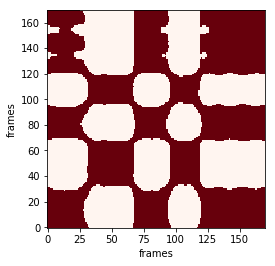
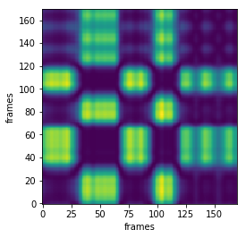

# GRU-Model with Openpose keypoints For imitation detection


```python
# -*- coding: utf-8 -*-
"""
Created on Wed Oct 25 17:27:47 2017

@author: isir
"""
import keras
import tensorflow as tf
import os, sys
from keras.layers import Dense, Flatten, Dropout,Activation  
from keras.models import Sequential  
from keras.layers.core import Dense, Activation  
from keras.layers.recurrent import LSTM
from keras.layers.recurrent import GRU
from keras.optimizers import *
from sklearn.preprocessing import StandardScaler
from sklearn.preprocessing import MinMaxScaler
import pandas as pd 
from sklearn.metrics.pairwise import euclidean_distances
from hyperopt import fmin, tpe, hp, Trials
import glob
import re
import numpy as np 
import matplotlib.pyplot as plt
from IPython.display import Image

```

### Class "GRUImitation" contains:
- preprocessing data
- Hyperparams optimization using bayesian optimization (gaussian process)
- training on optimal params
- draw keypoint evolution in time 
- draw recurrence matrix


```python
class GRUImitation(): 
    
    def __init__(self):
       
        #### Search space #####
        self.sp={'learning_rate': hp.uniform('learning_rate', 1e-06, 1e-02),
        'hidden_neurons':self.uniform_int('hidden_neurons', 20,500),
        'batch_size': self.loguniform_int('batch_size', 16, 171)}
        ##########step##############
        self.n_prev=11
        ###############chosing pose_keypoints############
        self.keypoints={'Nose':0, 'Neck': 1,'RShoulder': 2,'RElbow': 3, 'RWrist': 4, 'LShoulder': 5, 'LElbow': 6, 'LWrist': 7, 'RHip': 8, 'RKnee': 9,
                        'RAnkle': 10,'LHip': 11,'LKnee': 12,'LAnkle': 13,'REye': 14,'LEye': 15,'REar': 16,'LEar': 17,'Bkg': 18}
        self.keypoints_choice=['LWrist']
        
        choiceNum=[[(self.keypoints[a]*2),(self.keypoints[a]*2)+1] for a in self.keypoints_choice]
        choiceNum=np.array(choiceNum)
        self.choiceNum=np.unique(choiceNum.flatten())
        ######### gru or lstm input dimension #######
        self.dim=(self.choiceNum).shape[0]
        
        
        
    def atoi(self,text):
       return int(text) if text.isdigit() else text

    def natural_keys(self,text):
        return [ self.atoi(c) for c in re.split('(\d+)', text) ]

    ###########################################################data 1 #########################################################################################

       
    def get_dataframe(self,pointfile):
        drp=[ i for i in range(2,54,3)]
        points = sorted(glob.glob(pointfile+'\\*.json'))
        points.sort(key=self.natural_keys)
        data=pd.DataFrame()
        for i,p in enumerate(points):
            json=pd.read_json(points[i])
            data[i]=(json['people'][0]['pose_keypoints'])
        
        data=data.transpose()
        data.drop(data.columns[drp],axis=1,inplace=True)
        data.columns=range(36)
        data=data[self.choiceNum]
        data.columns=range(data.shape[1])
        print('data shape is ',data.shape)
        plt.plot(range(data.shape[0]),data[1])

        return data


    ##################### data preprocessing ##############################################

    def preproc(self,data):
        """
        -Scale data (MinMax or standard Scaler)
        -Eliminate 0 row and  0 columns  
        """
       

        ### scaling ####
        #scaler = StandardScaler()
        scaler=MinMaxScaler()
        scaler = scaler.fit(data)
        standardized = scaler.transform(data)
        standardizedDF=pd.DataFrame(standardized)
    
        return standardizedDF

    ############################################################# Transform data to gru-data 2 ##################################################

    def _load_data(self,data):  
        """
        data should be pd.DataFrame()
        """

        docX, docY = [], []
        for i in range(len(data)-self.n_prev):
            docX.append(data.iloc[i:i+self.n_prev].as_matrix())
            docY.append(data.iloc[i+self.n_prev].as_matrix())
        alsX = np.array(docX)
        alsY = np.array(docY)

        return alsX, alsY

    def train_test_split(self,df, test_size=0.1):  
        """
            This just splits data to training and testing parts
        """
        ntrn = round(len(df) * (1 - test_size))
        
        X_train, y_train = self._load_data(df.iloc[0:ntrn])
        X_test, y_test = self._load_data(df.iloc[ntrn:])

        return (X_train, y_train), (X_test, y_test)


    #############################################model 3 #####################################################################################################
    def GruModel(self,learning_rate,hidden_neurons,batch_size):
        callback=[]
        optimizer = Adam(lr=learning_rate, beta_1=0.9, beta_2=0.999, epsilon=1e-08, decay=0.0)
        in_out_neurons = self.dim  
        hidden_neurons = hidden_neurons

        model = Sequential()
        model.add(GRU(hidden_neurons, return_sequences=False,
               input_shape=(None, in_out_neurons),kernel_initializer='glorot_normal'))
        model.add(Dropout(0.8))
        model.add(Dense(in_out_neurons, input_dim=hidden_neurons))  
        model.add(Activation("linear"))  
        model.compile(loss="mean_squared_error", optimizer=optimizer)


        earlystopping=keras.callbacks.EarlyStopping(monitor='val_loss', min_delta=0.001, patience=4, verbose=1, mode='auto')
        callback.append(earlystopping)

        #filepath='C:\\Users\isir\\Desktop\\Imitation-LSTM\\modelCheckoint\\'+name+'.weights.best.hdf5'
        #ModelCheckpoint=keras.callbacks.ModelCheckpoint(filepath, monitor='val_loss', verbose=1, save_best_only=True, save_weights_only=True, mode='auto', period=1)

        hist=model.fit(self.X_train, self.y_train, epochs=2000, batch_size=batch_size, verbose=2,validation_split=0.30,shuffle=False, callbacks=callback)
        return hist,model


    #############################################################Hyperparameter optimization using HYPEROPT Parzen tree estimator################################
    def optimize(self,objectiveFunction,sp):
        trials_to_keep = Trials()
        space=sp
        best = fmin(objectiveFunction,
                    space=space,
                    algo=tpe.suggest,
                    max_evals=5, 
                    trials = trials_to_keep)
        return best

    def loguniform_int(self,name, lower, upper):
        # Do not forget to make a logarithm for the
        # lower and upper bounds.
        return hp.qloguniform(name, np.log(lower), np.log(upper), q=1)

    def uniform_int(self,name, lower, upper):
        # `quniform` returns:
        # round(uniform(low, high) / q) * q
        return hp.quniform(name, lower, upper, q=1)


    ####### objective function #####
    def objectiv_function(self,args):
        learning_rate = args['learning_rate']
        hidden_neurons= args['hidden_neurons']
        batch_size= args['batch_size']
        hist,model=self.GruModel(learning_rate,int(hidden_neurons),int(batch_size))
        a=float(hist.history['val_loss'][-1])
        return a
   

    ##################################################### Main ###########################################################################################
    def model_data(self,pointfile):
        #load data
        wail_df=self.get_dataframe(pointfile)
    
        #preproc data 
        wail_prep=self.preproc(wail_df)
    
        # training and test data for GRU with timestep 10
        (self.X_train, self.y_train), (self.X_test, self.y_test) = self.train_test_split(wail_prep) 

        ###### Finding hyperparams#####
        hyperparams=self.optimize(self.objectiv_function,self.sp) 

        ####### Test the hyperparams found  ###########
        hist,model=self.GruModel(hyperparams['learning_rate'],int(hyperparams['hidden_neurons']),int(hyperparams['batch_size']))
    
        return  model, (self.X_train, self.y_train), (self.X_test, self.y_test)
 
    
    def recurrence_matrix(self,E, S,w):
         """
         Rec Matrix
         """       
         Dij = np.zeros((E.shape[0], S.shape[0]))

         for i in range(E.shape[0]):
             for j in range(S.shape[0]):
                 if j>=i-w and j<=i+w:
                     Dij[i][j] = np.sum(np.square(E[j] - S[i]))
               
         return  Dij
     
    def plot_result(self,Dij,threshold,w): 
     
        RijS= np.where(Dij - threshold < 0, 1, 0) 
        for i in range(RijS.shape[0]):
            for j in range(RijS.shape[1]):
                if not(j>=i-w and j<=i+w):
                    RijS[i][j] =0
        fig=plt.figure()             
        plt.imshow(RijS,cmap='Reds',  interpolation='nearest')
        plt.gca().invert_yaxis()
        plt.xlabel('frames')
        plt.ylabel('frames')

        
        return RijS,fig
```

### Example of Openpose Keypoints


```python
display(Image(filename='../img/wail.png') )
display(Image(filename='../img/jean.png') )
     
```


```python
##### data path
pointfile_wail='C:\\Users\\isir\\Desktop\\keras_Realtime_Multi-Person_Pose_Estimation-master\\dataset\\training-gru\\wail_points'
pointfile_jean='C:\\Users\\isir\\Desktop\\keras_Realtime_Multi-Person_Pose_Estimation-master\\dataset\\training-gru\\jean_points'
########## instanciation
Gj=GRUImitation()
Gw=GRUImitation()

```

### Training


```python
###### wail left wrist model 
model_wail, (Xw_train, yw_train), (Xw_test, yw_test)=Gw.model_data(pointfile_wail)

```

    data shape is  (201, 2)
    Train on 118 samples, validate on 52 samples
    Epoch 1/2000
     - 1s - loss: 0.2416 - val_loss: 0.0868
    Epoch 2/2000
     - 0s - loss: 0.1274 - val_loss: 0.0609
    Epoch 3/2000
     - 0s - loss: 0.0702 - val_loss: 0.0438
    Epoch 4/2000
     - 0s - loss: 0.0781 - val_loss: 0.0523
    Epoch 5/2000
     - 0s - loss: 0.0653 - val_loss: 0.0509
    Epoch 6/2000
     - 0s - loss: 0.0552 - val_loss: 0.0423
    Epoch 7/2000
     - 0s - loss: 0.0504 - val_loss: 0.0368
    Epoch 8/2000
     - 0s - loss: 0.0426 - val_loss: 0.0376
    Epoch 9/2000
     - 0s - loss: 0.0354 - val_loss: 0.0386
    Epoch 10/2000
     - 0s - loss: 0.0355 - val_loss: 0.0358
    Epoch 11/2000
     - 0s - loss: 0.0324 - val_loss: 0.0321
    Epoch 12/2000
     - 0s - loss: 0.0297 - val_loss: 0.0318
    Epoch 13/2000
     - 0s - loss: 0.0320 - val_loss: 0.0327
    Epoch 14/2000
     - 0s - loss: 0.0301 - val_loss: 0.0315
    Epoch 15/2000
     - 0s - loss: 0.0278 - val_loss: 0.0301
    Epoch 16/2000
     - 0s - loss: 0.0288 - val_loss: 0.0303
    Epoch 17/2000
     - 0s - loss: 0.0255 - val_loss: 0.0314
    Epoch 18/2000
     - 0s - loss: 0.0234 - val_loss: 0.0325
    Epoch 19/2000
     - 0s - loss: 0.0225 - val_loss: 0.0326
    Epoch 00019: early stopping
    Train on 118 samples, validate on 52 samples
    Epoch 1/2000
     - 1s - loss: 0.4021 - val_loss: 0.1379
    Epoch 2/2000
     - 0s - loss: 0.1996 - val_loss: 0.0830
    Epoch 3/2000
     - 0s - loss: 0.0634 - val_loss: 0.1527
    Epoch 4/2000
     - 0s - loss: 0.1037 - val_loss: 0.1016
    Epoch 5/2000
     - 0s - loss: 0.0523 - val_loss: 0.0620
    Epoch 6/2000
     - 0s - loss: 0.0285 - val_loss: 0.0522
    Epoch 7/2000
     - 0s - loss: 0.0346 - val_loss: 0.0509
    Epoch 8/2000
     - 0s - loss: 0.0370 - val_loss: 0.0513
    Epoch 9/2000
     - 0s - loss: 0.0394 - val_loss: 0.0524
    Epoch 10/2000
     - 0s - loss: 0.0308 - val_loss: 0.0543
    Epoch 11/2000
     - 0s - loss: 0.0306 - val_loss: 0.0563
    Epoch 00011: early stopping
    Train on 118 samples, validate on 52 samples
    Epoch 1/2000
     - 1s - loss: 0.2455 - val_loss: 0.1964
    Epoch 2/2000
     - 0s - loss: 0.1201 - val_loss: 0.0557
    Epoch 3/2000
     - 0s - loss: 0.0474 - val_loss: 0.0472
    Epoch 4/2000
     - 0s - loss: 0.0511 - val_loss: 0.0511
    Epoch 5/2000
     - 0s - loss: 0.0307 - val_loss: 0.0596
    Epoch 6/2000
     - 0s - loss: 0.0311 - val_loss: 0.0620
    Epoch 7/2000
     - 0s - loss: 0.0355 - val_loss: 0.0368
    Epoch 8/2000
     - 0s - loss: 0.0225 - val_loss: 0.0299
    Epoch 9/2000
     - 0s - loss: 0.0248 - val_loss: 0.0286
    Epoch 10/2000
     - 0s - loss: 0.0199 - val_loss: 0.0302
    Epoch 11/2000
     - 0s - loss: 0.0202 - val_loss: 0.0332
    Epoch 12/2000
     - 0s - loss: 0.0157 - val_loss: 0.0326
    Epoch 13/2000
     - 0s - loss: 0.0178 - val_loss: 0.0283
    Epoch 00013: early stopping
    Train on 118 samples, validate on 52 samples
    Epoch 1/2000
     - 1s - loss: 0.2446 - val_loss: 0.1708
    Epoch 2/2000
     - 0s - loss: 0.1110 - val_loss: 0.0481
    Epoch 3/2000
     - 0s - loss: 0.0405 - val_loss: 0.0491
    Epoch 4/2000
     - 0s - loss: 0.0410 - val_loss: 0.0455
    Epoch 5/2000
     - 0s - loss: 0.0231 - val_loss: 0.0544
    Epoch 6/2000
     - 0s - loss: 0.0287 - val_loss: 0.0400
    Epoch 7/2000
     - 0s - loss: 0.0210 - val_loss: 0.0327
    Epoch 8/2000
     - 0s - loss: 0.0229 - val_loss: 0.0341
    Epoch 9/2000
     - 0s - loss: 0.0266 - val_loss: 0.0299
    Epoch 10/2000
     - 0s - loss: 0.0196 - val_loss: 0.0313
    Epoch 11/2000
     - 0s - loss: 0.0222 - val_loss: 0.0299
    Epoch 12/2000
     - 0s - loss: 0.0269 - val_loss: 0.0273
    Epoch 13/2000
     - 0s - loss: 0.0153 - val_loss: 0.0282
    Epoch 14/2000
     - 0s - loss: 0.0208 - val_loss: 0.0278
    Epoch 15/2000
     - 0s - loss: 0.0170 - val_loss: 0.0288
    Epoch 16/2000
     - 0s - loss: 0.0160 - val_loss: 0.0306
    Epoch 00016: early stopping
    Train on 118 samples, validate on 52 samples
    Epoch 1/2000
     - 1s - loss: 0.3298 - val_loss: 0.0761
    Epoch 2/2000
     - 0s - loss: 0.0718 - val_loss: 0.2023
    Epoch 3/2000
     - 0s - loss: 0.2047 - val_loss: 0.0508
    Epoch 4/2000
     - 0s - loss: 0.0440 - val_loss: 0.0513
    Epoch 5/2000
     - 0s - loss: 0.0618 - val_loss: 0.0594
    Epoch 6/2000
     - 0s - loss: 0.0934 - val_loss: 0.0598
    Epoch 7/2000
     - 0s - loss: 0.0836 - val_loss: 0.0547
    Epoch 00007: early stopping
    Train on 118 samples, validate on 52 samples
    Epoch 1/2000
     - 1s - loss: 0.2459 - val_loss: 0.1766
    Epoch 2/2000
     - 0s - loss: 0.0964 - val_loss: 0.0537
    Epoch 3/2000
     - 0s - loss: 0.0410 - val_loss: 0.0506
    Epoch 4/2000
     - 0s - loss: 0.0378 - val_loss: 0.0500
    Epoch 5/2000
     - 0s - loss: 0.0239 - val_loss: 0.0538
    Epoch 6/2000
     - 0s - loss: 0.0301 - val_loss: 0.0383
    Epoch 7/2000
     - 0s - loss: 0.0197 - val_loss: 0.0314
    Epoch 8/2000
     - 0s - loss: 0.0185 - val_loss: 0.0313
    Epoch 9/2000
     - 0s - loss: 0.0170 - val_loss: 0.0310
    Epoch 10/2000
     - 0s - loss: 0.0177 - val_loss: 0.0322
    Epoch 11/2000
     - 0s - loss: 0.0194 - val_loss: 0.0279
    Epoch 12/2000
     - 0s - loss: 0.0147 - val_loss: 0.0271
    Epoch 13/2000
     - 0s - loss: 0.0169 - val_loss: 0.0290
    Epoch 14/2000
     - 0s - loss: 0.0189 - val_loss: 0.0268
    Epoch 15/2000
     - 0s - loss: 0.0127 - val_loss: 0.0263
    Epoch 16/2000
     - 0s - loss: 0.0148 - val_loss: 0.0275
    Epoch 17/2000
     - 0s - loss: 0.0167 - val_loss: 0.0277
    Epoch 18/2000
     - 0s - loss: 0.0145 - val_loss: 0.0268
    Epoch 00018: early stopping


```python
### jean left wrist train 
model_jean, (Xj_train, yj_train), (Xj_test, yj_test)=Gj.model_data(pointfile_jean)
```

    data shape is  (201, 2)
    Train on 118 samples, validate on 52 samples
    Epoch 1/2000
     - 1s - loss: 0.4983 - val_loss: 0.0511
    Epoch 2/2000
     - 0s - loss: 0.0845 - val_loss: 0.0638
    Epoch 3/2000
     - 0s - loss: 0.1315 - val_loss: 0.0387
    Epoch 4/2000
     - 0s - loss: 0.0883 - val_loss: 0.0179
    Epoch 5/2000
     - 0s - loss: 0.0428 - val_loss: 0.0329
    Epoch 6/2000
     - 0s - loss: 0.0518 - val_loss: 0.0106
    Epoch 7/2000
     - 0s - loss: 0.0332 - val_loss: 0.0071
    Epoch 8/2000
     - 0s - loss: 0.0245 - val_loss: 0.3420
    Epoch 9/2000
     - 0s - loss: 0.4463 - val_loss: 0.0238
    Epoch 10/2000
     - 0s - loss: 0.0556 - val_loss: 0.0427
    Epoch 11/2000
     - 0s - loss: 0.0863 - val_loss: 0.0335
    Epoch 00011: early stopping
    Train on 118 samples, validate on 52 samples
    Epoch 1/2000
     - 1s - loss: 0.3250 - val_loss: 0.0700
    Epoch 2/2000
     - 0s - loss: 0.1157 - val_loss: 0.0267
    Epoch 3/2000
     - 0s - loss: 0.0922 - val_loss: 0.0089
    Epoch 4/2000
     - 0s - loss: 0.0548 - val_loss: 0.0430
    Epoch 5/2000
     - 0s - loss: 0.0608 - val_loss: 0.0126
    Epoch 6/2000
     - 0s - loss: 0.0448 - val_loss: 0.0065
    Epoch 7/2000
     - 0s - loss: 0.0419 - val_loss: 0.0047
    Epoch 8/2000
     - 0s - loss: 0.0296 - val_loss: 0.0080
    Epoch 9/2000
     - 0s - loss: 0.0325 - val_loss: 0.0068
    Epoch 10/2000
     - 0s - loss: 0.0354 - val_loss: 0.0041
    Epoch 11/2000
     - 0s - loss: 0.0354 - val_loss: 0.0052
    Epoch 00011: early stopping
    Train on 118 samples, validate on 52 samples
    Epoch 1/2000
     - 1s - loss: 0.4679 - val_loss: 0.2329
    Epoch 2/2000
     - 0s - loss: 0.3662 - val_loss: 0.1991
    Epoch 3/2000
     - 0s - loss: 0.3083 - val_loss: 0.1695
    Epoch 4/2000
     - 0s - loss: 0.2696 - val_loss: 0.1436
    Epoch 5/2000
     - 0s - loss: 0.2187 - val_loss: 0.1209
    Epoch 6/2000
     - 0s - loss: 0.1726 - val_loss: 0.1016
    Epoch 7/2000
     - 0s - loss: 0.1327 - val_loss: 0.0870
    Epoch 8/2000
     - 0s - loss: 0.1131 - val_loss: 0.0769
    Epoch 9/2000
     - 0s - loss: 0.1042 - val_loss: 0.0701
    Epoch 10/2000
     - 0s - loss: 0.1102 - val_loss: 0.0646
    Epoch 11/2000
     - 0s - loss: 0.0956 - val_loss: 0.0594
    Epoch 12/2000
     - 0s - loss: 0.1053 - val_loss: 0.0518
    Epoch 13/2000
     - 0s - loss: 0.0922 - val_loss: 0.0429
    Epoch 14/2000
     - 0s - loss: 0.0829 - val_loss: 0.0348
    Epoch 15/2000
     - 0s - loss: 0.0853 - val_loss: 0.0282
    Epoch 16/2000
     - 0s - loss: 0.0613 - val_loss: 0.0241
    Epoch 17/2000
     - 0s - loss: 0.0647 - val_loss: 0.0217
    Epoch 18/2000
     - 0s - loss: 0.0623 - val_loss: 0.0199
    Epoch 19/2000
     - 0s - loss: 0.0560 - val_loss: 0.0187
    Epoch 20/2000
     - 0s - loss: 0.0534 - val_loss: 0.0181
    Epoch 21/2000
     - 0s - loss: 0.0587 - val_loss: 0.0175
    Epoch 22/2000
     - 0s - loss: 0.0558 - val_loss: 0.0171
    Epoch 23/2000
     - 0s - loss: 0.0559 - val_loss: 0.0170
    Epoch 24/2000
     - 0s - loss: 0.0533 - val_loss: 0.0171
    Epoch 25/2000
     - 0s - loss: 0.0538 - val_loss: 0.0172
    Epoch 00025: early stopping
    Train on 118 samples, validate on 52 samples
    Epoch 1/2000
     - 1s - loss: 0.3442 - val_loss: 0.0749
    Epoch 2/2000
     - 0s - loss: 0.1203 - val_loss: 0.0205
    Epoch 3/2000
     - 0s - loss: 0.0544 - val_loss: 0.0134
    Epoch 4/2000
     - 0s - loss: 0.0566 - val_loss: 0.0192
    Epoch 5/2000
     - 0s - loss: 0.0424 - val_loss: 0.0114
    Epoch 6/2000
     - 0s - loss: 0.0317 - val_loss: 0.0065
    Epoch 7/2000
     - 0s - loss: 0.0309 - val_loss: 0.0117
    Epoch 8/2000
     - 0s - loss: 0.0247 - val_loss: 0.0047
    Epoch 9/2000
     - 0s - loss: 0.0254 - val_loss: 0.0150
    Epoch 10/2000
     - 0s - loss: 0.0279 - val_loss: 0.0046
    Epoch 11/2000
     - 0s - loss: 0.0224 - val_loss: 0.0038
    Epoch 12/2000
     - 0s - loss: 0.0186 - val_loss: 0.0101
    Epoch 00012: early stopping
    Train on 118 samples, validate on 52 samples
    Epoch 1/2000
     - 1s - loss: 0.4507 - val_loss: 0.1554
    Epoch 2/2000
     - 0s - loss: 0.3615 - val_loss: 0.1011
    Epoch 3/2000
     - 0s - loss: 0.2766 - val_loss: 0.0669
    Epoch 4/2000
     - 0s - loss: 0.2008 - val_loss: 0.0471
    Epoch 5/2000
     - 0s - loss: 0.1567 - val_loss: 0.0386
    Epoch 6/2000
     - 0s - loss: 0.1581 - val_loss: 0.0332
    Epoch 7/2000
     - 0s - loss: 0.1351 - val_loss: 0.0256
    Epoch 8/2000
     - 0s - loss: 0.1197 - val_loss: 0.0187
    Epoch 9/2000
     - 0s - loss: 0.1108 - val_loss: 0.0143
    Epoch 10/2000
     - 0s - loss: 0.1103 - val_loss: 0.0129
    Epoch 11/2000
     - 0s - loss: 0.1030 - val_loss: 0.0135
    Epoch 12/2000
     - 0s - loss: 0.1073 - val_loss: 0.0146
    Epoch 13/2000
     - 0s - loss: 0.0975 - val_loss: 0.0163
    Epoch 14/2000
     - 0s - loss: 0.0928 - val_loss: 0.0172
    Epoch 00014: early stopping
    Train on 118 samples, validate on 52 samples
    Epoch 1/2000
     - 1s - loss: 0.3338 - val_loss: 0.0870
    Epoch 2/2000
     - 0s - loss: 0.1109 - val_loss: 0.0445
    Epoch 3/2000
     - 0s - loss: 0.0870 - val_loss: 0.0265
    Epoch 4/2000
     - 0s - loss: 0.0538 - val_loss: 0.0203
    Epoch 5/2000
     - 0s - loss: 0.0558 - val_loss: 0.0047
    Epoch 6/2000
     - 0s - loss: 0.0475 - val_loss: 0.0124
    Epoch 7/2000
     - 0s - loss: 0.0440 - val_loss: 0.0050
    Epoch 8/2000
     - 0s - loss: 0.0334 - val_loss: 0.0073
    Epoch 9/2000
     - 0s - loss: 0.0371 - val_loss: 0.0067
    Epoch 00009: early stopping


### Cross-prediction


```python
#### cross prediction 
wj=model_wail.predict(Xj_train) #  wail(jean)
ww=model_wail.predict(Xw_train)# wail(wail)
######################################################################
jw=model_jean.predict(Xw_train) # jean(wail)
jj=jw=model_jean.predict(Xj_train)# jean(jean)
```

### Recurrence matrix


```python
######## recurrence matrix: similarity of jean and wail frames
%matplotlib inline

Dij=Gw.recurrence_matrix(jw[:253], wj[:253],w=2000) 
Gw.plot_result(Dij,threshold=0.2,w=2000)
```


    (array([[1, 1, 1, ..., 1, 1, 1],
            [1, 1, 1, ..., 1, 1, 1],
            [1, 1, 1, ..., 1, 1, 1],
            ..., 
            [1, 1, 1, ..., 1, 1, 1],
            [1, 1, 1, ..., 1, 1, 1],
            [1, 1, 1, ..., 1, 1, 1]]), <matplotlib.figure.Figure at 0x1cdae3d9630>)





```python
plt.imshow(Dij)
plt.gca().invert_yaxis()
plt.xlabel('frames')
plt.ylabel('frames')
```


    Text(0,0.5,'frames')




