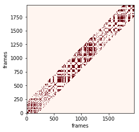

# Example: oneclassSVM
Try running this on your jupyther notebook by downloading:

[oneclassSVM notebook](https://github.com/Wail13/SyncPy/tree/master/examples)

```python
### This software is a computer program whose for investigating
### synchrony in a fast and exhaustive way. 
### 
### This software is governed by the CeCILL-B license under French law
### and abiding by the rules of distribution of free software.  You
### can use, modify and/ or redistribute the software under the terms
### of the CeCILL-B license as circulated by CEA, CNRS and INRIA at the
### following URL "http://www.cecill.info".

### As a counterpart to the access to the source code and rights to
### copy, modify and redistribute granted by the license, users are
### provided only with a limited warranty and the software's author,
### the holder of the economic rights, and the successive licensors
### have only limited liability.
### 
### In this respect, the user's attention is drawn to the risks
### associated with loading, using, modifying and/or developing or
### reproducing the software by the user in light of its specific
### status of free software, that may mean that it is complicated to
### manipulate, and that also therefore means that it is reserved for
### developers and experienced professionals having in-depth computer
### knowledge. Users are therefore encouraged to load and test the
### software's suitability as regards their requirements in conditions
### enabling the security of their systems and/or data to be ensured
### and, more generally, to use and operate it in the same conditions
### as regards security.
### 
### The fact that you are presently reading this means that you have
### had knowledge of the CeCILL-B license and that you accept its terms.
```


```python
import pandas as pd
import numpy as np
from keras.callbacks import TensorBoard, ModelCheckpoint, EarlyStopping, CSVLogger
import time
from keras.layers import Dense, Flatten, Dropout,Activation  
from keras.layers.recurrent import LSTM
from keras.models import Sequential, load_model
from keras.optimizers import *
from keras.layers.wrappers import TimeDistributed
from keras.layers.convolutional import (Conv2D, MaxPooling3D, Conv3D,
    MaxPooling2D)
from collections import deque
import sys
from keras import initializers
import os    
import keras
from keras.wrappers.scikit_learn import KerasRegressor 
from sklearn.decomposition import PCA
import matplotlib.pyplot as plt
from sklearn import preprocessing
from sklearn.model_selection import GridSearchCV
from hyperopt import fmin, tpe, hp, Trials
```

    Using TensorFlow backend.
    

## Plot the reccurence matrix


```python
def plot_result(interpol='nearest'):
        """
        This method is not fully functional. it is used for test purposes only
        """
        x=[]
        y=[]
        plt.rcParams.update(plt.rcParamsDefault)

        for index, v in np.ndenumerate(self.res[0]):
            if v==1:
                x.append(index[0])
                y.append(index[1])
        
        H, xedges, yedges = np.histogram2d(x, y, normed=True)
        extent = [yedges[0], yedges[-1], xedges[-1], xedges[0]]
        plt.imshow(H, extent=extent, interpolation=interpol)
        plt.gca().invert_yaxis()
        plt.show()
        
        
def plot_result2(Dij,threshold=0.01,w=200):   
        min_max_scaler = preprocessing.MinMaxScaler(feature_range=(0, 1))
        DijS = min_max_scaler.fit_transform(Dij)
        RijS= np.where(DijS - threshold < 0, 1, 0) 
        for i in range(RijS.shape[0]):
            for j in range(RijS.shape[1]):
                if not(j>=i-w and j<=i+w):
                    RijS[i][j] =0
        fig=plt.figure()             
        plt.imshow(RijS,cmap='Reds',  interpolation='nearest')
        plt.gca().invert_yaxis()
        plt.xlabel('frames')
        plt.ylabel('frames')
        plt.show()
     
```

## Pre-processing data (CNN-features)


```python

def applypca(data):
    pca = PCA(n_components=2048)
    X = pca.fit_transform(data)
    expvar=pca.explained_variance_ratio_*100
    for i in range(len(expvar)+1):
            if sum(expvar[:i]) > 99:
                var= sum(expvar[:i])
                ncomponent=i
                break
        
    print("######## Done applying PCA###############")
    print("Number of pc is:  "+str(ncomponent))
    return X,ncomponent


def _load_data(data, n_prev = 12):  
    docX, docY = [],[]
    for i in range(len(data)-n_prev):
        docX.append(data.iloc[i:i+n_prev].as_matrix())
        docY.append(data.iloc[i+n_prev].as_matrix())
    alsX = np.array(docX)
    alsY = np.array(docY)

    return alsX, alsY

def train_test_split(df, test_size=0.1):  
     ntrn = round(len(df) * (1 - test_size))
     X_train, y_train = _load_data(df.iloc[0:ntrn])
     X_test, y_test = _load_data(df.iloc[ntrn:])

     return (X_train, y_train), (X_test, y_test)

def scaleDataframe(df):
        dataset = preprocessing.scale(df)
        pcaData,ncomponenet=applypca(dataset)
        df=pd.DataFrame(pcaData)
        return df,ncomponenet

def filters(pred):
        predS=(np.square(pred))
        S=np.sum(predS,axis=1)
     
        return S
```

## Loading Data (CNN-features)


```python
 def loadingData(augment=3):
        dfE=pd.read_csv('data\\cnn-features\\Wail.txt',header=None, sep=r"\s+")
        dfS=pd.read_csv('data\\cnn-features\\Jean.txt',header=None, sep=r"\s+")
            
        dfPcaE,nc1=scaleDataframe(dfE)
        dfPcaS,nc2=scaleDataframe(dfS)
        nc=max(nc1,nc2)
        dfe=dfPcaE.iloc[:,0:nc]
        dfs=dfPcaS.iloc[:,0:nc]
        for i in range(augment):
            dfe=dfe.append(dfe)
            dfs=dfs.append(dfs)
 
        (XE_train, yE_train), (XE_test, yE_test) = train_test_split(dfe)  # retrieve data
        (XS_train, yS_train), (XS_test, yS_test) = train_test_split(dfs)  # retrieve data
             
        return (XE_train, yE_train), (XE_test, yE_test),(XE_train, yE_train), (XE_test, yE_test)
```


```python
(XE_train, yE_train), (XE_test, yE_test),(XS_train, yS_train), (XS_test, yS_test)=loadingData(augment=1)

```

    ######## Done applying PCA###############
    Number of pc is:  404
    ######## Done applying PCA###############
    Number of pc is:  418
    


```python
print('##### Wail training data #####')
print(XE_train.shape,yE_train.shape)
print('##### Jean training data #####')
print(XS_train.shape,yS_train.shape)
```

    ##### Wail training data #####
    (1966, 12, 418) (1966, 418)
    ##### Jean training data #####
    (1966, 12, 418) (1966, 418)
    

## Model training

### Keras model 


```python
def modelLSTM(name,Xtrain,Ytrain,hyeropt=False,learning_rate=0.0007, hidden_neurons=10,epoch=100,batch_size=400,validation_split=0.30
                 ,in_out_neurons=418
                ,dropout_rate=0.2,Shuffle=False,min_delta=0.01, patience=5):
       #optimizer used
        optimizer = Adam(lr=learning_rate, beta_1=0.9, beta_2=0.999, epsilon=1e-08, decay=0.0)
        callback=[]
    
       #define the model
        model = Sequential()
        model.add(LSTM(hidden_neurons, return_sequences=False,
               input_shape=(None, in_out_neurons), kernel_initializer='glorot_normal',dropout=dropout_rate))
        model.add(Dropout(dropout_rate))
        model.add(Dense(in_out_neurons, input_dim=hidden_neurons))  
        model.add(Activation("linear")) 
       
       #load model best weight warm start
        if  os.path.exists('modelCheckoint\\modelCheckpoint\\'+name+'.weights.best.hdf5') > 0 and not(hyeropt):
            print('--------Loading weights----------')
            model.load_weights('modelCheckoint\\modelCheckpoint\\'+name+'.weights.best.hdf5')
           
      
        model.compile(loss="mean_squared_error", optimizer=optimizer)
        #early stopping
        earlystopping=keras.callbacks.EarlyStopping(monitor='val_loss', min_delta=min_delta, patience=patience, verbose=1, mode='auto')
        callback.append(earlystopping)
        if not(hyeropt):
           #model checkpoint
           filepath='C:\\Users\isir\\Desktop\\Imitation-LSTM\\modelCheckoint\\'+name+'.weights.best.hdf5'
           ModelCheckpoint=keras.callbacks.ModelCheckpoint(filepath, monitor='val_loss', verbose=1, save_best_only=True, save_weights_only=True, mode='auto', period=1)
#           tensorboard
#           logdr='C:\\Users\\isir\\Desktop\\Imitation-LSTM\\logs\\log'+name
#           tensorboard=keras.callbacks.TensorBoard(log_dir=logdr, histogram_freq=0, write_graph=True, write_images=False, embeddings_freq=0, embeddings_layer_names=None, embeddings_metadata=None)
#           callback.append(tensorboard)
#           callback.append(ModelCheckpoint)
           
         
        hist=model.fit(Xtrain, Ytrain, epochs=epoch, batch_size=batch_size, verbose=2,validation_split=0.30,shuffle=Shuffle, callbacks=callback)
                        
        return model ,hist
```

### Hyperparameter optimization using 'hyperopt' 


```python
    #batchsize and hidden neurons search space 
    minBH=int(XE_train.shape[0]/4)-50
    maxBH=int(XE_train.shape[0]/4)+50
    # search space for learning rate
    spr={'x': hp.uniform('x', 1e-06, 1e-02)}
    # search space for hidden neurons and batchsize
    sphb={'x': hp.uniform('x', minBH-50,maxBH+50),'y': hp.uniform('y', minBH,maxBH)}
```


```python
def modelRE(args):
       x = args['x']
       print(x)
       model,hist=modelLSTM('E',XE_train,yE_train,hyeropt=True,hidden_neurons=10,
                            learning_rate=float(x),epoch=100,batch_size=400,validation_split=0.30,min_delta=0.01, patience=4)
       a=float(hist.history['val_loss'][-1])
       return a
   
    
def modelHBE(args):
       x = args['x']
       y = args['y']
       print(x)
       model,hist=modelLSTM('E',XE_train,yE_train,hyeropt=True,hidden_neurons=int(x),learning_rate= 0.00397005172386008,epoch=1000,batch_size=int(y))
       a=float(hist.history['val_loss'][-1])
       return a
   
def modelRS(args):
       x = args['x']
       print(x)
       model,hist=modelLSTM('S',XS_train,yS_train,hyeropt=True,hidden_neurons=10,
                            learning_rate=float(x),epoch=100,batch_size=400,validation_split=0.30,min_delta=0.01, patience=4)
       a=float(hist.history['val_loss'][-1])
       return a
   
    
def modelHBS(args):
       x = args['x']
       y = args['y']
       print(x)
       model,hist=modelLSTM('S',XS_train,yS_train,hyeropt=True,hidden_neurons=int(x),learning_rate= 0.00397005172386008,epoch=1000,batch_size=int(y))
       a=float(hist.history['val_loss'][-1])
       return a
```


```python
def optimize(objectiveFunction,sp):
        trials_to_keep = Trials()
        space=sp
        best = fmin(objectiveFunction,
            space=space,
            algo=tpe.suggest,
            max_evals=10, 
            trials = trials_to_keep)
        return best
```


```python
    # finding best hyperparams for E Wail
    bestlearningRateE=optimize(modelRE,spr)
    bestBatchHiddenNeuronsE=optimize(modelHBE,sphb)
    
    #finding best hyperparams for S  Jean
    bestlearningRateS=optimize(modelRS,spr)
    bestBatchHiddenNeuronsS=optimize(modelHBS,sphb)
    
    
    print("hyperparams optimization take too long ")
    
```

    0.00941433860793902
    Train on 1376 samples, validate on 590 samples
    Epoch 1/100
    2s - loss: 4.7681 - val_loss: 4.5333
    Epoch 2/100
    0s - loss: 4.7370 - val_loss: 4.5157
    Epoch 3/100
    0s - loss: 4.7096 - val_loss: 4.4987
    Epoch 4/100
    0s - loss: 4.6829 - val_loss: 4.4823
    Epoch 5/100
    0s - loss: 4.6572 - val_loss: 4.4647
    Epoch 6/100
    0s - loss: 4.6301 - val_loss: 4.4464
    Epoch 7/100
    0s - loss: 4.6065 - val_loss: 4.4265
    Epoch 8/100
    0s - loss: 4.5820 - val_loss: 4.4051
    Epoch 9/100
    0s - loss: 4.5525 - val_loss: 4.3837
    Epoch 10/100
    0s - loss: 4.5234 - val_loss: 4.3618
    Epoch 11/100
    0s - loss: 4.5005 - val_loss: 4.3401
    Epoch 12/100
    0s - loss: 4.4691 - val_loss: 4.3183
    Epoch 13/100
    0s - loss: 4.4507 - val_loss: 4.2968
    Epoch 14/100
    0s - loss: 4.4259 - val_loss: 4.2755
    Epoch 15/100
    0s - loss: 4.3961 - val_loss: 4.2549
    Epoch 16/100
    0s - loss: 4.3682 - val_loss: 4.2332
    Epoch 17/100
    0s - loss: 4.3457 - val_loss: 4.2115
    Epoch 18/100
    0s - loss: 4.3242 - val_loss: 4.1900
    Epoch 19/100
    0s - loss: 4.2999 - val_loss: 4.1687
    Epoch 20/100
    0s - loss: 4.2785 - val_loss: 4.1481
    Epoch 21/100
    0s - loss: 4.2558 - val_loss: 4.1276
    Epoch 22/100
    0s - loss: 4.2385 - val_loss: 4.1077
    Epoch 23/100
    0s - loss: 4.2145 - val_loss: 4.0884
    Epoch 24/100
    0s - loss: 4.1868 - val_loss: 4.0697
    Epoch 25/100
    0s - loss: 4.1644 - val_loss: 4.0512
    Epoch 26/100
    0s - loss: 4.1532 - val_loss: 4.0338
    Epoch 27/100
    0s - loss: 4.1308 - val_loss: 4.0164
    Epoch 28/100
    0s - loss: 4.1211 - val_loss: 3.9994
    Epoch 29/100
    0s - loss: 4.0995 - val_loss: 3.9825
    Epoch 30/100
    0s - loss: 4.0765 - val_loss: 3.9662
    Epoch 31/100
    0s - loss: 4.0572 - val_loss: 3.9511
    Epoch 32/100
    0s - loss: 4.0391 - val_loss: 3.9347
    Epoch 33/100
    0s - loss: 4.0249 - val_loss: 3.9183
    Epoch 34/100
    0s - loss: 4.0128 - val_loss: 3.9009
    Epoch 35/100
    0s - loss: 3.9821 - val_loss: 3.8847
    Epoch 36/100
    0s - loss: 3.9759 - val_loss: 3.8692
    Epoch 37/100
    0s - loss: 3.9582 - val_loss: 3.8543
    Epoch 38/100
    0s - loss: 3.9404 - val_loss: 3.8390
    Epoch 39/100
    0s - loss: 3.9159 - val_loss: 3.8243
    Epoch 40/100
    0s - loss: 3.9081 - val_loss: 3.8097
    Epoch 41/100
    0s - loss: 3.8856 - val_loss: 3.7954
    Epoch 42/100
    0s - loss: 3.8782 - val_loss: 3.7798
    Epoch 43/100
    0s - loss: 3.8602 - val_loss: 3.7644
    Epoch 44/100
    0s - loss: 3.8448 - val_loss: 3.7495
    Epoch 45/100
    0s - loss: 3.8479 - val_loss: 3.7365
    Epoch 46/100
    0s - loss: 3.8209 - val_loss: 3.7225
    Epoch 47/100
    0s - loss: 3.8082 - val_loss: 3.7098
    Epoch 48/100
    0s - loss: 3.7885 - val_loss: 3.6966
    Epoch 49/100
    0s - loss: 3.7797 - val_loss: 3.6817
    Epoch 50/100
    0s - loss: 3.7851 - val_loss: 3.6659
    Epoch 51/100
    0s - loss: 3.7486 - val_loss: 3.6505
    Epoch 52/100
    0s - loss: 3.7280 - val_loss: 3.6364
    Epoch 53/100
    0s - loss: 3.7382 - val_loss: 3.6230
    Epoch 54/100
    0s - loss: 3.7151 - val_loss: 3.6104
    Epoch 55/100
    0s - loss: 3.6979 - val_loss: 3.5997
    Epoch 56/100
    0s - loss: 3.6939 - val_loss: 3.5882
    Epoch 57/100
    0s - loss: 3.6785 - val_loss: 3.5747
    Epoch 58/100
    0s - loss: 3.6604 - val_loss: 3.5616
    Epoch 59/100
    0s - loss: 3.6491 - val_loss: 3.5459
    Epoch 60/100
    0s - loss: 3.6402 - val_loss: 3.5326
    Epoch 61/100
    0s - loss: 3.6395 - val_loss: 3.5202
    Epoch 62/100
    0s - loss: 3.6239 - val_loss: 3.5091
    Epoch 63/100
    0s - loss: 3.6258 - val_loss: 3.4993
    Epoch 64/100
    0s - loss: 3.6024 - val_loss: 3.4890
    Epoch 65/100
    0s - loss: 3.6029 - val_loss: 3.4787
    Epoch 66/100
    0s - loss: 3.5883 - val_loss: 3.4685
    Epoch 67/100
    0s - loss: 3.5835 - val_loss: 3.4563
    Epoch 68/100
    0s - loss: 3.5720 - val_loss: 3.4444
    Epoch 69/100
    0s - loss: 3.5534 - val_loss: 3.4328
    Epoch 70/100
    0s - loss: 3.5429 - val_loss: 3.4229
    Epoch 71/100
    0s - loss: 3.5457 - val_loss: 3.4139
    Epoch 72/100
    0s - loss: 3.5177 - val_loss: 3.4045
    Epoch 73/100
    0s - loss: 3.5214 - val_loss: 3.3955
    Epoch 74/100
    0s - loss: 3.5063 - val_loss: 3.3848
    Epoch 75/100
    0s - loss: 3.5104 - val_loss: 3.3744
    Epoch 76/100
    0s - loss: 3.4992 - val_loss: 3.3664
    Epoch 77/100
    0s - loss: 3.4849 - val_loss: 3.3585
    Epoch 78/100
    0s - loss: 3.4795 - val_loss: 3.3507
    Epoch 79/100
    0s - loss: 3.4581 - val_loss: 3.3411
    Epoch 80/100
    0s - loss: 3.4566 - val_loss: 3.3317
    Epoch 81/100
    0s - loss: 3.4696 - val_loss: 3.3221
    Epoch 82/100
    0s - loss: 3.4436 - val_loss: 3.3142
    Epoch 83/100
    0s - loss: 3.4255 - val_loss: 3.3054
    Epoch 84/100
    0s - loss: 3.4309 - val_loss: 3.2956
    Epoch 85/100
    0s - loss: 3.4265 - val_loss: 3.2864
    Epoch 86/100
    0s - loss: 3.4177 - val_loss: 3.2791
    Epoch 87/100
    0s - loss: 3.4171 - val_loss: 3.2724
    Epoch 88/100
    0s - loss: 3.3926 - val_loss: 3.2646
    Epoch 89/100
    0s - loss: 3.4034 - val_loss: 3.2577
    Epoch 90/100
    0s - loss: 3.3930 - val_loss: 3.2514
    Epoch 91/100
    0s - loss: 3.3857 - val_loss: 3.2443
    Epoch 92/100
    0s - loss: 3.3739 - val_loss: 3.2368
    Epoch 93/100
    0s - loss: 3.3688 - val_loss: 3.2295
    Epoch 94/100
    0s - loss: 3.3816 - val_loss: 3.2221
    Epoch 95/100
    0s - loss: 3.3707 - val_loss: 3.2152
    Epoch 96/100
    0s - loss: 3.3591 - val_loss: 3.2088
    Epoch 97/100
    0s - loss: 3.3663 - val_loss: 3.2023
    Epoch 98/100
    0s - loss: 3.3463 - val_loss: 3.1967
    Epoch 99/100
    0s - loss: 3.3395 - val_loss: 3.1891
    Epoch 100/100
    0s - loss: 3.3285 - val_loss: 3.1828
    0.007474085229514992
    Train on 1376 samples, validate on 590 samples
    Epoch 1/100
    1s - loss: 4.7701 - val_loss: 4.5374
    Epoch 2/100
    0s - loss: 4.7424 - val_loss: 4.5208
    Epoch 3/100
    0s - loss: 4.7222 - val_loss: 4.5066
    Epoch 4/100
    0s - loss: 4.7010 - val_loss: 4.4929
    Epoch 5/100
    0s - loss: 4.6792 - val_loss: 4.4795
    Epoch 6/100
    0s - loss: 4.6558 - val_loss: 4.4657
    Epoch 7/100
    0s - loss: 4.6331 - val_loss: 4.4507
    Epoch 8/100
    0s - loss: 4.6096 - val_loss: 4.4337
    Epoch 9/100
    0s - loss: 4.5850 - val_loss: 4.4153
    Epoch 10/100
    0s - loss: 4.5601 - val_loss: 4.3962
    Epoch 11/100
    0s - loss: 4.5359 - val_loss: 4.3763
    Epoch 12/100
    0s - loss: 4.5126 - val_loss: 4.3571
    Epoch 13/100
    0s - loss: 4.4861 - val_loss: 4.3379
    Epoch 14/100
    0s - loss: 4.4624 - val_loss: 4.3185
    Epoch 15/100
    0s - loss: 4.4350 - val_loss: 4.2990
    Epoch 16/100
    0s - loss: 4.4142 - val_loss: 4.2795
    Epoch 17/100
    0s - loss: 4.3965 - val_loss: 4.2603
    Epoch 18/100
    0s - loss: 4.3680 - val_loss: 4.2410
    Epoch 19/100
    0s - loss: 4.3439 - val_loss: 4.2215
    Epoch 20/100
    0s - loss: 4.3205 - val_loss: 4.2033
    Epoch 21/100
    0s - loss: 4.2996 - val_loss: 4.1850
    Epoch 22/100
    0s - loss: 4.2799 - val_loss: 4.1664
    Epoch 23/100
    0s - loss: 4.2604 - val_loss: 4.1482
    Epoch 24/100
    0s - loss: 4.2461 - val_loss: 4.1299
    Epoch 25/100
    0s - loss: 4.2180 - val_loss: 4.1109
    Epoch 26/100
    0s - loss: 4.1974 - val_loss: 4.0925
    Epoch 27/100
    0s - loss: 4.1770 - val_loss: 4.0746
    Epoch 28/100
    0s - loss: 4.1612 - val_loss: 4.0564
    Epoch 29/100
    0s - loss: 4.1400 - val_loss: 4.0382
    Epoch 30/100
    0s - loss: 4.1268 - val_loss: 4.0198
    Epoch 31/100
    0s - loss: 4.1071 - val_loss: 4.0021
    Epoch 32/100
    0s - loss: 4.0926 - val_loss: 3.9835
    Epoch 33/100
    0s - loss: 4.0656 - val_loss: 3.9657
    Epoch 34/100
    0s - loss: 4.0545 - val_loss: 3.9487
    Epoch 35/100
    0s - loss: 4.0365 - val_loss: 3.9321
    Epoch 36/100
    0s - loss: 4.0337 - val_loss: 3.9151
    Epoch 37/100
    0s - loss: 4.0056 - val_loss: 3.8971
    Epoch 38/100
    0s - loss: 4.0009 - val_loss: 3.8799
    Epoch 39/100
    0s - loss: 3.9746 - val_loss: 3.8626
    Epoch 40/100
    0s - loss: 3.9655 - val_loss: 3.8454
    Epoch 41/100
    0s - loss: 3.9359 - val_loss: 3.8267
    Epoch 42/100
    0s - loss: 3.9227 - val_loss: 3.8089
    Epoch 43/100
    0s - loss: 3.9095 - val_loss: 3.7909
    Epoch 44/100
    0s - loss: 3.8939 - val_loss: 3.7738
    Epoch 45/100
    0s - loss: 3.8656 - val_loss: 3.7573
    Epoch 46/100
    0s - loss: 3.8484 - val_loss: 3.7415
    Epoch 47/100
    0s - loss: 3.8470 - val_loss: 3.7269
    Epoch 48/100
    0s - loss: 3.8301 - val_loss: 3.7108
    Epoch 49/100
    0s - loss: 3.8275 - val_loss: 3.6954
    Epoch 50/100
    0s - loss: 3.8118 - val_loss: 3.6802
    Epoch 51/100
    0s - loss: 3.8121 - val_loss: 3.6659
    Epoch 52/100
    0s - loss: 3.7773 - val_loss: 3.6525
    Epoch 53/100
    0s - loss: 3.7692 - val_loss: 3.6385
    Epoch 54/100
    0s - loss: 3.7638 - val_loss: 3.6254
    Epoch 55/100
    0s - loss: 3.7511 - val_loss: 3.6122
    Epoch 56/100
    0s - loss: 3.7403 - val_loss: 3.5993
    Epoch 57/100
    0s - loss: 3.7208 - val_loss: 3.5867
    Epoch 58/100
    0s - loss: 3.7134 - val_loss: 3.5745
    Epoch 59/100
    0s - loss: 3.7038 - val_loss: 3.5628
    Epoch 60/100
    0s - loss: 3.6949 - val_loss: 3.5488
    Epoch 61/100
    0s - loss: 3.6822 - val_loss: 3.5372
    Epoch 62/100
    0s - loss: 3.6648 - val_loss: 3.5267
    Epoch 63/100
    0s - loss: 3.6611 - val_loss: 3.5155
    Epoch 64/100
    0s - loss: 3.6539 - val_loss: 3.5039
    Epoch 65/100
    0s - loss: 3.6358 - val_loss: 3.4929
    Epoch 66/100
    0s - loss: 3.6314 - val_loss: 3.4814
    Epoch 67/100
    0s - loss: 3.6265 - val_loss: 3.4700
    Epoch 68/100
    0s - loss: 3.6231 - val_loss: 3.4579
    Epoch 69/100
    0s - loss: 3.5992 - val_loss: 3.4468
    Epoch 70/100
    0s - loss: 3.6018 - val_loss: 3.4366
    Epoch 71/100
    0s - loss: 3.5718 - val_loss: 3.4271
    Epoch 72/100
    0s - loss: 3.5741 - val_loss: 3.4166
    Epoch 73/100
    0s - loss: 3.5560 - val_loss: 3.4057
    Epoch 74/100
    0s - loss: 3.5535 - val_loss: 3.3957
    Epoch 75/100
    0s - loss: 3.5321 - val_loss: 3.3858
    Epoch 76/100
    0s - loss: 3.5355 - val_loss: 3.3759
    Epoch 77/100
    0s - loss: 3.5214 - val_loss: 3.3662
    Epoch 78/100
    0s - loss: 3.5226 - val_loss: 3.3558
    Epoch 79/100
    0s - loss: 3.5096 - val_loss: 3.3453
    Epoch 80/100
    0s - loss: 3.5037 - val_loss: 3.3358
    Epoch 81/100
    0s - loss: 3.4966 - val_loss: 3.3265
    Epoch 82/100
    0s - loss: 3.4942 - val_loss: 3.3181
    Epoch 83/100
    0s - loss: 3.4828 - val_loss: 3.3104
    Epoch 84/100
    0s - loss: 3.4740 - val_loss: 3.3034
    Epoch 85/100
    0s - loss: 3.4618 - val_loss: 3.2942
    Epoch 86/100
    0s - loss: 3.4542 - val_loss: 3.2847
    Epoch 87/100
    0s - loss: 3.4694 - val_loss: 3.2748
    Epoch 88/100
    0s - loss: 3.4627 - val_loss: 3.2652
    Epoch 89/100
    0s - loss: 3.4361 - val_loss: 3.2579
    Epoch 90/100
    0s - loss: 3.4289 - val_loss: 3.2499
    Epoch 91/100
    0s - loss: 3.4018 - val_loss: 3.2425
    Epoch 92/100
    0s - loss: 3.4210 - val_loss: 3.2349
    Epoch 93/100
    0s - loss: 3.4167 - val_loss: 3.2261
    Epoch 94/100
    0s - loss: 3.4064 - val_loss: 3.2180
    Epoch 95/100
    0s - loss: 3.4113 - val_loss: 3.2105
    Epoch 96/100
    0s - loss: 3.3956 - val_loss: 3.2018
    Epoch 97/100
    0s - loss: 3.3958 - val_loss: 3.1941
    Epoch 98/100
    0s - loss: 3.3814 - val_loss: 3.1862
    Epoch 99/100
    0s - loss: 3.3801 - val_loss: 3.1789
    Epoch 100/100
    0s - loss: 3.3709 - val_loss: 3.1712
    0.00878890656070877
    Train on 1376 samples, validate on 590 samples
    Epoch 1/100
    2s - loss: 4.7700 - val_loss: 4.5356
    Epoch 2/100
    0s - loss: 4.7406 - val_loss: 4.5196
    Epoch 3/100
    0s - loss: 4.7168 - val_loss: 4.5043
    Epoch 4/100
    0s - loss: 4.6947 - val_loss: 4.4890
    Epoch 5/100
    0s - loss: 4.6692 - val_loss: 4.4729
    Epoch 6/100
    0s - loss: 4.6455 - val_loss: 4.4561
    Epoch 7/100
    0s - loss: 4.6186 - val_loss: 4.4387
    Epoch 8/100
    0s - loss: 4.5913 - val_loss: 4.4213
    Epoch 9/100
    0s - loss: 4.5686 - val_loss: 4.4040
    Epoch 10/100
    0s - loss: 4.5429 - val_loss: 4.3861
    Epoch 11/100
    0s - loss: 4.5175 - val_loss: 4.3681
    Epoch 12/100
    0s - loss: 4.4943 - val_loss: 4.3501
    Epoch 13/100
    0s - loss: 4.4656 - val_loss: 4.3316
    Epoch 14/100
    0s - loss: 4.4432 - val_loss: 4.3134
    Epoch 15/100
    0s - loss: 4.4205 - val_loss: 4.2957
    Epoch 16/100
    0s - loss: 4.4015 - val_loss: 4.2777
    Epoch 17/100
    0s - loss: 4.3726 - val_loss: 4.2599
    Epoch 18/100
    0s - loss: 4.3537 - val_loss: 4.2425
    Epoch 19/100
    0s - loss: 4.3293 - val_loss: 4.2248
    Epoch 20/100
    0s - loss: 4.3092 - val_loss: 4.2070
    Epoch 21/100
    0s - loss: 4.2840 - val_loss: 4.1891
    Epoch 22/100
    0s - loss: 4.2628 - val_loss: 4.1713
    Epoch 23/100
    0s - loss: 4.2441 - val_loss: 4.1536
    Epoch 24/100
    0s - loss: 4.2254 - val_loss: 4.1344
    Epoch 25/100
    0s - loss: 4.1968 - val_loss: 4.1151
    Epoch 26/100
    0s - loss: 4.1848 - val_loss: 4.0965
    Epoch 27/100
    0s - loss: 4.1569 - val_loss: 4.0778
    Epoch 28/100
    0s - loss: 4.1377 - val_loss: 4.0572
    Epoch 29/100
    0s - loss: 4.1253 - val_loss: 4.0365
    Epoch 30/100
    0s - loss: 4.1035 - val_loss: 4.0165
    Epoch 31/100
    0s - loss: 4.0738 - val_loss: 3.9971
    Epoch 32/100
    0s - loss: 4.0630 - val_loss: 3.9772
    Epoch 33/100
    0s - loss: 4.0508 - val_loss: 3.9583
    Epoch 34/100
    0s - loss: 4.0382 - val_loss: 3.9400
    Epoch 35/100
    0s - loss: 3.9952 - val_loss: 3.9227
    Epoch 36/100
    0s - loss: 3.9912 - val_loss: 3.9040
    Epoch 37/100
    0s - loss: 3.9679 - val_loss: 3.8861
    Epoch 38/100
    0s - loss: 3.9545 - val_loss: 3.8689
    Epoch 39/100
    0s - loss: 3.9366 - val_loss: 3.8527
    Epoch 40/100
    0s - loss: 3.9207 - val_loss: 3.8377
    Epoch 41/100
    0s - loss: 3.9004 - val_loss: 3.8210
    Epoch 42/100
    0s - loss: 3.8863 - val_loss: 3.8032
    Epoch 43/100
    0s - loss: 3.8696 - val_loss: 3.7856
    Epoch 44/100
    0s - loss: 3.8664 - val_loss: 3.7685
    Epoch 45/100
    0s - loss: 3.8407 - val_loss: 3.7533
    Epoch 46/100
    0s - loss: 3.8115 - val_loss: 3.7393
    Epoch 47/100
    0s - loss: 3.8172 - val_loss: 3.7255
    Epoch 48/100
    0s - loss: 3.7943 - val_loss: 3.7099
    Epoch 49/100
    0s - loss: 3.7763 - val_loss: 3.6947
    Epoch 50/100
    0s - loss: 3.7512 - val_loss: 3.6810
    Epoch 51/100
    0s - loss: 3.7488 - val_loss: 3.6678
    Epoch 52/100
    0s - loss: 3.7423 - val_loss: 3.6539
    Epoch 53/100
    0s - loss: 3.7345 - val_loss: 3.6404
    Epoch 54/100
    0s - loss: 3.7187 - val_loss: 3.6275
    Epoch 55/100
    0s - loss: 3.7032 - val_loss: 3.6149
    Epoch 56/100
    0s - loss: 3.6952 - val_loss: 3.6019
    Epoch 57/100
    0s - loss: 3.6692 - val_loss: 3.5881
    Epoch 58/100
    0s - loss: 3.6784 - val_loss: 3.5754
    Epoch 59/100
    0s - loss: 3.6688 - val_loss: 3.5638
    Epoch 60/100
    0s - loss: 3.6519 - val_loss: 3.5527
    Epoch 61/100
    0s - loss: 3.6232 - val_loss: 3.5415
    Epoch 62/100
    0s - loss: 3.6114 - val_loss: 3.5294
    Epoch 63/100
    0s - loss: 3.6113 - val_loss: 3.5187
    Epoch 64/100
    0s - loss: 3.5886 - val_loss: 3.5076
    Epoch 65/100
    0s - loss: 3.5768 - val_loss: 3.4975
    Epoch 66/100
    0s - loss: 3.5855 - val_loss: 3.4876
    Epoch 67/100
    0s - loss: 3.5532 - val_loss: 3.4791
    Epoch 68/100
    0s - loss: 3.5541 - val_loss: 3.4687
    Epoch 69/100
    0s - loss: 3.5484 - val_loss: 3.4580
    Epoch 70/100
    0s - loss: 3.5535 - val_loss: 3.4473
    Epoch 71/100
    0s - loss: 3.5245 - val_loss: 3.4375
    Epoch 72/100
    0s - loss: 3.5155 - val_loss: 3.4258
    Epoch 73/100
    0s - loss: 3.5079 - val_loss: 3.4150
    Epoch 74/100
    0s - loss: 3.4925 - val_loss: 3.4047
    Epoch 75/100
    0s - loss: 3.4983 - val_loss: 3.3938
    Epoch 76/100
    0s - loss: 3.4800 - val_loss: 3.3847
    Epoch 77/100
    0s - loss: 3.4764 - val_loss: 3.3741
    Epoch 78/100
    0s - loss: 3.4839 - val_loss: 3.3636
    Epoch 79/100
    0s - loss: 3.4533 - val_loss: 3.3539
    Epoch 80/100
    0s - loss: 3.4669 - val_loss: 3.3457
    Epoch 81/100
    0s - loss: 3.4424 - val_loss: 3.3373
    Epoch 82/100
    0s - loss: 3.4398 - val_loss: 3.3276
    Epoch 83/100
    0s - loss: 3.4328 - val_loss: 3.3183
    Epoch 84/100
    0s - loss: 3.4168 - val_loss: 3.3106
    Epoch 85/100
    0s - loss: 3.4069 - val_loss: 3.3022
    Epoch 86/100
    0s - loss: 3.4126 - val_loss: 3.2938
    Epoch 87/100
    0s - loss: 3.4009 - val_loss: 3.2862
    Epoch 88/100
    0s - loss: 3.3927 - val_loss: 3.2770
    Epoch 89/100
    0s - loss: 3.4008 - val_loss: 3.2668
    Epoch 90/100
    0s - loss: 3.3891 - val_loss: 3.2573
    Epoch 91/100
    0s - loss: 3.3596 - val_loss: 3.2483
    Epoch 92/100
    0s - loss: 3.3773 - val_loss: 3.2400
    Epoch 93/100
    0s - loss: 3.3673 - val_loss: 3.2332
    Epoch 94/100
    0s - loss: 3.3472 - val_loss: 3.2265
    Epoch 95/100
    0s - loss: 3.3289 - val_loss: 3.2189
    Epoch 96/100
    0s - loss: 3.3405 - val_loss: 3.2124
    Epoch 97/100
    0s - loss: 3.3215 - val_loss: 3.2056
    Epoch 98/100
    0s - loss: 3.3337 - val_loss: 3.1968
    Epoch 99/100
    0s - loss: 3.3322 - val_loss: 3.1881
    Epoch 100/100
    0s - loss: 3.3134 - val_loss: 3.1797
    0.003907260324204073
    Train on 1376 samples, validate on 590 samples
    Epoch 1/100
    2s - loss: 4.7671 - val_loss: 4.5427
    Epoch 2/100
    0s - loss: 4.7510 - val_loss: 4.5321
    Epoch 3/100
    0s - loss: 4.7400 - val_loss: 4.5239
    Epoch 4/100
    0s - loss: 4.7277 - val_loss: 4.5167
    Epoch 5/100
    0s - loss: 4.7162 - val_loss: 4.5098
    Epoch 6/100
    0s - loss: 4.7020 - val_loss: 4.5029
    Epoch 7/100
    0s - loss: 4.6878 - val_loss: 4.4959
    Epoch 8/100
    0s - loss: 4.6750 - val_loss: 4.4890
    Epoch 9/100
    0s - loss: 4.6625 - val_loss: 4.4817
    Epoch 10/100
    0s - loss: 4.6480 - val_loss: 4.4741
    Epoch 11/100
    0s - loss: 4.6344 - val_loss: 4.4661
    Epoch 12/100
    0s - loss: 4.6204 - val_loss: 4.4579
    Epoch 13/100
    0s - loss: 4.6091 - val_loss: 4.4494
    Epoch 14/100
    0s - loss: 4.5937 - val_loss: 4.4407
    Epoch 15/100
    0s - loss: 4.5811 - val_loss: 4.4321
    Epoch 16/100
    0s - loss: 4.5688 - val_loss: 4.4235
    Epoch 17/100
    0s - loss: 4.5550 - val_loss: 4.4147
    Epoch 18/100
    0s - loss: 4.5424 - val_loss: 4.4058
    Epoch 19/100
    0s - loss: 4.5258 - val_loss: 4.3969
    Epoch 20/100
    0s - loss: 4.5200 - val_loss: 4.3878
    Epoch 21/100
    0s - loss: 4.5016 - val_loss: 4.3787
    Epoch 22/100
    0s - loss: 4.4895 - val_loss: 4.3695
    Epoch 23/100
    0s - loss: 4.4765 - val_loss: 4.3604
    Epoch 24/100
    0s - loss: 4.4676 - val_loss: 4.3514
    Epoch 25/100
    0s - loss: 4.4557 - val_loss: 4.3423
    Epoch 26/100
    0s - loss: 4.4400 - val_loss: 4.3328
    Epoch 27/100
    0s - loss: 4.4274 - val_loss: 4.3233
    Epoch 28/100
    0s - loss: 4.4191 - val_loss: 4.3136
    Epoch 29/100
    0s - loss: 4.4062 - val_loss: 4.3037
    Epoch 30/100
    0s - loss: 4.3994 - val_loss: 4.2938
    Epoch 31/100
    0s - loss: 4.3835 - val_loss: 4.2833
    Epoch 32/100
    0s - loss: 4.3713 - val_loss: 4.2727
    Epoch 33/100
    0s - loss: 4.3550 - val_loss: 4.2625
    Epoch 34/100
    0s - loss: 4.3466 - val_loss: 4.2524
    Epoch 35/100
    0s - loss: 4.3354 - val_loss: 4.2423
    Epoch 36/100
    0s - loss: 4.3280 - val_loss: 4.2322
    Epoch 37/100
    0s - loss: 4.3097 - val_loss: 4.2221
    Epoch 38/100
    0s - loss: 4.3052 - val_loss: 4.2121
    Epoch 39/100
    0s - loss: 4.2956 - val_loss: 4.2022
    Epoch 40/100
    0s - loss: 4.2760 - val_loss: 4.1920
    Epoch 41/100
    0s - loss: 4.2640 - val_loss: 4.1813
    Epoch 42/100
    0s - loss: 4.2569 - val_loss: 4.1711
    Epoch 43/100
    0s - loss: 4.2465 - val_loss: 4.1606
    Epoch 44/100
    0s - loss: 4.2443 - val_loss: 4.1502
    Epoch 45/100
    0s - loss: 4.2242 - val_loss: 4.1396
    Epoch 46/100
    0s - loss: 4.2067 - val_loss: 4.1291
    Epoch 47/100
    0s - loss: 4.1997 - val_loss: 4.1184
    Epoch 48/100
    0s - loss: 4.1893 - val_loss: 4.1079
    Epoch 49/100
    0s - loss: 4.1772 - val_loss: 4.0977
    Epoch 50/100
    0s - loss: 4.1706 - val_loss: 4.0881
    Epoch 51/100
    0s - loss: 4.1669 - val_loss: 4.0782
    Epoch 52/100
    0s - loss: 4.1530 - val_loss: 4.0683
    Epoch 53/100
    


    ---------------------------------------------------------------------------

    KeyboardInterrupt                         Traceback (most recent call last)

    <ipython-input-13-5c32335a55d4> in <module>()
          1 # finding best hyperparams for E Wail
    ----> 2 bestlearningRateE=optimize(modelRE,spr)
          3 bestBatchHiddenNeuronsE=optimize(modelHBE,sphb)
          4 
          5 #finding best hyperparams for S  Jean
    

    <ipython-input-12-369c68b61bc4> in optimize(objectiveFunction, sp)
          6             algo=tpe.suggest,
          7             max_evals=10,
    ----> 8             trials = trials_to_keep)
          9         return best
    

    C:\ProgramData\Anaconda3\envs\py35\lib\site-packages\hyperopt\fmin.py in fmin(fn, space, algo, max_evals, trials, rstate, allow_trials_fmin, pass_expr_memo_ctrl, catch_eval_exceptions, verbose, return_argmin)
        305             verbose=verbose,
        306             catch_eval_exceptions=catch_eval_exceptions,
    --> 307             return_argmin=return_argmin,
        308         )
        309 
    

    C:\ProgramData\Anaconda3\envs\py35\lib\site-packages\hyperopt\base.py in fmin(self, fn, space, algo, max_evals, rstate, verbose, pass_expr_memo_ctrl, catch_eval_exceptions, return_argmin)
        633             pass_expr_memo_ctrl=pass_expr_memo_ctrl,
        634             catch_eval_exceptions=catch_eval_exceptions,
    --> 635             return_argmin=return_argmin)
        636 
        637 
    

    C:\ProgramData\Anaconda3\envs\py35\lib\site-packages\hyperopt\fmin.py in fmin(fn, space, algo, max_evals, trials, rstate, allow_trials_fmin, pass_expr_memo_ctrl, catch_eval_exceptions, verbose, return_argmin)
        318                     verbose=verbose)
        319     rval.catch_eval_exceptions = catch_eval_exceptions
    --> 320     rval.exhaust()
        321     if return_argmin:
        322         return trials.argmin
    

    C:\ProgramData\Anaconda3\envs\py35\lib\site-packages\hyperopt\fmin.py in exhaust(self)
        197     def exhaust(self):
        198         n_done = len(self.trials)
    --> 199         self.run(self.max_evals - n_done, block_until_done=self.async)
        200         self.trials.refresh()
        201         return self
    

    C:\ProgramData\Anaconda3\envs\py35\lib\site-packages\hyperopt\fmin.py in run(self, N, block_until_done)
        171             else:
        172                 # -- loop over trials and do the jobs directly
    --> 173                 self.serial_evaluate()
        174 
        175             if stopped:
    

    C:\ProgramData\Anaconda3\envs\py35\lib\site-packages\hyperopt\fmin.py in serial_evaluate(self, N)
         90                 ctrl = base.Ctrl(self.trials, current_trial=trial)
         91                 try:
    ---> 92                     result = self.domain.evaluate(spec, ctrl)
         93                 except Exception as e:
         94                     logger.info('job exception: %s' % str(e))
    

    C:\ProgramData\Anaconda3\envs\py35\lib\site-packages\hyperopt\base.py in evaluate(self, config, ctrl, attach_attachments)
        838                 memo=memo,
        839                 print_node_on_error=self.rec_eval_print_node_on_error)
    --> 840             rval = self.fn(pyll_rval)
        841 
        842         if isinstance(rval, (float, int, np.number)):
    

    <ipython-input-11-7ee0b1a0623c> in modelRE(args)
          3        print(x)
          4        model,hist=modelLSTM('E',XE_train,yE_train,hyeropt=True,hidden_neurons=10,
    ----> 5                             learning_rate=float(x),epoch=100,batch_size=400,validation_split=0.30,min_delta=0.01, patience=4)
          6        a=float(hist.history['val_loss'][-1])
          7        return a
    

    <ipython-input-9-8915a2401e93> in modelLSTM(name, Xtrain, Ytrain, hyeropt, learning_rate, hidden_neurons, epoch, batch_size, validation_split, in_out_neurons, dropout_rate, Shuffle, min_delta, patience)
         35 
         36 
    ---> 37         hist=model.fit(Xtrain, Ytrain, epochs=epoch, batch_size=batch_size, verbose=2,validation_split=0.30,shuffle=Shuffle, callbacks=callback)
         38 
         39         return model ,hist
    

    C:\ProgramData\Anaconda3\envs\py35\lib\site-packages\keras\models.py in fit(self, x, y, batch_size, epochs, verbose, callbacks, validation_split, validation_data, shuffle, class_weight, sample_weight, initial_epoch, **kwargs)
        851                               class_weight=class_weight,
        852                               sample_weight=sample_weight,
    --> 853                               initial_epoch=initial_epoch)
        854 
        855     def evaluate(self, x, y, batch_size=32, verbose=1,
    

    C:\ProgramData\Anaconda3\envs\py35\lib\site-packages\keras\engine\training.py in fit(self, x, y, batch_size, epochs, verbose, callbacks, validation_split, validation_data, shuffle, class_weight, sample_weight, initial_epoch, **kwargs)
       1484                               val_f=val_f, val_ins=val_ins, shuffle=shuffle,
       1485                               callback_metrics=callback_metrics,
    -> 1486                               initial_epoch=initial_epoch)
       1487 
       1488     def evaluate(self, x, y, batch_size=32, verbose=1, sample_weight=None):
    

    C:\ProgramData\Anaconda3\envs\py35\lib\site-packages\keras\engine\training.py in _fit_loop(self, f, ins, out_labels, batch_size, epochs, verbose, callbacks, val_f, val_ins, shuffle, callback_metrics, initial_epoch)
       1153                         val_outs = self._test_loop(val_f, val_ins,
       1154                                                    batch_size=batch_size,
    -> 1155                                                    verbose=0)
       1156                         if not isinstance(val_outs, list):
       1157                             val_outs = [val_outs]
    

    C:\ProgramData\Anaconda3\envs\py35\lib\site-packages\keras\engine\training.py in _test_loop(self, f, ins, batch_size, verbose)
       1255                 ins_batch = _slice_arrays(ins, batch_ids)
       1256 
    -> 1257             batch_outs = f(ins_batch)
       1258             if isinstance(batch_outs, list):
       1259                 if batch_index == 0:
    

    C:\ProgramData\Anaconda3\envs\py35\lib\site-packages\keras\backend\tensorflow_backend.py in __call__(self, inputs)
       2101         session = get_session()
       2102         updated = session.run(self.outputs + [self.updates_op],
    -> 2103                               feed_dict=feed_dict)
       2104         return updated[:len(self.outputs)]
       2105 
    

    C:\ProgramData\Anaconda3\envs\py35\lib\site-packages\tensorflow\python\client\session.py in run(self, fetches, feed_dict, options, run_metadata)
        765     try:
        766       result = self._run(None, fetches, feed_dict, options_ptr,
    --> 767                          run_metadata_ptr)
        768       if run_metadata:
        769         proto_data = tf_session.TF_GetBuffer(run_metadata_ptr)
    

    C:\ProgramData\Anaconda3\envs\py35\lib\site-packages\tensorflow\python\client\session.py in _run(self, handle, fetches, feed_dict, options, run_metadata)
        963     if final_fetches or final_targets:
        964       results = self._do_run(handle, final_targets, final_fetches,
    --> 965                              feed_dict_string, options, run_metadata)
        966     else:
        967       results = []
    

    C:\ProgramData\Anaconda3\envs\py35\lib\site-packages\tensorflow\python\client\session.py in _do_run(self, handle, target_list, fetch_list, feed_dict, options, run_metadata)
       1013     if handle is None:
       1014       return self._do_call(_run_fn, self._session, feed_dict, fetch_list,
    -> 1015                            target_list, options, run_metadata)
       1016     else:
       1017       return self._do_call(_prun_fn, self._session, handle, feed_dict,
    

    C:\ProgramData\Anaconda3\envs\py35\lib\site-packages\tensorflow\python\client\session.py in _do_call(self, fn, *args)
       1020   def _do_call(self, fn, *args):
       1021     try:
    -> 1022       return fn(*args)
       1023     except errors.OpError as e:
       1024       message = compat.as_text(e.message)
    

    C:\ProgramData\Anaconda3\envs\py35\lib\site-packages\tensorflow\python\client\session.py in _run_fn(session, feed_dict, fetch_list, target_list, options, run_metadata)
       1002         return tf_session.TF_Run(session, options,
       1003                                  feed_dict, fetch_list, target_list,
    -> 1004                                  status, run_metadata)
       1005 
       1006     def _prun_fn(session, handle, feed_dict, fetch_list):
    

    KeyboardInterrupt: 


```python
print("This time i will provide the best hyperparams ! ")
print("best learning rate",0.0098)
print('best hidden neurons',464)
print('best batch size',300)
print('keep in mind that this is just an approximation to save time, please execute the code above to ensure good quality hyperparams  ')

```

    This time i will provide the best hyperparams ! 
    best learning rate 0.0098
    best hidden neurons 464
    best batch size 300
    keep in mind that this is just an approximation to save time, please execute the code above to ensure good quality hyperparams  
    

### Training LSTM for 'Wail'


```python
modelE=modelLSTM('E',XE_train,yE_train,learning_rate=0.0098, hidden_neurons=464,epoch=1000,batch_size=300,validation_split=0.30,hyeropt=False
                 ,in_out_neurons=418)
modelE[0].evaluate(XE_test,yE_test)
    
   
```

    Train on 1376 samples, validate on 590 samples
    Epoch 1/1000
    7s - loss: 4.5885 - val_loss: 3.4228
    Epoch 2/1000
    6s - loss: 3.5372 - val_loss: 2.8462
    Epoch 3/1000
    6s - loss: 3.0012 - val_loss: 2.4020
    Epoch 4/1000
    7s - loss: 2.5873 - val_loss: 2.0876
    Epoch 5/1000
    7s - loss: 2.2165 - val_loss: 1.8595
    Epoch 6/1000
    7s - loss: 1.9491 - val_loss: 1.6713
    Epoch 7/1000
    8s - loss: 1.7754 - val_loss: 1.5379
    Epoch 8/1000
    7s - loss: 1.6354 - val_loss: 1.4276
    Epoch 9/1000
    7s - loss: 1.5178 - val_loss: 1.3370
    Epoch 10/1000
    7s - loss: 1.4262 - val_loss: 1.2660
    Epoch 11/1000
    7s - loss: 1.3574 - val_loss: 1.2041
    Epoch 12/1000
    7s - loss: 1.2976 - val_loss: 1.1459
    Epoch 13/1000
    7s - loss: 1.2384 - val_loss: 1.0940
    Epoch 14/1000
    7s - loss: 1.1936 - val_loss: 1.0472
    Epoch 15/1000
    7s - loss: 1.1459 - val_loss: 1.0054
    Epoch 16/1000
    7s - loss: 1.1109 - val_loss: 0.9650
    Epoch 17/1000
    7s - loss: 1.0703 - val_loss: 0.9274
    Epoch 18/1000
    7s - loss: 1.0406 - val_loss: 0.8973
    Epoch 19/1000
    7s - loss: 1.0161 - val_loss: 0.8902
    Epoch 20/1000
    7s - loss: 0.9937 - val_loss: 0.8779
    Epoch 21/1000
    7s - loss: 0.9821 - val_loss: 0.8278
    Epoch 22/1000
    7s - loss: 0.9460 - val_loss: 0.8107
    Epoch 23/1000
    7s - loss: 0.9259 - val_loss: 0.7806
    Epoch 24/1000
    7s - loss: 0.9035 - val_loss: 0.7583
    Epoch 25/1000
    8s - loss: 0.8878 - val_loss: 0.7331
    Epoch 26/1000
    8s - loss: 0.8690 - val_loss: 0.7137
    Epoch 27/1000
    7s - loss: 0.8582 - val_loss: 0.6963
    Epoch 28/1000
    7s - loss: 0.8422 - val_loss: 0.6787
    Epoch 29/1000
    7s - loss: 0.8298 - val_loss: 0.6621
    Epoch 30/1000
    7s - loss: 0.8269 - val_loss: 0.6476
    Epoch 31/1000
    7s - loss: 0.8069 - val_loss: 0.6342
    Epoch 32/1000
    7s - loss: 0.8031 - val_loss: 0.6204
    Epoch 33/1000
    7s - loss: 0.7928 - val_loss: 0.6077
    Epoch 34/1000
    8s - loss: 0.7751 - val_loss: 0.5954
    Epoch 35/1000
    8s - loss: 0.7659 - val_loss: 0.5839
    Epoch 36/1000
    7s - loss: 0.7627 - val_loss: 0.5752
    Epoch 37/1000
    7s - loss: 0.7552 - val_loss: 0.5645
    Epoch 38/1000
    7s - loss: 0.7447 - val_loss: 0.5544
    Epoch 39/1000
    7s - loss: 0.7472 - val_loss: 0.5445
    Epoch 40/1000
    7s - loss: 0.7404 - val_loss: 0.5389
    Epoch 41/1000
    8s - loss: 0.7317 - val_loss: 0.5375
    Epoch 42/1000
    7s - loss: 0.7297 - val_loss: 0.5280
    Epoch 43/1000
    8s - loss: 0.7233 - val_loss: 0.5179
    Epoch 44/1000
    8s - loss: 0.7147 - val_loss: 0.5127
    Epoch 45/1000
    8s - loss: 0.7144 - val_loss: 0.5054
    Epoch 46/1000
    7s - loss: 0.7073 - val_loss: 0.4986
    Epoch 47/1000
    7s - loss: 0.7027 - val_loss: 0.4912
    Epoch 48/1000
    7s - loss: 0.6944 - val_loss: 0.4864
    Epoch 49/1000
    7s - loss: 0.6919 - val_loss: 0.4840
    Epoch 50/1000
    8s - loss: 0.6898 - val_loss: 0.4861
    Epoch 51/1000
    7s - loss: 0.6852 - val_loss: 0.4760
    Epoch 52/1000
    7s - loss: 0.6842 - val_loss: 0.4691
    Epoch 53/1000
    7s - loss: 0.6763 - val_loss: 0.4659
    Epoch 54/1000
    7s - loss: 0.6777 - val_loss: 0.4597
    Epoch 55/1000
    7s - loss: 0.6737 - val_loss: 0.4545
    Epoch 56/1000
    8s - loss: 0.6662 - val_loss: 0.4511
    Epoch 57/1000
    8s - loss: 0.6604 - val_loss: 0.4467
    Epoch 58/1000
    7s - loss: 0.6589 - val_loss: 0.4428
    Epoch 59/1000
    7s - loss: 0.6574 - val_loss: 0.4379
    Epoch 60/1000
    7s - loss: 0.6566 - val_loss: 0.4344
    Epoch 61/1000
    7s - loss: 0.6524 - val_loss: 0.4321
    Epoch 62/1000
    7s - loss: 0.6545 - val_loss: 0.4289
    Epoch 63/1000
    7s - loss: 0.6435 - val_loss: 0.4264
    Epoch 64/1000
    7s - loss: 0.6408 - val_loss: 0.4230
    Epoch 65/1000
    7s - loss: 0.6391 - val_loss: 0.4192
    Epoch 66/1000
    7s - loss: 0.6387 - val_loss: 0.4165
    Epoch 67/1000
    7s - loss: 0.6374 - val_loss: 0.4145
    Epoch 68/1000
    7s - loss: 0.6373 - val_loss: 0.4122
    Epoch 69/1000
    7s - loss: 0.6329 - val_loss: 0.4097
    Epoch 70/1000
    7s - loss: 0.6292 - val_loss: 0.4070
    Epoch 71/1000
    7s - loss: 0.6293 - val_loss: 0.4050
    Epoch 72/1000
    7s - loss: 0.6257 - val_loss: 0.4024
    Epoch 73/1000
    7s - loss: 0.6271 - val_loss: 0.4006
    Epoch 74/1000
    7s - loss: 0.6205 - val_loss: 0.3986
    Epoch 75/1000
    7s - loss: 0.6187 - val_loss: 0.3979
    Epoch 76/1000
    7s - loss: 0.6209 - val_loss: 0.3946
    Epoch 77/1000
    7s - loss: 0.6188 - val_loss: 0.3931
    Epoch 78/1000
    7s - loss: 0.6185 - val_loss: 0.3919
    Epoch 79/1000
    7s - loss: 0.6171 - val_loss: 0.3904
    Epoch 80/1000
    7s - loss: 0.6106 - val_loss: 0.3897
    Epoch 81/1000
    7s - loss: 0.6097 - val_loss: 0.3866
    Epoch 82/1000
    7s - loss: 0.6091 - val_loss: 0.3848
    Epoch 00081: early stopping
    192/208 [==========================>...] - ETA: 0s


    0.53731955473239601


### Training LSTM for 'Jean'


```python
modelS=modelLSTM('S',XS_train,yS_train,learning_rate= 0.0098, hidden_neurons=464,epoch=1000,batch_size=300,validation_split=0.30,hyeropt=False
                 ,in_out_neurons=418)
    
modelS[0].evaluate(XS_test,yS_test)
```

    Train on 1376 samples, validate on 590 samples
    Epoch 1/1000
    6s - loss: 4.5862 - val_loss: 3.4666
    Epoch 2/1000
    4s - loss: 3.5362 - val_loss: 2.8731
    Epoch 3/1000
    5s - loss: 3.0039 - val_loss: 2.4077
    Epoch 4/1000
    5s - loss: 2.5661 - val_loss: 2.1038
    Epoch 5/1000
    5s - loss: 2.1971 - val_loss: 1.8520
    Epoch 6/1000
    6s - loss: 1.9396 - val_loss: 1.6611
    Epoch 7/1000
    6s - loss: 1.7591 - val_loss: 1.5293
    Epoch 8/1000
    6s - loss: 1.6240 - val_loss: 1.4222
    Epoch 9/1000
    6s - loss: 1.5165 - val_loss: 1.3321
    Epoch 10/1000
    6s - loss: 1.4289 - val_loss: 1.2568
    Epoch 11/1000
    6s - loss: 1.3597 - val_loss: 1.1883
    Epoch 12/1000
    6s - loss: 1.3000 - val_loss: 1.1315
    Epoch 13/1000
    6s - loss: 1.2404 - val_loss: 1.0803
    Epoch 14/1000
    6s - loss: 1.1890 - val_loss: 1.0377
    Epoch 15/1000
    6s - loss: 1.1482 - val_loss: 1.0082
    Epoch 16/1000
    7s - loss: 1.1123 - val_loss: 0.9661
    Epoch 17/1000
    7s - loss: 1.0748 - val_loss: 0.9279
    Epoch 18/1000
    7s - loss: 1.0400 - val_loss: 0.8952
    Epoch 19/1000
    7s - loss: 1.0088 - val_loss: 0.8639
    Epoch 20/1000
    7s - loss: 0.9864 - val_loss: 0.8331
    Epoch 21/1000
    7s - loss: 0.9567 - val_loss: 0.8038
    Epoch 22/1000
    7s - loss: 0.9358 - val_loss: 0.7814
    Epoch 23/1000
    7s - loss: 0.9178 - val_loss: 0.7603
    Epoch 24/1000
    7s - loss: 0.8996 - val_loss: 0.7493
    Epoch 25/1000
    7s - loss: 0.8926 - val_loss: 0.7412
    Epoch 26/1000
    7s - loss: 0.8867 - val_loss: 0.7161
    Epoch 27/1000
    7s - loss: 0.8675 - val_loss: 0.6984
    Epoch 28/1000
    7s - loss: 0.8595 - val_loss: 0.6788
    Epoch 29/1000
    7s - loss: 0.8376 - val_loss: 0.6592
    Epoch 30/1000
    7s - loss: 0.8249 - val_loss: 0.6414
    Epoch 31/1000
    7s - loss: 0.8110 - val_loss: 0.6268
    Epoch 32/1000
    7s - loss: 0.7985 - val_loss: 0.6147
    Epoch 33/1000
    7s - loss: 0.7886 - val_loss: 0.6044
    Epoch 34/1000
    7s - loss: 0.7833 - val_loss: 0.5918
    Epoch 35/1000
    7s - loss: 0.7762 - val_loss: 0.5786
    Epoch 36/1000
    7s - loss: 0.7654 - val_loss: 0.5689
    Epoch 37/1000
    7s - loss: 0.7532 - val_loss: 0.5613
    Epoch 38/1000
    7s - loss: 0.7481 - val_loss: 0.5542
    Epoch 39/1000
    7s - loss: 0.7460 - val_loss: 0.5433
    Epoch 40/1000
    7s - loss: 0.7356 - val_loss: 0.5350
    Epoch 41/1000
    8s - loss: 0.7260 - val_loss: 0.5250
    Epoch 42/1000
    9s - loss: 0.7214 - val_loss: 0.5177
    Epoch 43/1000
    8s - loss: 0.7144 - val_loss: 0.5098
    Epoch 44/1000
    8s - loss: 0.7162 - val_loss: 0.5034
    Epoch 45/1000
    8s - loss: 0.7050 - val_loss: 0.4971
    Epoch 46/1000
    7s - loss: 0.7017 - val_loss: 0.4916
    Epoch 47/1000
    9s - loss: 0.6996 - val_loss: 0.4875
    Epoch 48/1000
    8s - loss: 0.6913 - val_loss: 0.4826
    Epoch 49/1000
    8s - loss: 0.6918 - val_loss: 0.4770
    Epoch 50/1000
    8s - loss: 0.6840 - val_loss: 0.4732
    Epoch 51/1000
    7s - loss: 0.6841 - val_loss: 0.4677
    Epoch 52/1000
    7s - loss: 0.6795 - val_loss: 0.4639
    Epoch 53/1000
    7s - loss: 0.6771 - val_loss: 0.4596
    Epoch 54/1000
    8s - loss: 0.6716 - val_loss: 0.4543
    Epoch 55/1000
    7s - loss: 0.6646 - val_loss: 0.4506
    Epoch 56/1000
    7s - loss: 0.6672 - val_loss: 0.4477
    Epoch 57/1000
    7s - loss: 0.6637 - val_loss: 0.4450
    Epoch 58/1000
    7s - loss: 0.6632 - val_loss: 0.4424
    Epoch 59/1000
    8s - loss: 0.6602 - val_loss: 0.4380
    Epoch 60/1000
    7s - loss: 0.6534 - val_loss: 0.4358
    Epoch 61/1000
    7s - loss: 0.6529 - val_loss: 0.4334
    Epoch 62/1000
    7s - loss: 0.6521 - val_loss: 0.4300
    Epoch 63/1000
    7s - loss: 0.6435 - val_loss: 0.4267
    Epoch 64/1000
    8s - loss: 0.6461 - val_loss: 0.4244
    Epoch 65/1000
    7s - loss: 0.6390 - val_loss: 0.4219
    Epoch 66/1000
    7s - loss: 0.6400 - val_loss: 0.4174
    Epoch 67/1000
    7s - loss: 0.6388 - val_loss: 0.4148
    Epoch 68/1000
    8s - loss: 0.6353 - val_loss: 0.4126
    Epoch 69/1000
    7s - loss: 0.6331 - val_loss: 0.4101
    Epoch 70/1000
    7s - loss: 0.6332 - val_loss: 0.4071
    Epoch 71/1000
    7s - loss: 0.6298 - val_loss: 0.4054
    Epoch 72/1000
    8s - loss: 0.6272 - val_loss: 0.4031
    Epoch 73/1000
    7s - loss: 0.6231 - val_loss: 0.4026
    Epoch 74/1000
    8s - loss: 0.6235 - val_loss: 0.3989
    Epoch 75/1000
    7s - loss: 0.6194 - val_loss: 0.3976
    Epoch 76/1000
    7s - loss: 0.6197 - val_loss: 0.3960
    Epoch 77/1000
    7s - loss: 0.6182 - val_loss: 0.3937
    Epoch 78/1000
    7s - loss: 0.6136 - val_loss: 0.3909
    Epoch 79/1000
    7s - loss: 0.6102 - val_loss: 0.3889
    Epoch 80/1000
    7s - loss: 0.6119 - val_loss: 0.3871
    Epoch 81/1000
    8s - loss: 0.6109 - val_loss: 0.3852
    Epoch 82/1000
    7s - loss: 0.6112 - val_loss: 0.3841
    Epoch 83/1000
    8s - loss: 0.6058 - val_loss: 0.3823
    Epoch 84/1000
    8s - loss: 0.6110 - val_loss: 0.3813
    Epoch 85/1000
    8s - loss: 0.6027 - val_loss: 0.3782
    Epoch 86/1000
    8s - loss: 0.5989 - val_loss: 0.3764
    Epoch 87/1000
    7s - loss: 0.6002 - val_loss: 0.3753
    Epoch 00086: early stopping
    208/208 [==============================] - 0s     
    


    0.5325432969973638


```python
    # score for model E on S
    predES= modelE[0].predict(XS_train)
    # score for model S on E
    predSE=modelS[0].predict(XE_train)  
```


```python
    # Apply filters  and test them 
    ES=filters(predES)
    SE=filters(predSE)   
```


```python
print(ES)
```

    [ 2067.04956055  2618.45166016  2092.35620117 ...,  1080.421875
       982.29412842  1070.13024902]
    


```python
print(SE)
```

    [ 1967.29699707  2601.80859375  2104.25537109 ...,  1083.62243652
       972.60870361  1087.31787109]
    

## Recurrence matrix


```python
def recurrence_matrix(E, S,w=200):
         """
          Rec Matrix
         """
       
         Rij = np.zeros((E.shape[0], S.shape[0]))
         Dij = np.zeros((E.shape[0], S.shape[0]))

         for i in range(E.shape[0]):
             for j in range(S.shape[0]):
                 if j>=i-w and j<=i+w:
                     Dij[i][j] = np.square(E[j] - S[i])
               
                    

         return  Dij
    
```


```python
DijLstm=recurrence_matrix(SE, ES,w=200) 
plot_result2(DijLstm,threshold=0.01,w=200)
   
   
```




