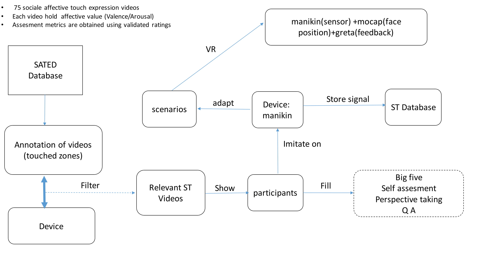
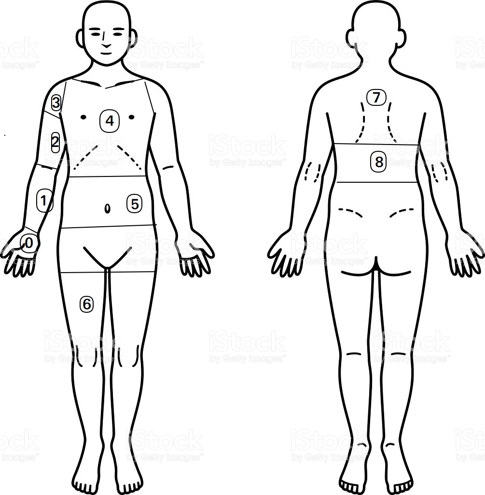
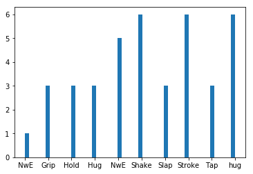
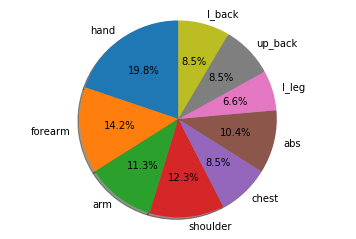
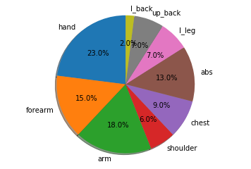

# Social touch protocol

## 1.  Motivation

#### The purpose of this preliminary study is to extract relevant informations about social touch gestures in each video of SATE (social affective touch expression) database. for instance:
 + #### Touch zones involved ( arm, chest, back,...).
 + #### Type of touch (stroke, tap, grab, hold,...).
 + #### Initiative (  subject whom starts the interaction).
 + #### Valence/Arousal.


#### The first step, is to skim all social touch interactions videos and annotate them based on the variables described below (touch zones,...) and the touch vocabulary defined in section 2. Then, analyze the annotations data to decide which device to use and where the sensors will be placed in human body (zones)
 

### *Protocol of the intended experiment*

 

## 2. Body parts and annotation

| Number        | Name          |
| ------------- |-------------| 
| 0             | hand         | 
| 1             | forearm        | 
| 2             | arm           | 
| 3             | shoulder      | 
| 4             | chest         | 
| 5             | abs           | 
| 6             | lower leg     | 
| 7             | upper back    | 
| 8             | lower back    | 


 

## 3. Exploratory analysis on ST data


```python
import pandas as pd
from IPython.display import HTML
import numpy as np
import matplotlib.pyplot as plt
def plot_pie(data):
    sizes=np.mean(data,axis=0)
    label=['hand','forearm','arm','shoulder','chest','abs','l_leg','up_back','l_back']
    fig1, ax1 = plt.subplots()
    ax1.pie(sizes, labels=label, autopct='%1.1f%%',
        shadow=True, startangle=90)
    ax1.axis('equal')  # Equal aspect ratio ensures that pie is drawn as a circle.
    plt.show()

df=pd.read_csv('Annot.csv')

```


```python
HTML("""
<div align="middle">
<video width="80%" controls>
      <source src="5.mp4">
</video></div>""")
```


<div align="middle">
<video width="80%" controls>
      <source src="5.mp4">
</video></div>


```python
df.head()
```


<div>
<style scoped>
    .dataframe tbody tr th:only-of-type {
        vertical-align: middle;
    }

    .dataframe tbody tr th {
        vertical-align: top;
    }

    .dataframe thead th {
        text-align: right;
    }
</style>
<table border="1" class="dataframe">
  <thead>
    <tr style="text-align: right;">
      <th></th>
      <th>VIDEO_NUM</th>
      <th>PAIR</th>
      <th>INITIATIVE_F</th>
      <th>INITIATIVE_M</th>
      <th>F0</th>
      <th>F1</th>
      <th>F2</th>
      <th>F3</th>
      <th>F4</th>
      <th>F5</th>
      <th>...</th>
      <th>M2</th>
      <th>M3</th>
      <th>M4</th>
      <th>M5</th>
      <th>M6</th>
      <th>M7</th>
      <th>M8</th>
      <th>ACTION</th>
      <th>STIMILUS_NAME</th>
      <th>VALENCE</th>
    </tr>
  </thead>
  <tbody>
    <tr>
      <th>0</th>
      <td>1</td>
      <td>1</td>
      <td>1</td>
      <td>1</td>
      <td>1</td>
      <td>1</td>
      <td>1</td>
      <td>0</td>
      <td>1</td>
      <td>1</td>
      <td>...</td>
      <td>1</td>
      <td>0</td>
      <td>1</td>
      <td>1</td>
      <td>1</td>
      <td>1</td>
      <td>0</td>
      <td>hug</td>
      <td>Hug1_p</td>
      <td>positive</td>
    </tr>
    <tr>
      <th>1</th>
      <td>2</td>
      <td>1</td>
      <td>0</td>
      <td>1</td>
      <td>1</td>
      <td>1</td>
      <td>1</td>
      <td>0</td>
      <td>1</td>
      <td>1</td>
      <td>...</td>
      <td>1</td>
      <td>0</td>
      <td>1</td>
      <td>1</td>
      <td>1</td>
      <td>1</td>
      <td>1</td>
      <td>hug</td>
      <td>Hug2_p</td>
      <td>positive</td>
    </tr>
    <tr>
      <th>2</th>
      <td>3</td>
      <td>1</td>
      <td>0</td>
      <td>1</td>
      <td>1</td>
      <td>1</td>
      <td>1</td>
      <td>1</td>
      <td>1</td>
      <td>1</td>
      <td>...</td>
      <td>1</td>
      <td>0</td>
      <td>1</td>
      <td>1</td>
      <td>1</td>
      <td>1</td>
      <td>0</td>
      <td>Hug</td>
      <td>Hug3_p</td>
      <td>Positive</td>
    </tr>
    <tr>
      <th>3</th>
      <td>4</td>
      <td>1</td>
      <td>1</td>
      <td>0</td>
      <td>1</td>
      <td>0</td>
      <td>0</td>
      <td>0</td>
      <td>0</td>
      <td>1</td>
      <td>...</td>
      <td>1</td>
      <td>1</td>
      <td>0</td>
      <td>1</td>
      <td>0</td>
      <td>0</td>
      <td>0</td>
      <td>Stroke</td>
      <td>Str1_p</td>
      <td>Positive</td>
    </tr>
    <tr>
      <th>4</th>
      <td>5</td>
      <td>1</td>
      <td>1</td>
      <td>0</td>
      <td>1</td>
      <td>0</td>
      <td>0</td>
      <td>0</td>
      <td>0</td>
      <td>0</td>
      <td>...</td>
      <td>1</td>
      <td>1</td>
      <td>0</td>
      <td>0</td>
      <td>0</td>
      <td>0</td>
      <td>0</td>
      <td>Stroke</td>
      <td>Str2_p</td>
      <td>Positive</td>
    </tr>
  </tbody>
</table>
<p>5 rows × 25 columns</p>
</div>


## Variables definition 

#### In this clip (VIDEO_NUM=5) the F participant is stroking the M participant shoulder and arm.
#### The activated zones are:
+ #### F0=1 (female hand)
+ #### M2=1 (male arm), M3=1(male shoulder)

## Exploratory Analysis


```python
data=df.values
print(data.shape," #videos and #attributes")
print("########### touch action ######################")
print(np.unique(data[:,22]))
print("########### Variations of touch actions ######################")
print(np.unique(data[:,23]))

```

    (39, 25)  #videos and #attributes
    ########### touch action ######################
    [' NwE' 'Grip' 'Hold' 'Hug' 'NwE' 'Shake' 'Slap' 'Stroke' 'Tap' 'hug']
    ########### Variations of touch actions ######################
    ['Gri1_n' 'Hold1_p' 'Hug1_p' 'Hug2_p' 'Hug3_p' 'Nudg1_n' 'Nudg2_n'
     'Sha2_n' 'Slap1_n' 'Str1_p' 'Str2_p' 'Tap1_neu' 'sha1_n']


```python
plt.hist(data[:,22],bins=50)
print("Number of each action (NwE is nudge with elbow)")
```

    Number of each action (NwE is nudge with elbow)





```python
print("female are likely to be touched/touch zones: ")
plot_pie(data[:,4:13])

```

    female are likely to be_touched/touch zones: 





```python
print("Male are likely to be touched/touch zones: ")
plot_pie(data[:,13:22])
```

    Male are likely to be touched/touch zones: 





## 4. Conclusion
